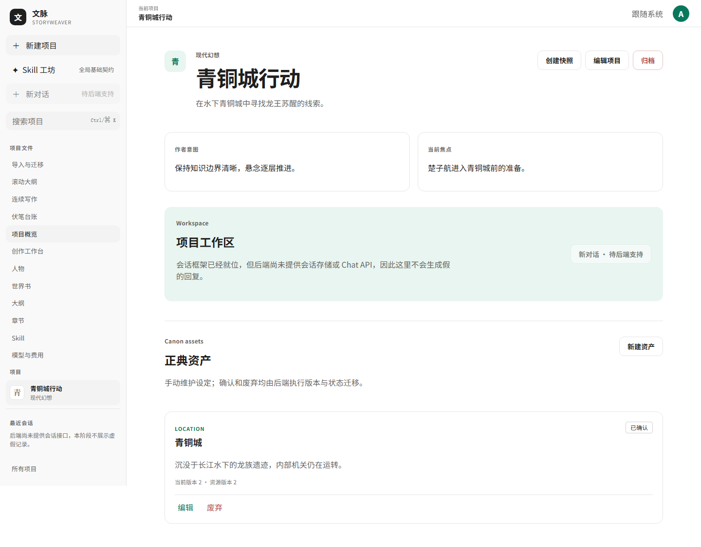
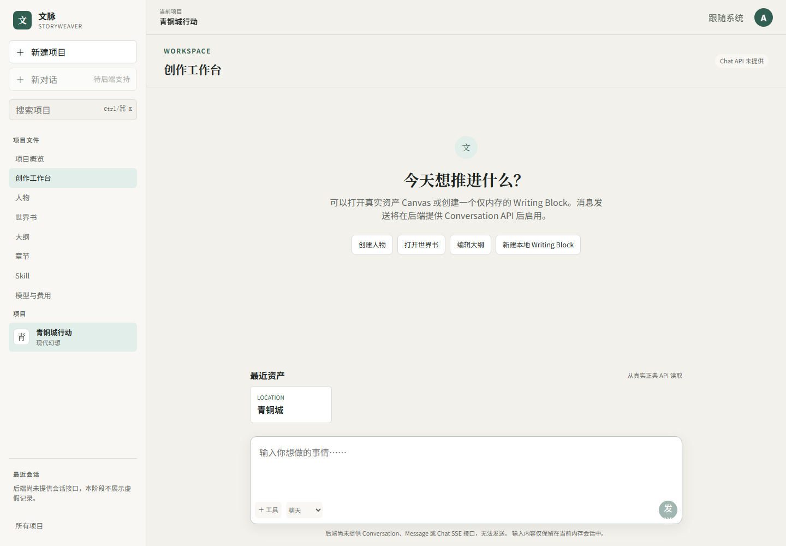
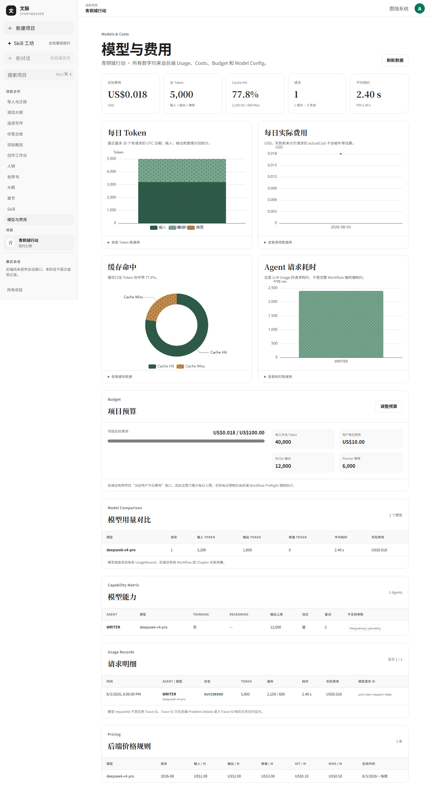
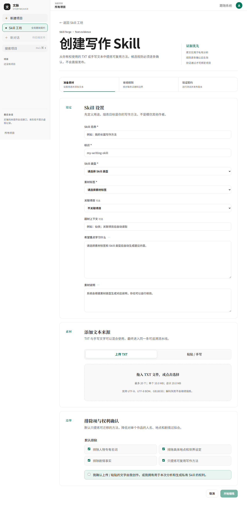
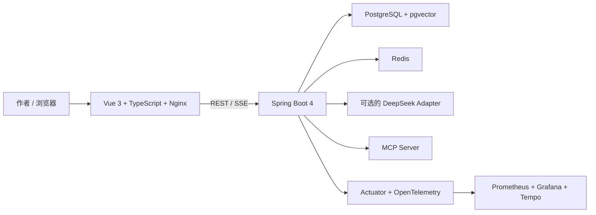

<div align="center">

# 文脉 StoryWeaver

**面向长篇小说创作的全栈工作台**

在一个可审核、可版本化的工作流中管理项目、人物、世界书、大纲、章节与 AI 辅助写作。

[](https://github.com/Ricardo-2005/StoryWeaver/actions/workflows/ci.yml)
[](https://github.com/Ricardo-2005/StoryWeaver/actions/workflows/frontend-ci.yml)
[](https://github.com/Ricardo-2005/StoryWeaver/actions/workflows/agent-evals.yml)


</div>



## 项目简介

StoryWeaver（文脉）是一个面向长篇小说创作的全栈应用。它把分散的人物设定、世界规则、大纲、章节、伏笔和生成工作流放进同一套项目模型，并通过版本、审核、一致性校验与可观测性机制降低长篇创作中的设定漂移。

当前仓库包含完整的 Vue 3 前端、Spring Boot 后端、Docker Compose 开发环境、Agent Evaluation Harness，以及可追溯的产品与工程文档。当前实现以源码、数据库迁移和自动化测试为准，详细状态见[实现状态](docs/IMPLEMENTATION_STATUS.md)。

## 核心能力

| 领域 | 已实现能力 |
| --- | --- |
| 创作资产 | 项目、人物与状态、世界书、大纲、章节、不可变章节版本、正典资产与快照 |
| 长篇生产 | 滚动大纲、串行章节批次、重大剧情门、伏笔台账、影响报告、分支与局部修订 |
| 写作工作流 | Preflight、Context、Planner、Writer、Extractor、Reviewer、SSE 进度与人工审批 |
| 一致性治理 | 故事事实、物品归属、人物知识边界、时间线校验与 BLOCKER 门禁 |
| Skill 工坊 | 全局 Skill、TXT/手写素材熔炼、28 套动态模板、证据审阅、边界测试与安全导出 |
| 导入与迁移 | TXT、Markdown、DOCX、ZIP 导入，章节切分、候选审查与 Git ZIP 导出 |
| 成本与观测 | Token、费用、预算、耗时、Prometheus、Grafana、OpenTelemetry 与 Tempo |
| 接口能力 | REST、SSE 与 Stateless Streamable HTTP MCP；MCP 写入仅生成候选事实 |

## 界面预览

<table>
  <tr>
    <th>创作工作台</th>
    <th>用量与可观测性</th>
  </tr>
  <tr>
    <td></td>
    <td></td>
  </tr>
</table>

<details>
<summary><strong>查看完整 Skill 熔炉界面</strong></summary>

### Skill 熔炉



</details>

## 技术架构



| 层级 | 技术栈 |
| --- | --- |
| 前端 | Vue 3、TypeScript、Vite、Pinia、TanStack Vue Query、TipTap、ECharts、Element Plus |
| 后端 | Java 21、Spring Boot 4.1、Spring AI、Spring Security、JPA、Flyway |
| 数据 | PostgreSQL 18、pgvector、Redis 8 |
| 测试 | JUnit、Testcontainers、ArchUnit、Vitest、Playwright、axe |
| 运行 | Docker Compose、Nginx、Prometheus、Grafana、Tempo |

## 快速开始

### 方式一：Windows 一键启动

前置条件：Windows 10/11、PowerShell 5.1+，以及已启动的 Docker Desktop。

```powershell
git clone https://github.com/Ricardo-2005/StoryWeaver.git
Set-Location StoryWeaver
.\Start-StoryWeaver.ps1
```

启动脚本会：

1. 检查 Docker 与 Compose；
2. 从 `backend/.env.example` 创建本地 `backend/.env`；
3. 启动数据库、缓存、后端、监控和前端；
4. 等待健康检查通过后打开浏览器。

修改源码或 Dockerfile 后需要重新构建镜像：

```powershell
.\Start-StoryWeaver.ps1 -Rebuild
```

也可以双击仓库根目录的 [`启动StoryWeaver.cmd`](启动StoryWeaver.cmd)。

### 方式二：Docker Compose

Linux / macOS：

```bash
git clone https://github.com/Ricardo-2005/StoryWeaver.git
cd StoryWeaver
cp backend/.env.example backend/.env
docker compose up -d --build
```

停止服务并保留数据卷：

```bash
docker compose down
```

> 不要随意使用 `docker compose down -v`，该命令会删除本地数据库和监控数据卷。

### 默认地址

| 服务 | 地址 |
| --- | --- |
| Web 应用 | <http://127.0.0.1:4173> |
| 后端健康检查 | <http://127.0.0.1:8080/actuator/health> |
| MCP | <http://127.0.0.1:8080/mcp> |
| Prometheus | <http://127.0.0.1:9090> |
| Grafana | <http://127.0.0.1:3000> |

端口均可通过本地 `backend/.env` 调整。完整说明见[快速开始指南](docs/GETTING_STARTED.md)。

## 模型与安全配置

项目不包含任何真实 API Key。模型配置只允许保存在已被 Git 忽略的 `backend/.env` 中：

```dotenv
DEEPSEEK_API_KEY=
DEEPSEEK_BASE_URL=https://api.deepseek.com
```

- 未配置模型 Key 时，登录、项目管理、资产编辑和确定性校验仍可运行；模型生成相关功能会明确提示未配置。
- 不要把真实 Key 写入 `.env.example`、源码、Issue、日志或截图。
- 本地 ONNX 模型缺失时，世界书检索会降级为常量与关键词检索。
- 如需启用本地语义检索，可运行 `backend/scripts/download-embedding-model.ps1`。

更多环境变量与安全边界见[配置与安全](docs/CONFIGURATION.md)。

## 本地开发

### 后端

要求 JDK 21+；仓库已包含 Maven Wrapper。

```powershell
Set-Location backend
.\mvnw.cmd clean verify
.\mvnw.cmd spring-boot:run
```

### 前端

要求 Node.js 24 和 pnpm 10.30.0。

```bash
cd frontend
corepack enable
pnpm install --frozen-lockfile
pnpm dev
```

常用验证命令：

```bash
pnpm test:unit
pnpm lint
pnpm typecheck
pnpm build
pnpm test:e2e
```

### Agent Evaluation

Windows 用户可运行：

```powershell
.\evals\run-evals.cmd
```

评测默认使用确定性离线 Profile，不会调用真实 DeepSeek，也不会消耗模型额度。数据集、冻结基线和报告口径见 [Agent Evaluation](docs/evaluation.md) 与 [evals/README.md](evals/README.md)。

## 仓库结构

```text
StoryWeaver/
├── backend/                 # Spring Boot 后端、迁移、Compose 与运维资源
├── frontend/                # Vue 3 前端、单元测试与 Playwright 测试
├── evals/                   # Agent Evaluation Harness、数据集与版本化报告
├── docs/                    # 使用、架构、接口、开发与运维文档
├── 设计稿/                  # 产品目标、设计稿与历史实施记录
├── compose.yaml             # 完整应用编排入口
├── Start-StoryWeaver.ps1    # Windows 一键启动脚本
└── README.md
```

## 文档导航

- [项目技术白皮书](docs/StoryWeaver_项目技术白皮书/StoryWeaver_项目详细技术文档.md)：从架构、工作流、Context Engineering、RAG、一致性到评测与面试表达的 154 题完整说明。
- [文档中心](docs/README.md)：按使用、开发、配置和运维组织的完整索引。
- [项目流程](docs/PROJECT_FLOW.md)：从创建项目到生成、审核和发布章节的操作流程。
- [实现状态](docs/IMPLEMENTATION_STATUS.md)：当前能力、数据迁移、测试与明确边界。
- [系统架构](docs/SYSTEM_ARCHITECTURE.md)：模块、数据流和部署拓扑。
- [接口与数据](docs/API_AND_DATA.md)：REST、SSE、认证、版本和一致性规则。
- [开发与测试](docs/DEVELOPMENT.md)：本地开发方式与验证策略。
- [部署与运维](docs/OPERATIONS.md)：健康检查、监控、数据持久化和故障排查。

## 当前边界

StoryWeaver 当前面向本地开发、工程验证和产品演示，不是生产高可用部署。以下能力尚未完成：

- 持久化 Conversation / Message / Chat API；
- Refresh Token、Token 吊销与完整账号安全体系；
- 管理员用户管理界面和管理 REST API；
- TLS、生产 Secret Manager、多实例高可用和 Kubernetes；
- 无人工审批的自动正典写入。

前端不会为不存在的后端能力伪造数据；MCP 与模型输出也不能绕过人工审核直接写入正典。

## 参与开发

提交前请至少运行与改动范围对应的单元测试、Lint 或 Maven `verify`，并遵循以下约定：

- 不提交 `backend/.env`、模型文件、构建产物、本地数据卷或数据库备份；
- 数据库结构只通过新的 Flyway 迁移变更；
- 前端业务请求统一经过共享 API Client；
- 设计稿记录目标，当前行为以源码、迁移、测试和中央文档为准。

## License

本仓库暂未附带开源许可证。公开可见不代表授予复制、修改或再分发许可；如需使用，请先联系仓库维护者。
