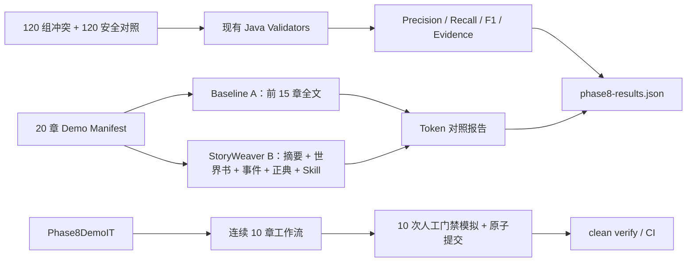

# 后端架构

StoryWeaver 采用模块化单体。Controller 只做协议适配，Application Service 组织用例，Domain/Repository 管理状态；ArchUnit 持续验证 Controller 不直连 Repository、`shared` 不反向依赖业务模块及顶层模块无循环依赖。

## 技术基线与模块

运行基线为 Java 21、Spring Boot 4.1、Spring AI 2.0、PostgreSQL 18 + pgvector、Redis 8.2。应用是一个可部署 JAR，不是分布式微服务；模块边界通过包、Application Service 和 ArchUnit 维持，从而避免为 MVP 引入跨服务事务和运维复杂度。

| 模块 | 职责 |
|---|---|
| `auth` | 注册、登录、JWT、USER/ADMIN 角色、当前用户 |
| `project` | 项目、项目所有权和跨模块快照 |
| `canon` | 正典资产、不可变版本、确认/废弃状态 |
| `character` | 人物卡和当前人物状态 |
| `outline` / `chapter` | 大纲树、章节元数据和不可变正式版本 |
| `skill` | BASE/PROJECT/CHAPTER 合成，以及全局 Skill、证据熔炼、动态模板上下文、验证与项目绑定 |
| `llm` | DeepSeek Adapter、Agents、SSE、Embedding Gateway |
| `worldbook` / `memory` | 世界书激活和故事事件检索 |
| `workflow` | 章节生成状态机、上下文、恢复、SSE、审批编排 |
| `consistency` / `review` | 确定性一致性、候选事实、审查模型；`review` 为预留边界，当前实现集中在 consistency |
| `usage` | Usage、PricingRule、预算和成本 |
| `mcp` / `audit` | MCP 协议能力和调用审计 |
| `shared` | 通用错误和无业务方向的共享约定 |

典型请求链为 `HTTP/MCP Adapter → Application Service → Domain → Repository → PostgreSQL`。Controller 和 MCP transport 不承载事务规则；跨模块用例只能调用公开 Application Service，不允许从协议层绕过业务门禁直接写 Repository。

## 身份、安全与错误

服务使用无状态 HS256 Bearer JWT，subject 为用户 UUID，issuer 为 `storyweaver`。JWT 的 `role` claim 映射为 `ROLE_USER/ROLE_ADMIN`；公开注册默认 `USER`。除 Auth、Actuator 和 Spring `/error` 外全部请求需认证。项目资源首先经过 `ProjectAccessService` 所有权校验；跨用户访问不泄露资源存在性。当前已有管理员权限基础设施，但尚无管理后台或管理员专属业务接口。

REST 错误统一为 RFC 9457 风格 Problem Details，并增加稳定 `code`；校验失败增加字段 `errors`。MCP 复用相同身份与所有权，但按协议返回 tool `isError`。密码使用 Spring DelegatingPasswordEncoder，DeepSeek API Key 只来自环境变量，向模型发送的 `user_id` 是独立密钥 HMAC 伪名。

## 数据一致性策略

- PostgreSQL 是正典记录源；Redis 只用于协调/运行时能力，不保存唯一正式事实。
- 聚合根使用 JPA `@Version`，客户端写入同时显式提交 `expectedVersion`。
- 章节和正典更新追加不可变版本，不覆盖历史内容。
- 跨项目引用使用服务校验和数据库复合外键双重防线。
- 同项目活跃 Workflow 使用应用限制和数据库部分唯一索引双重串行化。
- 外部 LLM/Embedding 调用不放在审批提交事务中。

## Phase 6 章节闭环

```text
Preflight + Canonical Context Packet
  -> Planner -> Writer 运行态草稿 -> Extractor 候选
  -> Java Validators
       CharacterState / ItemOwnership / Timeline / KnowledgeBoundary / CanonReference
  -> DeepSeek Reviewer
  -> WAITING_APPROVAL
       ├─ 修改正文 -> 重新 Extract + Validate + Review
       └─ 审批 -> 再校验 -> Atomic Commit -> COMPLETED
```

模型只产生候选和语义审查意见，不能直接修改正典。四类关键一致性由 Java 确定性校验；Reviewer 问题与 Java 问题统一持久化，但保留 `source`。任何未解决 BLOCKER 都会在应用层和事务层阻止提交。

## 原子事务与回滚

审批先校验项目所有权、Context Packet 有效期、Workflow 乐观版本及结构化变更。提交事务使用悲观锁锁定 WorkflowRun，然后一次写入章节版本、摘要、事实、事件、人物状态、道具归属、人物知识和最终工作流状态；事务内不调用 LLM 或 Embedding。

发生数据库、并发或注入故障时事务整体回滚，章节 `currentVersionNo` 和所有故事状态保持不变。协调器随后在独立事务中将运行标记为 `ROLLED_BACK`，便于审计失败而不制造半提交。

## 下一章状态传播

提交后的下一章 Context Packet 会读取：

- 视角人物最新 CharacterState；
- 已接受 StoryFact；
- 当前 ItemOwnership；
- CharacterKnowledge；
- 已提交 StoryEvent 与上一章版本。

因此下一章读取的是数据库已提交真相，不依赖上一轮内存或模型上下文。

## 异步、恢复与 SSE

生成、提取、校验和 Reviewer 在虚拟线程工作流中执行；定时 Worker 可从数据库状态恢复。正文 Delta 和状态事件先写入 `workflow_event`，SSE 使用事件 ID 重放。审批事务为同步短事务，不进入恢复 Worker。

## Phase 7 MCP 边界

MCP 使用 Spring AI 2.0 官方 WebMVC Stateless Streamable HTTP 传输，端点为 `/mcp`。传输适配器只负责注解、参数和当前 JWT 调用者；`McpStoryService` 组合既有 Application Service，MCP 模块不直连 Repository。资源 URI、工具和提示词均复用 REST 相同的项目所有权规则。

五个查询工具均声明 read-only；`save_candidate_fact` 需要正文证据，只创建带调用者、来源和幂等键的 `CANDIDATE`。MCP 没有接受事实、提交章节或修改人物/世界状态的工具。Tool、Resource、Prompt 的成功和失败均记录调用者、目标项目、请求 ID、耗时和错误码。

## 费用与可观测

Usage 保存请求时使用生效中的数据库 PricingRule 固化规则版本和成本；Preflight 检查单任务、用户每日、项目累计、Writer 输出和 Planner 推理预算。指标只使用 `agent/model/status/step/severity` 等低基数标签，不使用用户、项目或章节 ID。

HTTP 请求由 Spring Boot 自动创建根 Span，工作流为异步根 Span，并为 Preflight、Context Build、Worldbook、Memory、Planner、Writer、Extractor、Validators、Reviewer 和 Commit 创建 Observation。OTLP Trace 发往 Tempo，Grafana 同时预配置 Prometheus 与 Tempo 数据源。

## 安全与边界

- 工作流、事实、道具和知识查询全部执行项目所有权校验，跨用户访问统一按不存在处理。
- 数据库使用项目级复合外键防止人物、章节、事件跨项目引用。
- DeepSeek API Key 只从环境变量读取；Prompt、正文和密钥不写普通日志。
- Phase 8 脚本复用公开 API，不提供绕过所有权或审批的 Demo 后门；默认 Demo 不调用 DeepSeek、不自动审批。

## Phase 8 评测与 Demo 架构



评测测试直接实例化生产 Validator 和 TokenEstimator；它不复制判断逻辑。`Phase8DemoIT` 使用 PostgreSQL/pgvector 与 Redis Testcontainers，只替换 Planner/Writer/Extractor/Reviewer 为确定性测试 Stub，因此状态机、上下文、持久化、审批和原子事务均走生产实现。
