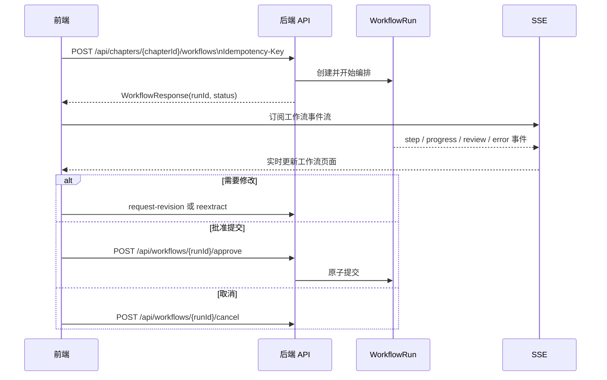

# 接口与数据说明

本文件提供面向前端联调和新开发者的概览；完整字段、错误码、枚举和 MCP 契约以 [`backend/docs/api.md`](../backend/docs/api.md) 为准。前端请求封装位于 `frontend/src/api/endpoints/`，类型定义位于 `frontend/src/api/types.ts`。

## 访问方式与认证

- 浏览器只访问前端同源的 `/api`；开发模式由 Vite 代理到后端，容器模式由 Nginx 反向代理。
- 注册、登录等认证接口不需要 Access Token。
- 受保护接口需要 `Authorization: Bearer <JWT>`。
- 用户响应包含 `role=USER|ADMIN`；JWT 将其映射为 `ROLE_USER` 或 `ROLE_ADMIN`。公开注册固定为 `USER`。
- 未登录请求由前端路由守卫引导到登录页；后端以标准 Problem Details 返回错误。
- 所有项目资源都受用户和项目所有权隔离；不能通过修改 URL 中的 ID 越权访问其他用户数据。

## 主要接口分组

| 分组 | 典型资源 | 说明 |
| --- | --- | --- |
| 认证 | `/api/auth/*` | 注册、登录和会话凭证 |
| 项目 | `/api/projects` | 项目列表、创建、详情、快照与项目上下文 |
| TXT 书籍建项 | `/api/imports/txt`、`/api/txt-imports/{id}/*` | 单个 20 MiB TXT 上传、编码/章节 Preview、编辑和确认建项 |
| AI 项目重建 | `/api/projects/{id}/reconstruction/*` | Estimate、启动/恢复/暂停/取消、Candidate 审核/撤回和安全应用 |
| 全局 Skill | `/api/skills`、`/api/skill-forge/runs` | 项目外创建、TXT/手写文本熔炼、证据审阅、验证、测试集与安全导出 |
| 创作资产 | `/api/projects/{id}/characters`、`worldbook-entries`、`outlines`、`chapters`、`skills` | 人物、世界书、大纲、章节与 Skill 的维护 |
| 章节版本 | `/api/chapters/{id}/versions`、`restore/{versionNo}` | 新建不可变版本、查看版本和恢复 |
| 工作流 | `/api/chapters/{id}/workflows`、`/api/workflows/{id}/*` | 发起、查询、取消、修订、重新提取和审批 |
| V1.5 生产 | `/api/projects/{id}/imports`、`rolling-outline`、`chapter-batches`、`story-gates`、`chapter-branches` | 导入、连续生产、剧情门与分支 |
| 可观测性 | `/api/usage/*`、`/api/ai/model-*` | 用量、预算、模型配置与健康信息 |
| MCP | `/mcp` | 面向 MCP 客户端的只读与候选事实能力 |

接口路径以实现为准；不要在页面中直接拼接 URL，应通过 API endpoint 文件调用共享的 `apiClient`，以保持认证头、错误处理和类型一致。

## 工作流接口时序

创建工作流必须携带幂等键，避免网络重试导致同一章节出现重复的写作任务。前端的 SSE 消费逻辑负责事件去重和重连，业务界面应基于后端状态而不是本地猜测状态显示结果。

## 重要数据概念

| 概念 | 含义 | 关键规则 |
| --- | --- | --- |
| Project | 一部作品的隔离边界 | 资源、预算和 Writer 并发均以项目隔离 |
| Canon Asset | 已确认的项目正典资产 | 不应被候选内容直接覆盖 |
| Chapter / ChapterVersion | 章节及其不可变正文版本 | 新版本追加；恢复创建新的有效状态而非修改历史 |
| WorkflowRun | 一次章节写作任务 | 由状态机驱动，审批前不是正式内容 |
| StoryFact | 从章节提取并确认的故事事实 | 与时间线、归属和知识边界校验关联 |
| Candidate Fact | 尚未确认的候选事实 | 可来自工作流或 MCP，不能直接作为正典 |
| BookImportJob | 一次 TXT 书籍建项任务 | Preview 前后都受 owner 隔离；Commit 成功前不创建 Project |
| ReconstructionJob / Candidate | 导入后一次分层项目理解及其候选结果 | Chapter/Chunk 执行，真实进度/Usage；候选可审阅、拒绝或撤回 |
| Temporal State / Retrieval Eligibility | 某一章节有效的状态及能否进入当前检索 | 未来、过期、撤回、取代、合并、归档和清除数据不得污染当前 Context |
| Skill Composition | BASE/PROJECT/CHAPTER 三级规则合成结果 | 冲突应被报告并由用户处理 |
| Global Skill / ForgeRun | 跨项目复用的版本化行为契约及一次熔炼任务 | 原文私有保存；规则必须带段落证据并经用户接受/编辑；只有验证版本可绑定项目 |
| ChapterBatch / StoryGate | 连续生产批次及其重大剧情门 | 剧情门未决时不能无控制地继续推进 |
| ChapterBranch | 章节的替代叙事方案 | 选定后才提升其影响或正式状态 |

## 状态与事务规则

`WorkflowRun` 的主线状态依次经历 `CREATED`、`PREFLIGHT`、`CONTEXT_READY`、`PLANNING`、`PLAN_READY`、`WRITING`、`TEXT_READY`、`EXTRACTING`、`VALIDATING`、`REVIEWING`、`WAITING_APPROVAL`，之后由人工决定提交、修订或取消。

- `WAITING_APPROVAL`：审核已完成，等待人工决定。
- `REVISION_REQUIRED`：存在需要作者或流程修正的问题。
- `BLOCKED`：被阻断，不能作为正常完成处理。
- `COMMITTING` → `COMPLETED`：在一个数据库事务中写入正式章节版本和已接受的故事状态。
- `FAILED`、`CANCELLED`、`ROLLED_BACK`：不应把当前草稿视为已发布正典。

后端同时使用乐观锁、项目所有权校验、幂等键和同项目 Writer 并发限制。调用方应保留资源的版本/预期版本等并发控制字段，并在冲突时重新加载数据，而不是盲目重试覆盖。

## TXT 导入与项目重建边界

TXT 书籍建项的真实主链路是 `POST /api/imports/txt` → `POST /api/txt-imports/{id}/parse` → Preview/章节编辑 → `POST /api/txt-imports/{id}/commit`。上传只接受 `.txt` 和单文件 20 MiB；Spring/Nginx 使用 25 MiB 请求上限容纳 multipart 开销，业务层仍重复校验实际读取字节数。支持 UTF-8、UTF-8 BOM、GB18030、GBK，编码不确定时由用户选择后重新解析。

Commit 后可使用 `/api/projects/{projectId}/reconstruction` 启动 QUICK/STANDARD/DEEP 分析。任务按 Chapter/Chunk 保存真实进度，支持 Pause、Resume、Cancel、Retry Failed 与预算暂停；Candidate 可决定、批量安全应用或通过 `/candidates/{candidateId}/revoke` 撤回。Safe Apply 当前只处理低风险章节重建元数据，不能将其理解为人物、世界书、伏笔或 Skill 已自动成为正式资产。

## MCP 边界

MCP 以无状态 Streamable HTTP 方式提供在 `/mcp`。它可读取项目状态，并且唯一的写入能力是创建带证据的 `CANDIDATE` 事实。MCP 不能接受事实、修改正典或绕过工作流审核；这一限制保证外部工具无法污染已确认的故事状态。

## 调试建议

1. 先在浏览器 Network 面板检查请求 URL、Authorization 头和 Problem Details 响应。
2. 检查前端 `src/api/endpoints` 的请求和类型，再检查后端 API 文档和对应实现。
3. 工作流问题同时查看 SSE 事件、`GET /api/workflows/{runId}` 的当前状态和后端日志。
4. 数据问题检查 Flyway 迁移版本，不要直接修改数据库来“修复”应用逻辑。

Skill 熔炼创建请求包含 `materialTag`、`skillType`、`focus`、`materialDescription`、可选 `genre/sourceProjectId`。前端 28 套模板只负责提供可编辑建议；后端保存最终提交值并按 Skill 类型生成不同的结构化输出。完整字段见后端 API 文档 2.10 节。
