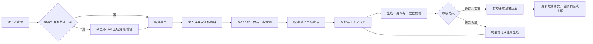
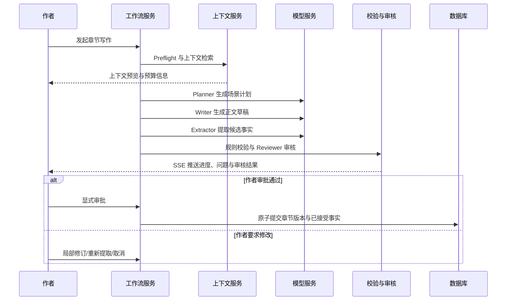
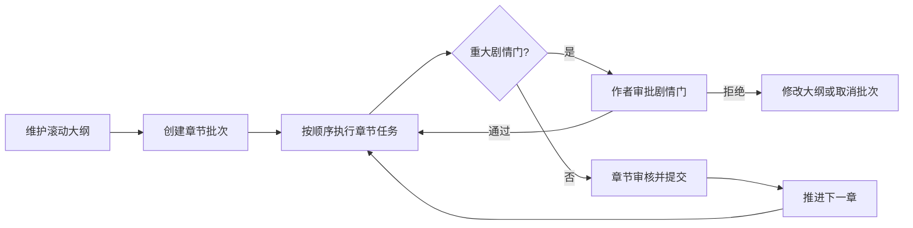

# 项目流程说明

本文件面向产品使用者、演示人员和新加入的开发者，说明 StoryWeaver 如何把“小说设定—章节创作—一致性校验—人工确认”串成一个可追溯的流程。

## 一句话理解

作者先建立可信的项目资料（人物、世界书、大纲、已有章节），再围绕某一章节发起写作工作流。系统把相关上下文交给模型生成，并提取候选事实、校验冲突；**只有作者明确审批后，结果才会成为正式章节版本和正典状态**。

## 用户主流程

## 第一步：创建项目与基础资料

在创建项目之前，也可以先进入项目外的 Skill 工坊：选择素材标签和 Skill 类型，使用 TXT/手写文本熔炼并验证基础 Skill。验证通过后，新建项目时可选择该基础契约；不准备 Skill 也不会阻止创建项目。

1. 在“项目”页新建项目，依次选择题材、目标读者、作品视角和篇幅，并填写至少 10 字的故事构想；高级设置可补充简介、作者意图、当前焦点、世界规则和字数目标。
2. 进入项目后，优先补充“人物”“世界书”“大纲”。这些资料是后续检索、上下文拼装和冲突校验的依据。
3. 若已有书稿，可通过“导入与迁移”上传 TXT、Markdown、DOCX 或 ZIP。系统按导入流程处理章节切分和候选审核；不要把未经确认的导入内容直接视为正式正典。
4. 在“章节”页新建章节、完善章节梗概，或在编辑器中录入已有正文。章节版本以不可变版本记录，支持回看与恢复。

建议顺序是：先有项目骨架，再有章节正文。人物状态、关键地点规则、时间线和世界观限制越完整，生成和校验的结果越可靠。

## 第二步：维护创作上下文

| 资料 | 用途 | 典型内容 |
| --- | --- | --- |
| 人物与状态 | 确定角色当前身份、位置、状态与已知信息 | 主角伤势、阵营、随身物品、是否知晓某个秘密 |
| 世界书 | 保存可检索的世界观、规则、地点和组织设定 | 魔法限制、城市布局、组织结构、禁忌 |
| 大纲 | 描述章节目标和故事推进方向 | 本章冲突、转折、出场人物、结尾钩子 |
| 正典资产/StoryFact | 保存已经确认的剧情事实和关联关系 | 事件、物品归属、角色知识边界、时间顺序 |
| Skill | 保存可复用的创作约束或提示组合 | 叙事视角、篇幅要求、风格限制、项目规则 |

世界书会按常量、关键词和（模型可用时的）向量检索召回相关资料，并根据 Token 预算裁剪。它不是把整个项目资料无差别发给模型；作者应把重点设定写得结构清晰、颗粒度适中。

## 第三步：章节 AI 写作工作流

在目标章节中发起工作流后，系统按下面顺序运行：

### 工作流阶段说明

| 阶段 | 做什么 | 作者可关注什么 |
| --- | --- | --- |
| `PREFLIGHT` | 检查章节、项目状态、并发和前提条件 | 是否缺少必要资料或已有进行中的任务 |
| `CONTEXT_READY` | 汇总正典、人物、世界书、大纲和 Skill | 上下文是否包含本章关键限制，Token 是否超预算 |
| `PLANNING` / `PLAN_READY` | 生成并保存场景计划 | 场景顺序、冲突和章节目标是否合理 |
| `WRITING` / `TEXT_READY` | 生成章节草稿 | 正文是否满足预期、是否需要局部修改 |
| `EXTRACTING` | 从草稿中提取候选故事事实 | 提取内容是否正确表达了新剧情 |
| `VALIDATING` / `REVIEWING` | 校验时间线、知识边界、归属等并审核 | BLOCKER、证据和需修订项 |
| `WAITING_APPROVAL` | 等待人工决定，不写入正式正典 | 在此审阅、修改、重提取或审批 |
| `COMMITTING` / `COMPLETED` | 事务性提交章节版本和接受的事实 | 结果成为项目正式状态 |

当任务进入 `BLOCKED`、`REVISION_REQUIRED`、`FAILED` 或 `CANCELLED` 时，不会自动把草稿当作正式章节提交。工作流支持 SSE 进度流、取消与超时恢复；同一项目会限制并发 Writer，避免两次生成同时覆盖同一创作上下文。

## 第四步：审核与提交

审核是产品流程的关键分界线：

1. 查看正文、场景计划、上下文预览和候选事实。
2. 查看 Reviewer 与一致性校验的提示，特别是 `BLOCKER`、人物知识边界、物品归属和事件时间线问题。
3. 需要改动时，可请求修订、局部修订或重新提取；不满意则取消。
4. 只有在 `WAITING_APPROVAL`（或允许修订的相应状态）下执行显式审批，系统才会在一次数据库事务中提交章节版本与已接受故事状态。

这意味着：AI 输出是“待审创作材料”，而非自动生效的正典。这样可以避免一次错误生成污染后续章节的上下文。

## V1.5 长篇生产流程

当创作进入连续更新阶段，可使用“滚动大纲”和“连续写作”：

- **章节批次**：将多个章节按顺序组织为连续生产任务，可暂停、恢复或取消。
- **重大剧情门**：在关键转折前要求人工决定，避免批量生成把故事推向未确认的方向。
- **局部修订**：针对已生成内容做范围更小的修改，减少不必要的重写。
- **章节分支**：保存不同叙事尝试，比较后再将选定结果的影响提升为正式状态。
- **模型尝试审计**：记录模型使用和尝试信息，便于复盘质量与成本。

## 常见使用路径

### 从零开始写一本书

创建项目 → 建人物/世界书 → 写总纲和章节梗概 → 新建第一章 → 发起工作流 → 审核 → 提交 → 更新后续大纲。

### 导入已有书稿后续写

创建项目 → 导入书稿 → 审核章节切分与候选资料 → 修正人物/世界书/时间线 → 为新章节补写梗概 → 发起工作流 → 审核提交。

### 已有稳定设定的连续日更

维护滚动大纲 → 创建章节批次 → 每章查看审核结果 → 在重大剧情门处决定方向 → 提交章节并推进下一章。

## 使用边界

- 生成质量依赖输入设定、模型能力和审核；系统不能替代作者的最终创作判断。
- Demo 主题和 Fixture 仅用于非商业技术演示与测试，不能视为原作内容或授权素材。
- 当前项目已实现的接口与能力以 `backend/docs`、`frontend/docs` 和设计稿中的实现差异记录为准；路线图中的内容不等于已上线功能。
