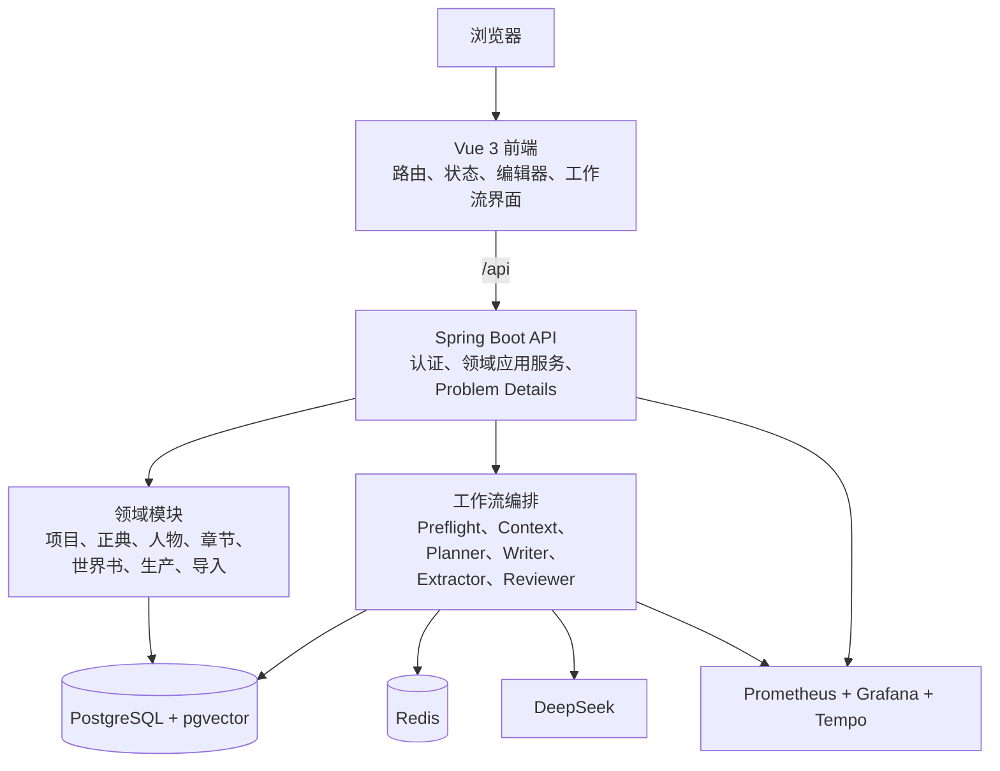
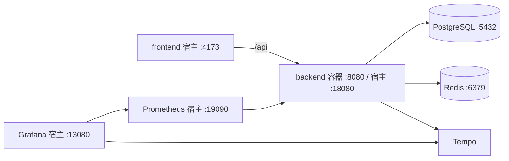

# 系统架构说明

## 架构目标

StoryWeaver 采用“前后端分离 + 模块化单体”的架构：前端专注创作工作台、交互和本地草稿体验；后端集中负责鉴权、领域规则、AI 编排、事务一致性和可观测性。数据库作为正典状态的唯一来源，任何 AI 生成内容必须经工作流与人工审批后才写入正式状态。

## 逻辑架构

## 前端职责

前端位于 `frontend/`，以 Vue 3、TypeScript、Vite、Pinia、TanStack Vue Query、TipTap 和 Element Plus 实现。核心职责包括：

- 登录、注册、`USER/ADMIN` 角色、项目选择与路由访问控制。
- 项目、人物、世界书、大纲、章节、Skill、伏笔等业务页。
- 长章节编辑、段落定位、IndexedDB 草稿恢复、查找替换和版本恢复。
- 工作流预检、上下文预览、SSE 进度订阅、审核和取消/修订操作。
- V1.5 的导入、滚动大纲、章节批次、剧情门、分支与模型尝试界面。
- 用量、预算、成本、耗时与主题/可访问性体验。
- 项目外全局 Skill 工坊、TXT/手写熔炼、28 套动态模板、证据审阅、验证与项目绑定。

开发服务器将 `/api` 代理到 `127.0.0.1:8080`；容器版前端由 Nginx 提供静态文件并代理同源 `/api` 请求，避免浏览器侧跨域配置。

## 后端模块职责

后端位于 `backend/`，基于 Java 21 与 Spring Boot。代码按业务边界组织为模块化单体：

| 模块 | 职责 |
| --- | --- |
| `auth` | 用户注册登录、Bearer JWT、USER/ADMIN 角色与访问控制 |
| `project` | 项目、快照与项目级隔离 |
| `canon` | 正典资产、版本与正式设定管理 |
| `character` | 人物、人物状态和创作约束 |
| `worldbook` | 世界书条目、激活、关键词/向量检索与 Token 裁剪 |
| `outline` / `chapter` | 大纲、章节、章节版本和恢复 |
| `skill` | BASE/PROJECT/CHAPTER 规则合成，以及全局 Skill、证据熔炼、验证、版本和项目绑定 |
| `workflow` | 工作流状态机、SSE、审批、事务提交、恢复和并发保护 |
| `llm` | DeepSeek 适配、Planner/Writer/Extractor/Reviewer 调用与用量记录 |
| `consistency` / `review` | StoryFact、物品归属、角色知识、时间线与审核规则 |
| `importing` | TXT/Markdown/DOCX/ZIP 导入与候选审核 |
| `production` / `branching` / `impact` / `foreshadow` | V1.5 连续生产、章节分支、影响报告和伏笔台账 |
| `usage` / `audit` / `mcp` | 用量预算、审计、MCP 工具和资源边界 |

## 请求与数据流

普通的页面查询遵循：页面组件 → API endpoint 封装 → `apiClient` → 后端 Controller/应用服务 → JPA/数据库 → DTO 响应。前端不应在页面中绕开 API 封装直接请求后端。

写作工作流是异步过程：

1. 前端以幂等键创建章节工作流。
2. 后端创建 `WorkflowRun`，组织预检、上下文、模型阶段、候选事实提取和审核。
3. 后端把阶段事件持久化，并通过 SSE 推送到前端；前端具备去重和重连处理。
4. 工作流等待用户显式审批；审批时以单一事务写入正式章节版本和已接受的故事状态。
5. 指标、Trace 与模型用量分别进入监控和用量记录，用于观察性能与预算。

## 数据与一致性

PostgreSQL 是主数据存储，Flyway 按 `V0` 到 `V15` 迁移维护结构；pgvector 为世界书语义检索提供向量能力。Redis 用于缓存和运行协调。后端使用所有权隔离、乐观锁、幂等键、同项目 Writer 并发限制与状态机转换来避免并发写入冲突。

系统把以下内容作为重点校验对象：

- 角色是否在其知识边界内获知信息。
- 物品是否被错误地同时归属给多个角色或地点。
- 剧情事件是否违反已确认的时间线。
- 新章节是否与已接受的 StoryFact 或正典资产冲突。

## 部署拓扑

`backend/compose.yaml` 负责数据库、缓存、后端和监控栈；`frontend/compose.frontend.yaml` 负责前端。根目录 `Start-StoryWeaver.ps1` 用健康检查将二者串成完整本地启动流程。服务地址、配置和操作细节见[快速开始](GETTING_STARTED.md)、[配置与安全](CONFIGURATION.md)和[部署与运维](OPERATIONS.md)。

## 非目标与边界

当前 Compose 适合开发和演示，不等价于生产高可用方案。生产环境还需要独立的密钥管理、TLS、受控网络、备份恢复、资源限制、告警、变更治理与高可用设计。路线图中未实现的功能不应被当作已有能力。
