# StoryWeaver 项目详细技术文档

> 文档性质：项目技术白皮书 / 架构说明 / 面试材料
>
> 事实快照：2026-08-12，仓库 `main`，最近基线提交 `7d940cf`
>
> 事实优先级：当前代码 → Flyway → Controller/DTO → 测试 → Eval Report → 配置与 Docker → 最新设计稿 → README/Roadmap
> 真实性边界：本文明确区分“已经实现”“默认启用”“离线验证”“规划中”。没有把 Stub Workflow 写成 Live Agent，也没有发起 DeepSeek Live Eval。

## 阅读地图

本文按问题、架构、工作流、Context Engineering、RAG、状态/记忆、一致性、Skill、MCP、模型适配、后端、前端、导入、评测、运维、安全、数据/API、故障、决策与面试表达展开，共 154 个编号主题。最值得先看的路径是：1 → 3 → 6 → 8 → 17 → 21 → 29 → 33 → 48 → 100 → 139 → 154。

## 事实快照

| 维度 | 当前事实 |
|---|---|
| 后端 | Java 21 目标版本、Spring Boot 4.1.0、Spring AI 2.0.0、模块化单体 |
| 前端 | Vue 3.5.40、TypeScript 5.9.3、Vite 8.2.0、Pinia、TanStack Query、TipTap |
| 数据 | PostgreSQL 18 + pgvector 0.8.6，19 条 Flyway 迁移到 V16，31 个 JPA Repository |
| 缓存/事件 | Redis；业务实时通道为 SSE，不引入 Kafka |
| 模型 | 自定义 DeepSeek HTTP Adapter；Spring AI Chat/Embedding 自动配置关闭；本地 ONNX 中文 Embedding |
| 工作流 | Preflight → Context → Planner → Writer → Extractor → Validator/Reviewer → Human Approval → Atomic Commit |
| 正典边界 | 模型和 MCP 只能产生候选；事实状态实际为 `CANDIDATE / ACCEPTED / REJECTED` |
| 默认检索 | Worldbook 默认 `VECTOR_ONLY`，向量不可用时回退关键词；Hybrid RRF 已实现并有离线实验，但不是默认配置 |
| 验证 | 2026-08-12：后端 19 单测 + 20 集成测试通过；前端 18 文件/49 单测通过；lint/typecheck/build 通过；Compose config 通过 |
| 离线评测 | v1：R@5 93%、R@10 95.5%、All-Required@10 100%、Token Reduction 78.59%；DeepSeek 调用 0 |

---

## 1. StoryWeaver 是什么

StoryWeaver 是面向长篇小说生产的状态化 AI Agent 工作台。它不把小说看成一次 Prompt 的长文本生成，而把创作拆成项目、章节、人物、正典、世界书、事件、角色知识、Skill、工作流运行、审批与版本提交等可持久化对象。核心产物不是“某次模型回复”，而是可审查、可恢复、可追溯、可继续演进的故事状态。

## 2. 为什么要做 StoryWeaver

普通 AI 写作在数千字内可以流畅，但长篇会暴露五类系统问题：上下文成本随篇幅增长、重要设定被噪声淹没、人物状态随章节漂移、角色获得不该知道的信息、模型输出直接覆盖正文且无法审计。StoryWeaver 的目标是把这些问题从 Prompt 技巧提升为数据建模、检索、工作流和事务一致性问题。

## 3. 为什么长篇创作不是简单的 Long Context 问题

Long Context 只扩大“可放入多少字”，没有回答“哪些事实是权威”“哪些角色在何时知道什么”“物品当前属于谁”“本次输出是否允许写回”。全量历史还有位置偏置、冲突版本并存、成本和延迟升高等副作用。系统真正需要的是按任务组装最小充分上下文，并把动态状态存在模型之外。

## 4. 普通 AI 写作 vs StoryWeaver

| 对比 | 普通对话式写作 | StoryWeaver |
|---|---|---|
| 上下文 | 手工粘贴或全量历史 | Context Packet 按任务组装 |
| 真值 | 最近一次模型回答 | 数据库中的版本与已接受事实 |
| 流程 | Prompt → 文本 | 多阶段、可恢复状态机 |
| 一致性 | 依赖模型自觉 | Java Validator + LLM Reviewer |
| 写回 | 常直接覆盖 | 人工审批 + 原子提交 |
| 评测 | 主观“看起来不错” | Dataset、Ground Truth、离线指标与失败样本 |

## 5. StoryWeaver 的核心设计原则

原则是：状态外置、上下文按需、候选与真值分离、写入先审后交、确定性规则优先、模型调用集中适配、用户拥有最终控制权、失败必须可见且可恢复。代价是对象和流程更多，但换来长篇生产最需要的连续性、审计性与可维护性。

## 6. 总体系统架构

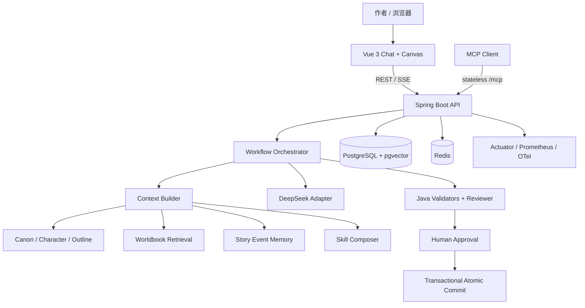

架构采用模块化单体：模块通过 application/service 与 domain 边界协作，数据仍在一个事务域内。前端用 REST 获取快照、SSE 获取增量；LLM 只能经适配器和 Agent Service 进入；最终写入由事务提交器完成。

## 7. 为什么不是一个 Prompt

单 Prompt 把检索、规划、写作、提取、审查和写回混在一次不可观测调用里，任何一步失败都难定位。拆阶段后，每步拥有输入、输出、状态、超时、错误和成本记录；Writer 专注文本，Extractor 专注结构化候选，Reviewer 专注风险，提交器只执行已批准变更。

## 8. StoryWeaver Workflow

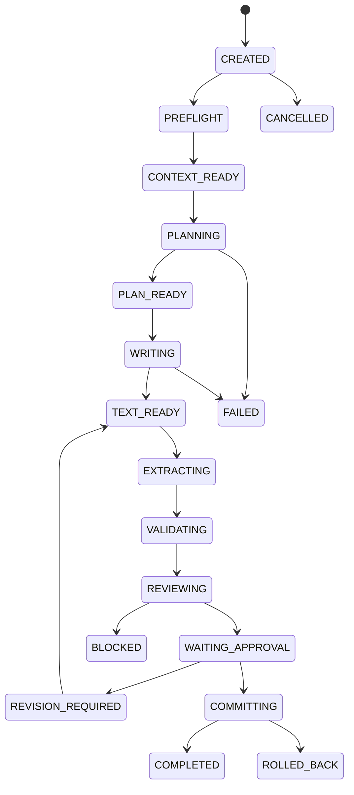

实际 `WorkflowStatus` 还包含恢复所需的 `BLOCKED/FAILED/CANCELLED/ROLLED_BACK`。Orchestrator 在每个关键阶段检查 Context 是否过期，Writer 通过流式回调发正文增量，状态变化通过 Workflow Event 暴露。

## 9. 为什么需要 Preflight

Preflight 在付费调用前检查项目归属、作者意图、章节/大纲、视角人物、前章确认、模型配置、必需 Skill、Token/项目/用户预算以及同项目并发运行。它把“跑到一半才发现缺条件”前移为结构化阻断，降低浪费和不完整草稿。

## 10. 为什么 Context 是独立阶段

Context 构建是可解释的业务决策，不应藏在 Agent Prompt 里。独立阶段可以保存选择报告、Token 估计、Skill 快照和过期时间，支持 UI 预览、失败复现和后续评测；默认 TTL 为 30 分钟，过期后不会继续审批提交。

## 11. Planner

Planner 接收渲染后的 Context Packet，输出结构化场景计划与推理结果，而不是直接写正文。它让章节目标、冲突、场景顺序和约束先变成可审查中间表示；配置为 reasoning 型调用，预算独立于 Writer。

## 12. Writer

Writer 以计划和相同上下文为输入，流式输出章节草稿。生产配置给 Writer 12,000 输出 Token 上限；流式失败会区分是否已经产出内容，只有可安全重试的场景才走 fallback，避免重复拼接不完整正文。

## 13. Extractor

Extractor 不改数据库权威状态，而从草稿中产生候选事实、人物状态变化、物品变更、时间线事件和知识变化。其结构化 JSON 经 Bean Validation 和业务 Validator 校验，最终呈现在审批界面。

## 14. 为什么 Writer 不能自己更新状态

自然语言生成与状态变更的正确性条件不同。Writer 擅长叙事，不适合承担幂等、外键、乐观锁、证据、时间线单调性和事务回滚。若边写边改，后文失败会留下半提交状态；因此 Writer 只能提议，提交器才能落库。

## 15. Reviewer

Reviewer 接收草稿、抽取结果、Java Issues 和 Context Packet，产出结构化 Review Issue。Issue 包含来源、类别、严重度、当前/历史证据、建议、是否阻断及解决状态。Reviewer 提供语义判断，但不替代确定性校验和人工审批。

## 16. 为什么不能全量 Context

全量上下文会同时增加费用、首 Token 延迟、无关信息干扰和冲突版本暴露。更重要的是，“全部放进去”并不保证模型关注关键规则。系统因此采用常量规则隔离、范围/可见性过滤、相关性检索、排序、Token 打包和 dropped reason 报告。

## 17. Context Packet

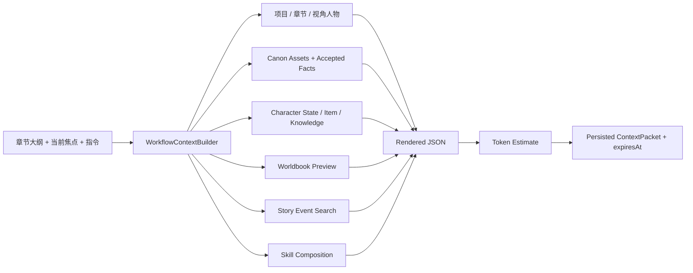

`ContextPacket` 持久化 `context_data/worldbook_report/memory_report/skill_snapshot` JSON、Token 估计、费用估计、创建与过期时间。前一章只放当前版本标题、摘要和版本号，而非全章正文；Accepted Facts、物品所有权和角色知识作为权威结构化状态进入。

## 18. Token Budget

当前限制包含每任务 40,000 Token、Writer 12,000 输出 Token、Planner reasoning 6,000 Token，以及用户日成本、项目累计成本。Worldbook 自身预算 4,000 Token。TokenEstimator 是估算器，评测也明确标注 `ESTIMATED_TOKEN_COUNT`，不能把它宣传为模型供应商精确计费值。

## 19. 为什么 RAG 不是越多越好

RAG 的目标不是召回最多，而是以有限预算保留所有 Required Context。候选过多会挤掉常量规则和核心事实；因此系统同时报告 selected、dropped、理由和 Token。评测用 All-Required Hit 与 Context Preservation 约束压缩收益，防止用删上下文换漂亮的成本数字。

## 20. 为什么需要 RAG

世界设定、地点、组织、术语随项目增长，不能全部常驻 Prompt。RAG 让章节任务只激活相关 Worldbook Entry；事件检索则以语义、参与者、地点、章节邻近和重要度组合搜索过去剧情，降低遗忘和状态混淆。

## 21. 为什么 Hybrid RAG

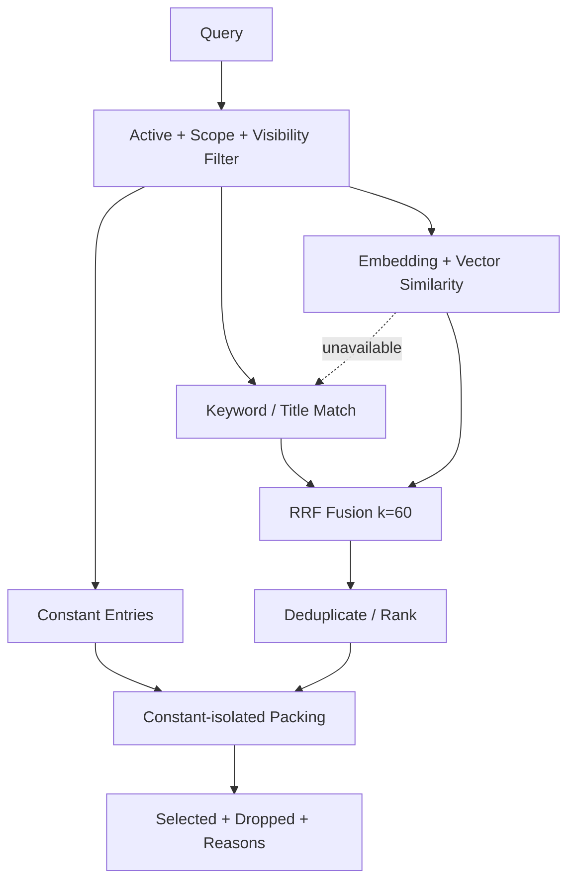

关键词擅长专名与精确触发，向量擅长同义与语义相关，Hybrid 用 RRF 避免直接混合不可比的原始分数。代码已实现 `BASELINE/CONSTANT_ISOLATED/KEYWORD_ONLY/VECTOR_ONLY/HYBRID_FUSION`。但当前 `application.yml` 默认是 `VECTOR_ONLY`、候选池 10、final K 无限、向量失败回退关键词；实验结论没有被伪装为默认配置。

## 22. PostgreSQL + pgvector

选择 pgvector 是因为业务实体、版本、归属和审批本来就需要关系数据库，向量和元数据放在同一事务/权限边界更简单。开发与集成测试使用 `pgvector/pgvector:0.8.6-pg18-bookworm`；离线 Eval 使用 exact cosine 内存仓库，所以报告不声称测过 pgvector ANN 性能。

## 23. Embedding

本地 `BAAI/bge-small-zh-v1.5` 经 DJL Tokenizer 与 ONNX Runtime 推理，最大截断 512，取首输出的 CLS 向量、校验 512 维并做 L2 归一化。模型不可用时 Gateway 返回明确原因并允许检索降级，不把原文或密钥写入日志。

## 24. Reranking

Worldbook 排序根据模式分别使用关键词比较器、向量比较器或 RRF；常量项与检索项隔离，按 ID 去重，再受 final ranking 和 Token budget 限制。当前没有 Cross-Encoder 二阶段重排，文档不把 RRF 叫作神经 Reranker。升级条件是现有 Recall 已不足且延迟/算力预算允许。

## 25. Worldbook Activation

激活先检查 `active`，再检查项目、章节/人物 Scope 与 Visibility，然后加入 `constantEnabled`、关键词或向量候选。`priority` 用于业务排序，选择结果记录命中来源；被过滤项可标为模式过滤、final limit 或 Token 截断，便于作者理解“为什么没进 Prompt”。

## 26. 为什么 RAG 不等于 Memory

Worldbook RAG 检索相对稳定的设定条目；Memory 搜索发生过的 Story Event；Canon/Accepted Fact 是权威真值；前章摘要提供叙事连续性。它们的更新频率、可信度、检索特征和写入门槛不同，合并成一个向量库会丢失语义边界。

## 27. Memory Layers

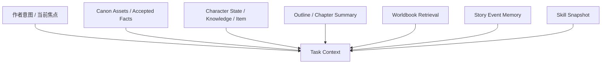

这些层不是简单的长短期缓存，而是不同可信度的上下文源。ContextBuilder 明确记录每层结果，避免模型把“检索到的候选”误当成“已经接受的事实”。

## 28. 为什么需要章节摘要

上一章全文可能数千到上万字，但续写通常只需要结局状态、未解冲突和关键事件。摘要降低 Token，同时给事件与结构化状态留预算。当前 ContextBuilder只加入前一章当前版本的标题、摘要和版本号；摘要为空时不能假设系统已自动补全。

## 29. Memory 与 Canon 的区别

Memory 回答“发生过什么、可能与当前任务相关什么”；Canon 回答“什么被作者确认为真”。Memory 可以检索多个事件并打相关性分，Canon 必须有版本和接受状态。事件可以是事实证据来源，但不自动升级为正典。

## 30. Canon 是什么

Canon 包含带版本的 Canon Asset、被接受的 Story Fact，以及经提交同步的人物状态、物品、事件和知识。它是下一轮 Context 的权威输入。项目中的 `CanonAsset` 具有版本链与确认/废弃操作；`StoryFact` 的实际状态枚举为候选、接受、拒绝，两套对象不要混称。

## 31. Candidate → Accepted / Rejected

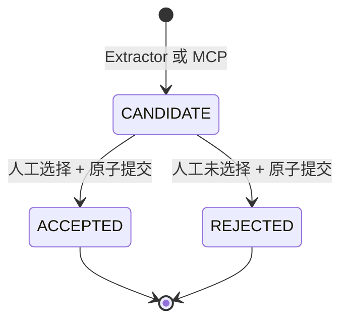

设计描述里常见 “Candidate → Confirmed”，但生产 `StoryFact` 使用 `ACCEPTED`。MCP `save_candidate_fact` 明确返回 `canonEffect=false`，LLM 永远不是最终真值源。事实必须带精确证据，重复请求可以用 request key 幂等。

## 32. Canon Version

Canon Asset、Chapter/ChapterVersion、CharacterState、WorkflowRun 等使用版本或乐观锁。版本号既防止两个页面互相覆盖，也让恢复/审批时能检测“审核期间状态已变化”。版本冲突返回结构化 Conflict，而不是静默 last-write-wins。

## 33. Atomic Commit

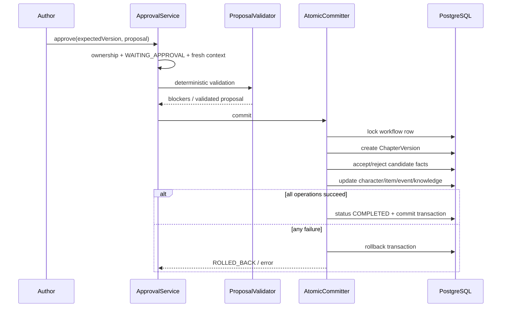

`WorkflowAtomicCommitter` 是 `@Transactional` 边界：校验用户、运行状态和 expectedVersion，锁定工作流行，再一次性写章节版本与结构化状态。故障注入测试用于证明中间失败不会留下半成品。

## 34. Character

人物基础卡存姓名、角色、描述、性格、背景、目标；运行状态单独保存生命状态、当前位置、身体/情绪、能力、物品说明、备注和版本。这让稳定身份与随剧情变化的状态拥有不同生命周期。

## 35. 为什么人物不能只有一张人物卡

一张大文本卡会混合“永久背景”和“第 37 章之后的状态”，更新难以定位，历史版本也难比较。拆分后，Writer 可看到稳定人物画像和当前状态；Validator 可以对位置、生命状态和 expectedVersion 做确定性检查。

## 36. Character Knowledge

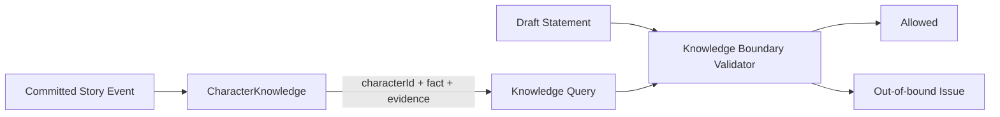

角色知识记录某人物知道的事实、来源事件和证据。Context 会按项目带入知识集合，MCP 也提供只读查询。提交新知识时必须验证来源事件属于同一项目且有证据。

## 37. 为什么角色知识越界难检查

“读者知道”不等于“角色知道”；同一事实可能由对话、目击或推理在不同章节传播。仅靠关键字无法判断知情路径。当前 Java Validator 能按视角人物和知识表发现明确越界，LLM Reviewer补充语义判断；复杂间接推理仍是已知限制。

## 38. Worldbook

Worldbook 是项目设定容器，Entry 带正文、关键词、优先级、Scope、Visibility、constant/vector 开关、Embedding 状态和乐观锁。作者可手工维护并预览激活结果，它不是后台自动吞噬所有文本的黑箱知识库。

## 39. World Tree

产品层的 World Tree 用于以层级视图组织世界观，但当前后端权威结构主要是 Worldbook/Entry 与 OutlineNode；不要把 UI 概念夸大为独立图数据库。未来若出现跨条目继承、关系查询和图遍历压力，再评估显式树/图模型。

## 40. Worldbook Manual First

Manual First 让作者决定哪些设定值得常驻、哪些只按范围检索。自动抽取只能生成候选，因为小说中的暧昧、误导和不可靠叙述不能直接当世界规则。好处是可控，代价是编辑成本；可以用候选建议降低成本，但不能取消最终确认。

## 41. Outline 层级

OutlineNode 支持项目内的层级大纲，章节也有直接 outline 字段。层级大纲负责卷、幕、章等长期结构，章节 outline 提供本轮 Writer 的近距离目标。两者共同进入规划相关服务，但正文版本不反向覆盖大纲。

## 42. 为什么 Outline 和正文分离

大纲是意图和约束，正文是某次实现。把两者存成一份文本会导致正文微调意外改变规划，或大纲改动覆盖已发布内容。分离允许滚动大纲、影响分析和分支试验，同时让章节版本保持可恢复。

## 43. Outline 与 Planner

Planner 把章节 outline、作者当前焦点、项目设定、前章摘要与检索上下文转成场景计划。它不会把 OutlineNode 当成不可变真理：作者仍可在审批前要求修订。长篇生产模块还包含 rolling outline、impact、branch、foreshadow、batch/gate 能力，用于跨章规划。

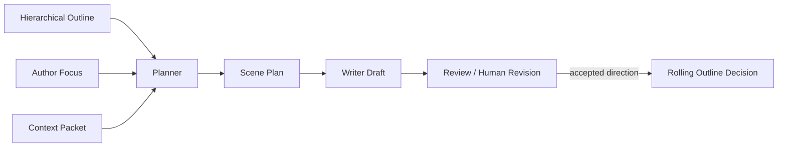

## 44. 为什么长篇最难的是 Consistency

长篇错误往往不是语法错误，而是跨几十章的约束冲突：已死亡人物出现、同一物品同时在两人手中、角色提前知道秘密、事件顺序倒置。它们需要历史状态、结构化证据和写入时不变量，而不只是更强语言模型。

## 45. Consistency Categories

生产确定性校验集中覆盖 `CHARACTER_STATE`、`ITEM_OWNERSHIP`、`TIMELINE`、`KNOWLEDGE_BOUNDARY`，并要求证据与同项目引用。Review Issue 还可承载更广的语义类别，但本文不声称 Java 已完整编码所有世界规则、文风或情节逻辑。

## 46. Java Validator

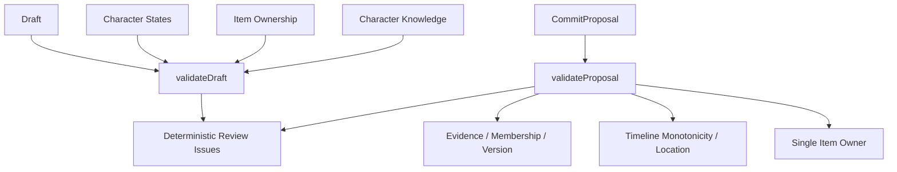

Java Validator 适合不容争辩的规则：引用必须属于项目、证据不能为空、同一物品不能出现重复所有者、时间线不能明显逆序、一个角色不能在同一时点多地出现、状态更新需 expectedVersion。它快速、便宜、可测试。

## 47. LLM Reviewer

LLM Reviewer 处理语义层风险，例如动机突变、因果跳跃、潜在知识越界和叙事不连贯。它接收 Java Issues 而不是重复造轮子，并以结构化 JSON 返回。模型判断可能误报/漏报，因此只生成 Issue，不能直接更改 Canon。

## 48. 为什么 Java + LLM Combined

组合策略把确定性和开放性分开：Java 保证硬不变量与证据契约，LLM 覆盖难形式化的语义。只用 Java 覆盖不足，只用 LLM 不稳定且昂贵。升级方向是用 Eval 持续把高频、明确的语义错误下沉为规则，同时保留 Reviewer 处理长尾。

## 49. BLOCKER

`blocking=true` 且未解决的 Review Issue 会阻止审批。BLOCKER 不是“模型觉得写得不好”，而应对应会破坏故事状态或无法安全提交的问题。审批服务还会把 Proposal Validator 的阻断结果合并进去，前端展示数量并要求先修订。

## 50. 为什么需要 Skill

Skill 把可复用的写作方法、题材约束、技法和审查规则从一次 Prompt 中抽离。项目可以组合基础、题材、技巧、Review 等 Skill，并在 Context Packet 中保存快照，使某次生成可复现，不受后来 Skill 修改影响。

## 51. Skill Contract

Skill 不是任意大段文字，而是带 slug、显示名、类型、版本、结构化 contract、验证结果和项目绑定的对象。Global Skill 与 Project Binding 分离，支持版本化、校验、测试、导入导出和删除边界。默认 Contract 只是起点，必须经用户审阅。

## 52. 为什么 Skill 不是一段 System Prompt

纯 System Prompt 无版本、无证据、难组合，也不能回答“本次实际用了哪个版本”。结构化 Skill 可以定义适用范围、规则、示例、禁用项和 Review 关注点，并在 Composer 中确定性合并；代价是需要 schema 与迁移维护。

## 53. Skill Forge

```mermaid
flowchart LR
  SRC["Manual Text / TXT Sources"] --> RIGHTS["Ownership Confirmation"]
  RIGHTS --> SNAP["Raw Source Snapshot + SHA"]
  SNAP --> SEG["Evidence Segmentation"]
  SEG --> CAND["Reusable Method Candidates"]
  CAND --> REVIEW["Human Evidence Review"]
  REVIEW --> CONTRACT["Skill Contract"]
  CONTRACT --> VERSION["GlobalSkillVersion"]
  VERSION --> BIND["Project Skill Binding"]
```

当前 Skill Forge 是 evidence-first 的 TXT/手写文本管线：最多 20 个文件、单文件 10 MiB、合计 20 MiB；手写文本 200—50,000 字符。服务保留原始 bytes、编码、哈希、来源顺序和证据，不在快照前重写。熔炼可排除人名、地点、情节事实，只保留可复用方法。

## 54. 为什么 Skill 熔炼要保留 Evidence

没有 Evidence 的“写作规律”不可审计，也容易把样本文中的人物和情节复制成所谓方法。证据让用户核对规则从何而来、是否越界、是否过拟合；来源所有权确认同时降低导入不当文本的风险。Evidence 不是授权证明，生产仍需合规策略。

## 55. Skill Overfitting

少量材料可能让规则过度模仿某作者、人物或固定情节。当前通过可复用方法开关、实体排除、来源描述、逐条证据与人工审查降低风险。更强方案是多来源对照、holdout 文本评测和相似度泄漏检查，当前尚未完整实现。

## 56. Project Skill Binding

项目绑定引用全局 Skill/Version，使复用资产与项目配置解耦。绑定时可选择基础 Skill 与动态模板上下文；运行时 Composer 生成 Skill Snapshot。好处是同一方法可多项目复用，代价是需要处理版本升级与旧运行复现。

## 57. 为什么加入 MCP

MCP 让外部 Agent 在统一契约下读取 StoryWeaver 状态，而不是给它数据库账号或要求复制内部 REST 细节。它适合“查询人物状态、知识、世界书、最近事件”和“保存带证据候选事实”这类边界清晰能力。

## 58. MCP Capabilities

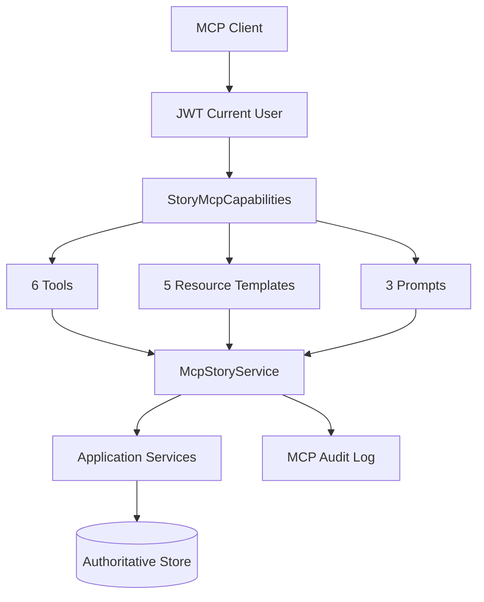

集成测试启动日志确认注册 6 Tools、5 Resource Templates、3 Prompts。Tools 为人物状态、人物知识、世界书、最近事件、物品所有者和保存候选事实；Resources 为作者意图、当前大纲、近期摘要、人物卡、人物知识；Prompts 为规划下一章、审查章节和查询故事状态。

## 59. 为什么 MCP 不能直接访问 Repository

Repository 绕过用户归属、领域校验、审计和候选边界。`McpStoryService` 只调用 Project/Character/Consistency/Worldbook/Event/Outline/Chapter 等 application service，并为成功/失败写审计。这样 REST 与 MCP 复用相同业务规则。

## 60. Tool Side Effect

MCP 注解声明 readOnly/destructive/idempotent/openWorld 提示。五个读取 Tool 无副作用；唯一写 Tool 只能保存 `CANDIDATE`，要求 content/evidence，可带 requestKey，返回 `canonEffect=false`。真正 Accept 仍需 Workflow 审批与事务提交。

## 61. 为什么 DeepSeek

项目当前针对 DeepSeek 的 Chat Completions、Thinking、reasoning content、SSE usage 和模型路由实现适配，以较低接入成本覆盖规划/写作/结构化输出。但业务层不直接依赖 HTTP 细节，未来替换供应商主要落在 Adapter/Agent 配置，而不是改 Canon 与 Workflow。

## 62. Model Routing

`DeepSeekAgent` 为不同角色定义模型、fallback、thinking、temperature、JSON、stream、timeout、max attempts 和 max output。Adapter 依据模型后缀区分并发信号量（pro 4、flash 8），首选失败且可重试时切 fallback。当前不是动态成本最优路由，也没有多供应商仲裁。

## 63. Thinking 模式

RequestFactory 在 thinking 打开时发送 `thinking.type=enabled` 与 `reasoning_effort`，关闭时才发送 temperature。这样避免互斥/不支持参数混用；`presence_penalty/frequency_penalty` 被明确列为忽略项。推理内容可用于诊断，但不能作为正典证据。

## 64. Structured Output

JSON Agent 设置 `response_format=json_object`；响应先检查空内容和 `finish_reason=length`，再反序列化 DTO 并执行 Jakarta Bean Validation。无效 JSON、schema violation 和截断均转成明确错误，可在允许时重试，避免把半截结构传给提交器。

## 65. Retry / Timeout

HTTP 请求使用 Agent timeout；408、429、5xx 判为可重试，指数退避叠加 jitter，最多次数由 Agent 配置。流式调用只在安全条件下切 fallback；已输出部分正文时不会盲目重跑造成重复。工作流事件另有 5 分钟等待超时和心跳/恢复周期。

## 66. Model Failure

未配置 API Key 在 Preflight/Adapter 明确失败；网络、HTTP、空 choices、无效 stream、JSON 不合法、schema 不合法、截断和中断都有不同错误码。失败记录只保留必要元数据，用户可以取消、修订或从持久化运行状态恢复，不把失败伪装成空成功。

## 67. Java 21

项目编译目标是 Java 21，使用 record、sealed-friendly DTO 风格、虚拟线程配置和成熟事务/安全生态。验证机实际 JDK 为 23.0.2，但 `pom.xml` 的产品基线仍是 21；不能因验证环境更高就把项目宣传为 Java 23。

## 68. 为什么不是全 Python

核心问题是事务、权限、状态机、并发版本和复杂业务对象，Java/Spring 在类型、Bean Validation、JPA/Flyway、Security、Actuator、Testcontainers 上形成完整工程闭环。Python 更适合实验/数据处理，但把主域切成 Python 会增加双栈契约与事务协调；当前 Eval 也复用 Java 生产逻辑而非复制算法。

## 69. Spring Boot

Spring Boot 提供 Web MVC、Security、JPA、Redis、Actuator、配置绑定、验证与测试切片。统一依赖注入让 Clock、Gateway、Repository 和 Observation 可替换测试。代价是启动与框架复杂度，适合当前中大型业务域而非轻量脚本。

## 70. Spring AI

项目使用 Spring AI 2.0.0 的 MCP Server 注解与自动配置，但 Chat/Embedding Provider 自动选择在 `application.yml` 设为 `none`。DeepSeek 与 ONNX Embedding 由自定义 Gateway 管理，以便精确支持供应商参数、SSE、降级和评测复用。

## 71. 为什么不让所有模块调用 ChatModel

模型调用集中在 llm/application 与 Workflow Agent 边界，否则任意 service 都能付费、泄露上下文或绕过预算/审计。集中化使模型健康、并发、重试、伪匿名 user_id、usage 和结构化校验具有单一实现。

## 72. PostgreSQL

PostgreSQL 承载用户、项目、版本、工作流、正典、世界书、事件、Skill、预算、审计和导入任务。关系约束适合强归属与原子提交，JSON 字段承载上下文快照/模型结构，向量扩展避免额外向量数据库。

## 73. pgvector

pgvector 用于 Worldbook/Story Event 等 embedding 相似查询。选择同库简化备份、开发 Compose 与测试容器；限制是大规模 ANN 调优尚未评测。当前离线报告的 exact cosine 只验证排序质量，不能外推线上吞吐。

## 74. Redis

Redis 作为缓存/运行协调基础设施，配置 2 秒超时，Compose 开启持久卷。核心权威状态仍在 PostgreSQL，因此 Redis 故障不应造成 Canon 丢失；具体依赖路径应按模块降级或返回可重试错误，而不是假设 Redis 永远可用。

## 75. 为什么当前不需要 Kafka

当前是单体、每项目默认同时一个活跃工作流、事件主要供一个作者 UI 实时观察，SSE + 数据库事件已满足。Kafka 会引入 broker、schema、重复消费和最终一致性成本。需要跨服务高吞吐、多消费者回放或独立扩缩容时再拆消息总线。

## 76. 为什么 SSE

生成过程主要是服务端单向推送文本块、步骤和心跳，SSE 具备 HTTP 语义、代理友好、事件 ID 和断线续接，比 WebSocket 更简单。命令仍走 REST，读写方向清晰。

## 77. SSE Events

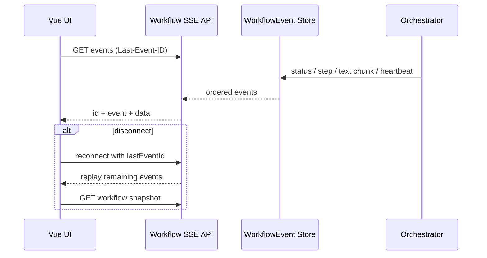

前端自实现增量 SSE Parser，支持 CR/LF、multi-line data、id、event、retry。workflow stream store 保存 lastEventId 和运行态草稿，最多重连 5 次，500ms 指数退避到 8s；每次断线后还获取工作流快照判断是否已终态。

## 78. 为什么 SSE 状态和正文都要流

只流正文会让用户不知道 Planner/Extractor/Reviewer 在做什么；只流状态则长时间看不到写作进度。两者同时流，使 UI 可展示 Stepper、心跳和实时草稿。持久化快照负责最终一致，SSE 只负责体验，避免断线即丢稿。

## 79. 为什么参考 ChatGPT Chat UI

对话区适合表达作者意图、系统反馈和工作流消息，用户认知成本低。但小说生产还需要可编辑长文、结构化状态和明确审批，所以只借鉴会话节奏，不复制“消息就是全部状态”的模型。

## 80. Chat + Canvas

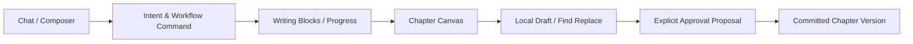

Workspace 页面在 Canvas 激活时形成约 45%/55% 双栏，左侧保留对话/工作流，右侧承载 WritingBlockCanvas 或 CanonCanvas。Canvas 不是聊天消息的放大版，而是用户编辑与版本确认空间。

## 81. 为什么 AI 不能直接覆盖 Canvas

直接覆盖会抹掉作者未保存编辑，且无法比较模型建议与当前稿。系统把流式输出保存为运行态 draft/writing block，用户在审批和本地修订流程中明确选择；提交时创建新的 ChapterVersion，而不是无痕覆盖。

## 82. 前端技术栈

Vue 3 Composition API + TypeScript + Vite 构建 SPA；Vue Router 管路由，Pinia 管 UI/运行态，TanStack Vue Query 管服务端快照，TipTap 管富文本，Element Plus 提供基础控件，ECharts 展示 Usage，Vitest/Playwright/axe 覆盖测试。

## 83. Pinia vs TanStack Query

Pinia 保存主题、工作区 UI、SSE 连接和运行态草稿等客户端状态；TanStack Query 保存项目、章节、工作流、Canon、Usage 等可从服务器重新获取的数据。审批/提交后 invalidation 或 fetch snapshot，避免在两个 store 复制服务端真值。

## 84. TipTap

TipTap 基于 ProseMirror，适合章节编辑、选择、高亮和可扩展命令。项目使用 StarterKit 与 Highlight。当前仍需注意正文 HTML/文本规范、版本 diff 和大文档性能；不能仅因引入 TipTap 就声称协同编辑已经实现。

## 85. Writing Block / Canvas

Writing Block 表达某次 Agent 生成块及其状态，Canvas 表达用户正在编辑的章节文档。`chapterDocument`、`draftStorage` 和 `paragraphKey` 提供本地文档、草稿与段落定位支持；提交边界仍以服务端 Workflow/ChapterVersion 为准。

## 86. 为什么需要 TXT 导入

真实作者已有大量旧稿，若只能从空项目开始，产品价值受限。TXT 导入把存量小说变成项目与章节版本，并保留来源哈希、编码、offset 和 parser version，为后续 AI 分析、续写和证据追踪提供基础。

## 87. TXT 导入 Pipeline

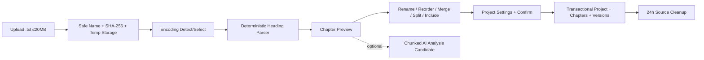

## 88. 为什么导入不依赖 LLM

章节标题识别、范围 offset、编码、预览和提交都可确定性完成，速度快、成本为零且可复现。LLM 分析是可选候选阶段，不阻塞基础导入；这样即使未配置 DeepSeek，用户仍能迁移作品。

## 89. 20MB 文件

后端限制 multipart 与 TXT 为 20MB，并采用临时文件、范围读取和按章节处理，避免把整本书长期放在堆内。文件仅允许 `.txt`，文件名去路径，记录 SHA-256；临时源默认保留 24 小时，每小时幂等清理。20MB 是工程保护值，不代表所有机器都能同延迟处理。

## 90. TXT → AI Analysis

导入 Job 具有 analysis 状态、处理 chunk 计数和 12,000 字符分析块配置。分析输出应继续作为候选，不能直接改项目设定/Canon。当前基础导入已由 API 集成测试覆盖；AI 分析质量不能用确定性解析测试代替。

## 91. 为什么普通测试不够

单元测试能证明排序器按公式运行，却不能回答 Dataset 上 Required Context 是否被召回；Controller 200 不能证明工作流到达正确终态；Schema 通过也不能证明冲突识别准确。因此项目将工程测试和 Agent Evaluation 分层：前者验证契约，后者验证能力基线。

## 92. Evaluation Harness

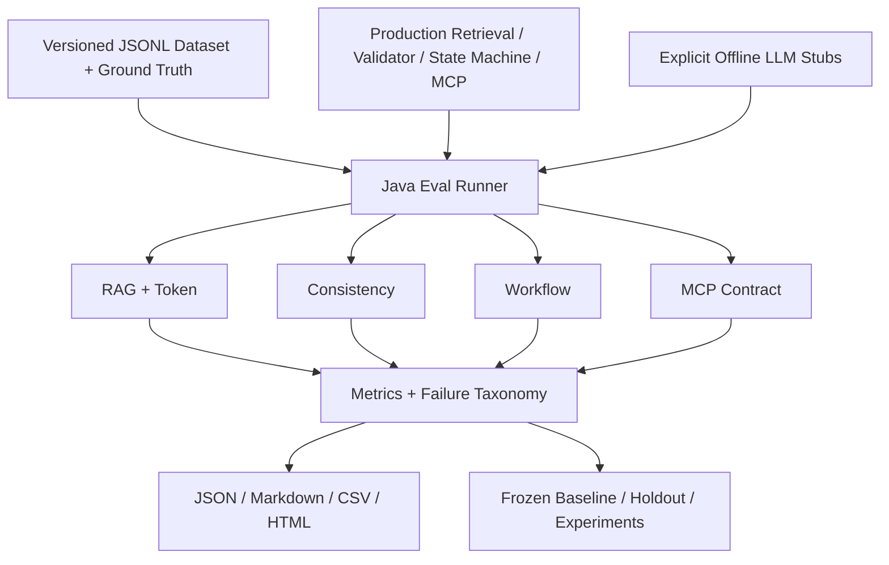

Harness 位于独立 `evals/`，Dataset 必须含 version、caseId、category、fixture、input、expected、tags、createdBy。默认 Offline 直接复用生产 WorldbookService、TokenEstimator、Java Validator、Workflow 状态机和 MCP Capability；Planner/Writer 等明确用 deterministic Stub。

## 93. RAG Recall@K

Recall@K 衡量 Relevant 资产在前 K 名被覆盖的比例，适合观察排序整体覆盖。2026-08-12 复跑的 v1 默认 Vector-only 为 R@1 63.5%、R@3 88%、R@5 93%、R@10 95.5%。仍有 5 个失败 Case，报告分类为 true retrieval miss，不能只报平均值。

## 94. Required Hit Rate

Relevant 可有可无，Required 是任务不可缺上下文。v1 默认配置 Required Hit@5/10 与 All-Required Hit@5/10 均为 100%；首次 holdout 的 All-Required@5 为 91.67%、@10 为 100%。这说明 top-10 更稳，也暴露 top-5 尚有泛化空间。

## 95. Token Reduction

Token Reduction 比较 Naive Full Context 与 Production Activation Context 的估算 Token。v1 默认为 78.59%，holdout 为 72.89%。这不是供应商账单节省的精确百分比，而是同一估算器下的相对压缩基线。

## 96. 为什么 Token Reduction 必须有 Quality Gate

删除所有上下文可以获得 100% reduction，却无法写作。Harness 因此同时要求 Context Preservation，v1 和 holdout 均为 100%，并报告 quality-preserving token reduction。任何优化若 Required Context 下降，不能被称作成功。

## 97. Consistency Eval

v1 有 100 个一致性 Case，直接实例化生产 Java Validator，计算 TP/TN/FP/FN、Precision、Recall、F1、clean pass 和 blocker recall。复跑结果均为 100%。它只证明该 Dataset 上的确定性规则，不代表 LLM Reviewer 泛化能力；未运行指标必须为 `null`。

## 98. Workflow Eval

14 个 Workflow Case 驱动生产 WorkflowRun/StateMachine，核对终态、必需步骤、结构化输出、取消、恢复和原子提交领域不变量。Workflow Engine、Atomic Commit、Recovery 均为 100%，但 Agent 输出是 Stub；真正数据库事务回滚另由 Testcontainers Integration Test 负责。

## 99. MCP Tool Eval

18 个 MCP Case 从注解发现生产 Capability，覆盖合法调用、参数错误、Not Found、权限、read-only、副作用和候选写入边界。Tool Success、Authorization Enforcement、Output Schema 均为 100%。这是进程内 Contract/Invocation Eval，不是 `/mcp` HTTP 压测。

## 100. 当前真实 Evaluation

| 范围 | 配置/规模 | 结果 | 真实性说明 |
|---|---|---|---|
| v1 RAG | VECTOR_ONLY，50 Case | R@5 93%，R@10 95.5%，MRR 1.0，5 fail | 本地 ONNX + exact cosine；非 pgvector ANN |
| v1 Token | 50 Case | Reduction 78.59%，Preserve 100% | 估算 Token |
| Consistency | 100 Case | Precision/Recall/F1/Blocker Recall 100% | Java Validator only |
| Workflow | 14 Case | Engine/Atomic/Recovery 100% | Offline Stub LLM |
| MCP | 18 Case | Tool/Auth/Schema 100% | 进程内，不含传输压测 |
| Holdout | 24 RAG + 24 Token | R@5 94.10%，R@10 98.61%，1 fail | first-run holdout |

实验矩阵显示：Baseline R@5 22%；Constant-isolated 58.5%；Keyword-only 69%；Vector-only 93%；Hybrid Fusion 93%。在当前 v1 上 Vector-only MRR/首位表现更好，因此生产默认选择 Vector-only；Hybrid pool 30 的失败数降到 3，但 Token reduction 下降到 73.89%，属于可讨论取舍。Live gate 未请求、未开启、无 Key、执行为 false，DeepSeek calls 为 0。

## 101. Unit Test

2026-08-12 `mvnw verify` 的 Surefire 阶段运行 19 个测试，覆盖 Canon、Consistency、Eval、TXT parser/storage、DeepSeek RequestFactory、Skill Composer、Workflow StateMachine 和 ArchUnit。前端 Vitest 为 18 个文件、49 个测试，全部通过。

## 102. Integration Test

Failsafe 运行 20 个集成测试文件，Testcontainers 启动 PostgreSQL 18/pgvector 与 Redis，Flyway 19 条迁移应用到 V16。覆盖 Infrastructure、Phase1—8、Demo、Skill Forge、TXT Import API 等；0 failure/0 error/0 skipped。该结果依赖本机 Docker 可用。

## 103. ArchUnit

`ModuleArchitectureTest` 含 5 条架构规则，约束模块依赖和分层边界，防止 Controller/Repository 随演进互相穿透。它把“模块化单体”从目录约定升级为可执行规则；规则仍需随新模块同步维护。

## 104. Contract Test

DeepSeek RequestFactory 单测验证 thinking/temperature/结构化参数，MCP Eval 验证注解和 schema，前端 API client/SSE/approval 测试验证浏览器端协议。完整 OpenAPI 自动契约生成尚不是当前证据，API 表应以 Controller/DTO 为准。

## 105. E2E

前端 `tests/e2e` 包含认证、项目、工作区、工作流、Skill Forge、TXT 导入、可访问性、键盘、视觉、性能与 Demo 等 Playwright 规范。此次文档核验未启动完整浏览器 E2E，因此只能写“用例存在”，不能写“本轮全量 E2E 通过”。

## 106. Eval 与 Test 的区别

Test 判断代码是否满足明确契约，通常是布尔；Eval 衡量能力质量，输出 Recall、F1、Token、失败分布与实验对比。Test 失败一般是回归，Eval 失败样本可能是产品能力边界，必须保留而不是删题。二者都要版本化，但不能互相冒充。

## 107. Docker Compose

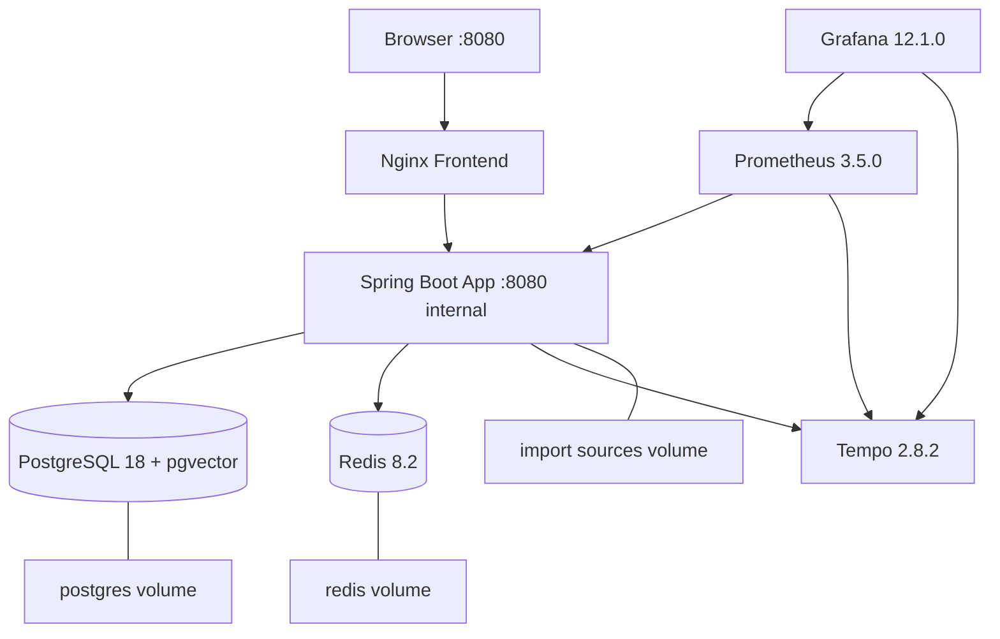

根 `compose.yaml` 编排 frontend、app、postgres、redis、tempo、prometheus、grafana，并持久化数据库、缓存、监控与导入源。2026-08-12 `docker compose config --quiet` 通过。Compose 默认值面向本地开发/演示，不是生产 Secret/TLS/HA 配置。

## 108. 为什么 Docker Compose

项目依赖数据库扩展、Redis 和可观测栈，手工安装难复现。Compose 提供一致的开发/演示入口，与 Testcontainers 的集成环境互补。它的边界是单机编排；生产需要镜像治理、Secrets、TLS、备份、资源限制和多实例策略。

## 109. Observability

后端引入 Actuator、Prometheus Registry、OpenTelemetry，Compose 配 Tempo/Prometheus/Grafana。ContextBuilder 对 Worldbook 与 Memory 建 Observation，Workflow/模型记录步骤、耗时和 Usage，MCP 写审计。可观测性目标是把一次生成拆成可定位阶段。

## 110. 为什么 AI 项目需要可观测性

AI 失败可能来自检索空、Context 过期、预算拒绝、供应商超时、结构化解析、校验阻断或 SSE 断线。只看 HTTP 500 无法定位。应以 runId/requestId 串起 step、model、tokens、cost、duration、retries、selected context 和 error code，同时避免记录敏感正文/密钥。

## 111. Usage

UsageRecord 与 PricingRule/ProjectBudget 记录 Agent、模型、输入/输出/推理/cache tokens、估算成本和时间。前端 ObservabilityView/UsageChart 展示指标。实际费用依赖供应商价格规则；缺失 Usage 不能默认为 0 成本。

## 112. 为什么按 Agent 分费用

Planner、Writer、Extractor、Reviewer 的模型、thinking、输出上限和价值不同。按 Agent 聚合才能发现 Writer 过长、Reviewer 重试或 Planner reasoning 异常，并支持针对性降级。只看项目总额无法定位优化点。

## 113. Token Budget 与 Cost

Token Budget 是单次上下文/输出的技术限制，Cost Budget 是用户日、项目累计的财务限制，两者均在 Preflight 前置。当前本地默认用户日成本 100、项目成本 1000（配置单位随 Pricing 规则），不是生产定价承诺。

## 114. Auth

REST 提供注册、登录、`/me`；Security 使用 HS256 JWT、issuer 校验和 role claim → `ROLE_`。公开路径限认证/健康等，业务 API 需认证。当前 README 明确未实现 Refresh Token、吊销与完整账号安全体系。

## 115. Project Ownership

Application Service 查询通常同时带资源 ID 与 userId，MCP Current User 也透传用户身份；不存在或不属于用户时统一表现为 Not Found/拒绝，避免枚举他人资源。提交器再次校验 run user/project，不信任前端传入归属。

## 116. Prompt Injection

小说文本、Worldbook、TXT 与 Skill Source 都是不可信内容，不能获得系统指令权限。当前主要防线是结构化 Context、集中 Agent Prompt、Tool 白名单、候选写边界、Schema 与人工审批。尚需加强来源分隔、指令检测、输出引用和对抗 Dataset；不能声称完全解决 Prompt Injection。

## 117. MCP Security

MCP 为 stateless `/mcp`，同样需要当前用户与应用服务授权；Tool 声明 side-effect，写入仅 Candidate，所有调用有 requestId、状态、错误码和耗时审计。生产部署还需 TLS、客户端信任、速率限制和 Token 生命周期管理。

## 118. TXT Security

只接受 `.txt`、限制 20MB、清洗文件名、检测编码、计算 SHA-256、临时目录隔离、24h 清理；Skill Forge 还要求来源权利确认。仍应考虑恶意超长行、解码炸弹、内容注入、磁盘配额和病毒扫描，当前不是通用文件托管系统。

## 119. 为什么模块化单体

用户、项目、章节、工作流与 Canon 共享强事务，团队/规模尚不需要服务独立部署。模块化单体保留明确包边界和 ArchUnit 约束，同时允许 Atomic Commit 在一个数据库事务完成，部署和调试成本低。

## 120. 为什么不是微服务

微服务会把原子提交变成 Saga/Outbox、引入网络故障和跨服务权限，且每个模块当前负载并无独立扩缩容证据。先把领域边界做实，比先拆进程更有价值。微服务不是架构成熟度标签。

## 121. 未来什么时候拆

当出现独立伸缩（Embedding/LLM Worker）、不同可用性目标、团队自治、部署节奏冲突、单库/单进程成为测得瓶颈时再拆。优先候选是异步模型执行与导入分析；Canon/Atomic Commit 应尽量保持单一权威事务域，或通过 Outbox 明确一致性。

## 122. 数据库完整设计

19 条 Flyway 从 baseline 到 V16 逐步加入 users/projects、Canon、Outline/Chapter、Character、Skills、Usage、Worldbook/Event、Workflow、Consistency/Atomic、MCP/Audit/Cost、Longform、Creation Preferences、Global Skill Forge、Dynamic Context、Roles 和 TXT Import。实体约 32 个，Repository 31 个；JSON 与关系字段混合建模。

## 123. Mermaid ER

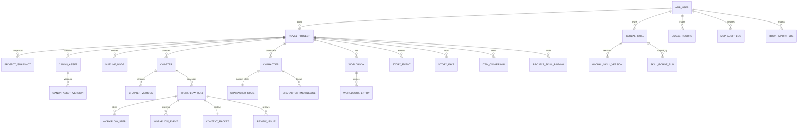

ER 图为了可读性省略关联表的全部字段。精确列、索引、约束和 vector 维度必须以 `backend/src/main/resources/db/migration` 为准。

## 124. REST API

REST 资源按 `/api` 分组：auth；projects/snapshots；canon assets；characters/state；outlines；chapters/versions/restore；worldbooks/entries/preview；story events/search；AI config/planner/writer/extractor/reviewer；workflows/start/status/cancel/revision/reextract/approve；consistency；imports/TXT import；branches/impact/foreshadow/rolling outline/batches/gates；global skills/forge/binding；usage/model health/MCP audit。写请求普遍带 DTO Validation 和 expectedVersion。

## 125. SSE API

Workflow Controller 提供按 runId 的事件流，前端以 `Accept: text/event-stream` 请求并携带 Last-Event-ID。事件包含有序 ID、类型与 JSON data，服务端发心跳；断线后以事件 ID 补流并用 GET Workflow 快照兜底。SSE 不承担审批命令，命令走 REST。

## 126. MCP Tools

六个 Tools 的准确名称是：`get_character_state`、`get_character_knowledge`、`get_worldbook_entries`、`get_recent_story_events`、`get_item_owner`、`save_candidate_fact`。只有最后一个写候选；它非 destructive、声明 idempotent，不能接受 Canon 状态参数。

## 127. DeepSeek Timeout

请求超过 Agent timeout 会进入 HTTP client 的中断/IO 错误路径；可重试且未产生不可安全重复的输出时按退避/fallback 处理。工作流标记失败并保留已持久化状态。用户应看到具体错误码和重试建议，而不是永远 loading。

## 128. Structured Output Invalid

空 content、`finish_reason=length`、malformed JSON、Bean Validation violation 分别产生结构化错误。Adapter 允许配置次数内重试；持续失败则 Workflow FAILED，不把默认空对象交给 Committer。可观测性应记录 schema 类型和模型元数据，避免记录敏感全文。

## 129. RAG Empty

若没有匹配 Entry，Worldbook Preview 可返回空 selected 与报告；Context 仍可由 Canon、状态、前章和 Skill 组成。若向量不可用，Vector/Hybrid 回退 Keyword-only。是否阻断取决于 Required Context/业务检查，不能编造检索结果。

## 130. pgvector Failure

创建/更新 Entry 时 Embedding 持久化失败会记录状态并允许业务降级；查询路径回退关键词。数据库整体不可用则不能继续权威工作流，应失败并重试，而不是用缓存提交 Canon。需要监控 embedding status 和 fallback rate。

## 131. Redis Failure

Redis 故障可能影响缓存或协调，但 PostgreSQL 仍是权威状态。安全策略应是可重建缓存降级、关键锁/幂等能力不可确认时拒绝写。当前没有以 Chaos Test 证明所有 Redis 故障路径，文档不作过度保证。

## 132. SSE Disconnect

前端保留 `lastEventId` 与运行态草稿，最多重连 5 次并获取 Workflow Snapshot；终态则停止，持续失败显示“事件流多次断开，运行态草稿已保留”。用户可手动 reconnect。断线不等于后端任务取消。

## 133. Writer Interrupted

流式 client 区分是否已产生 content；中断后保留草稿和运行状态，避免无条件 fallback 生成第二份拼接文本。恢复器依据 heartbeat/stale timeout 查找挂起运行。最终是否可继续需看状态机允许转换，不能直接跳到 Commit。

## 134. Reviewer Failure

Reviewer 失败时工作流不能进入可安全审批的完成态，因为语义 Review Issue 缺失。可以按 Adapter 策略重试，持续失败则 FAILED/BLOCKED 并提示用户。不能把 Java Validator 通过当成 Reviewer 已执行。

## 135. Atomic Commit Failure

任一章节版本、Fact、CharacterState、Item、Event 或 Knowledge 写入失败，事务整体回滚；Workflow 进入回滚/失败路径而非 COMPLETED。expectedVersion 与行锁防并发旧审批。用户应重新加载当前版本后再决定重提。

## 136. TXT Import Failure

错误码覆盖空文件、类型不支持、过大、编码无效、无文本、项目配置不完整、乐观锁冲突、已提交不可编辑和创建项目失败。Job 保存 FAILED/error，事务提交失败不会留下半个项目；过期临时源标记 `IMPORT_EXPIRED` 并取消未完成任务。

## 137. Feature Matrix

| 能力 | 当前状态 | 默认/证据 | 明确边界 |
|---|---|---|---|
| 项目/章节/人物/大纲/世界书 | 已实现 | REST + Flyway + Integration Test | 非多人实时协同 |
| 多阶段 Agent Workflow | 已实现 | 状态机、持久化 Step/Event、SSE | 真实模型需 API Key |
| Human Approval + Atomic Commit | 已实现 | Transactional Committer + Test | 不支持无审批写 Canon |
| DeepSeek Planner/Writer/Extractor/Reviewer | 已实现 | 自定义 Adapter、结构化校验 | Live Eval 未执行 |
| 本地中文 Embedding | 已实现/默认 | BGE-small-zh-v1.5 ONNX，512 维 | 不是外部 Embedding API |
| Worldbook Vector Retrieval | 默认启用 | VECTOR_ONLY topK 8/候选池10 | pgvector ANN 性能未评测 |
| Keyword fallback | 已实现 | 向量不可用降级 | 关键词 Preserve 在 v1 为 80% |
| Hybrid RRF | 已实现/非默认 | Eval experiment | 当前 v1 不优于 Vector-only MRR |
| Story Event 组合评分 | 已实现 | 语义/参与者/地点/章节/重要度 | 权重为配置，不是学习排序 |
| Java Consistency Validator | 已实现 | 100 Case Eval | 不覆盖所有文学逻辑 |
| LLM Reviewer | 已实现 | Workflow Agent | 无 Live quality 基线 |
| MCP | 已实现 | 6 Tools/5 Resources/3 Prompts | v1 无 HTTP 压测 |
| Skill Forge | 已实现 | Evidence-first + IT | 过拟合检测仍有限 |
| TXT 导入 | 已实现 | 20MB、解析/预览/编辑/提交 + IT | 只支持 TXT |
| Branch/Impact/Foreshadow/Rolling Outline | 已实现接口与领域能力 | Controller/迁移/前端页面 | 深度产品验证仍需继续 |
| Eval Harness | 已实现 | baseline/holdout/experiments/report | Offline Stub ≠ Live Agent |
| 可观测栈 | 已集成 | Actuator/Prometheus/Tempo/Grafana | 无生产 SLO/告警闭环 |
| Refresh Token / 吊销 | 未实现 | README 明示 | 生产前必补 |
| Kafka / 微服务 / Kubernetes | 未引入 | 架构决策 | 达到拆分条件再评估 |

## 138. Architecture Decision Matrix

| 决策 | 当前选择 | 关键收益 | 主要代价 | 替代方案与升级条件 |
|---|---|---|---|---|
| 系统形态 | 模块化单体 | 单事务、易部署、边界可测试 | 单进程伸缩 | 独立负载/团队/SLO 出现后拆服务 |
| 工作流 | 显式状态机 | 可恢复、可审计、可取消 | 状态更多 | 规模增大后评估 durable workflow engine |
| 实时通道 | REST + SSE | 单向流简单、可续传 | 不适合双向高频 | 协同编辑/高频双向时 WebSocket |
| 数据库 | PostgreSQL + pgvector | 关系/JSON/向量同域 | 超大向量规模受限 | 实测瓶颈后独立向量库 |
| 检索默认 | Vector-only + keyword fallback | v1/holdout 质量最佳 | 专名可能依赖模型 | 新 Dataset 显示 Hybrid 稳定收益再切 |
| Hybrid 融合 | RRF | 无需校准异构分数 | 非学习排序 | 数据量/标注足够时 learning-to-rank |
| Embedding | 本地 ONNX 中文模型 | 隐私、零调用费、离线可评测 | 模型固定/本机算力 | 质量不足时可插拔远程模型 |
| 一致性 | Java + LLM | 硬规则稳定、语义长尾灵活 | 两套维护 | 高频语义错误逐步规则化 |
| 正典写入 | Human Approval + Atomic Commit | 作者控制、无半提交 | 流程更慢 | 低风险操作可做可撤销批量审批 |
| 模型接入 | 自定义 DeepSeek Adapter | 参数/流式/错误精控 | 供应商代码需维护 | 多供应商需求后抽统一 ports |
| 前端状态 | Query + Pinia | 服务端/客户端职责清晰 | 学习成本 | 小型页面可只用 Query/local state |
| TXT 解析 | Deterministic first | 快、便宜、可复现 | 非标准标题需手改 | 可选 LLM 候选，不替代预览 |
| 消息系统 | 不引入 Kafka | 运维与一致性简单 | 异步扩展有限 | 多消费者/高吞吐/回放需求出现 |

## 139. 最重要的技术难点

第一，Context Engineering：从多种可信度数据源组装最小充分上下文，并让选择可解释、可评测。第二，状态安全：把自由文本中的候选变化转成带证据、版本、归属的 Commit Proposal。第三，长运行可靠性：SSE 断线、模型超时、恢复、取消和幂等必须与状态机一致。第四，真实性评测：把生产检索/Validator/MCP 纳入 Dataset，且严格区分 Stub 与 Live。第五，导入与 Skill 熔炼：处理大文本、编码、证据和版权边界。

解决方式不是堆 Prompt，而是建立 ContextPacket、Fact 状态、Java Validator、Review Issue、Approval Service、Transactional Committer、Workflow Event、Eval Harness 和版本化 Dataset。这些机制共同构成项目的工程难度。

## 140. 真正有价值的项目亮点

1. 把长篇写作建模为“状态化 Agent 系统”，不是聊天壳。
2. Writer 与状态写入彻底分离，模型只提议，作者审批后事务落库。
3. Canon、Character State、Knowledge、Item、Timeline 各自建模并有证据边界。
4. Context Packet 将 RAG、Memory、Skill、Token 与过期语义变成可持久化中间产物。
5. 本地中文 ONNX Embedding + pgvector + deterministic Eval，兼顾隐私和可复现。
6. 6 MCP Tools 的唯一写能力也只能落候选，体现工具副作用治理。
7. Eval 报告保留失败样本、holdout 与实验矩阵，不用删难题“优化”分数。
8. TXT 导入与 Skill Forge 把存量作品变成可追溯资产，而非一次性上传 Prompt。

## 141. 80 字项目介绍

StoryWeaver 是面向长篇小说的状态化 AI Agent 工作台，以多阶段 Workflow、按需 Context、RAG、Canon/人物知识建模、Java+LLM 一致性审查和人工原子提交，解决长篇续写中的遗忘、冲突、越权写回与不可评测问题。

## 142. 150 字项目介绍

StoryWeaver 将长篇创作从“一个 Prompt 生成正文”升级为可恢复、可审查的 Agent 生产系统。后端以 Java/Spring Boot 构建 Preflight、Context、Planner、Writer、Extractor、Reviewer、审批和原子提交链路；以 PostgreSQL/pgvector、Redis、本地中文 Embedding 管理 Canon、人物状态、角色知识、世界书和事件记忆；前端用 Vue Chat + Canvas、SSE 呈现过程。独立 Eval Harness 对 RAG、Token、一致性、Workflow 和 MCP 建立可复现基线。

## 143. 300 字项目介绍

StoryWeaver 是一个面向长篇小说生产的状态化 AI Agent 工作台。项目认为长篇创作的核心矛盾不是模型 Context Window 不够大，而是权威状态、任务相关上下文、角色知识边界和写回事务没有被系统化。为此，系统把生成拆成 Preflight、Context Build、Planner、Writer、Extractor、Java Validator、LLM Reviewer、Human Approval 与 Atomic Commit；Writer 只生成草稿，Extractor 只提交带证据候选，作者确认后才在单事务中创建章节版本并更新人物、物品、事件与知识。Worldbook 通过本地 BGE 中文 Embedding 和 pgvector 检索，生产默认 Vector-only、失败回退关键词，Hybrid RRF 作为已实现实验策略。前端以 Vue 3 Chat + Canvas 和可续传 SSE 展示工作流，TXT Import 与 Skill Forge 支持存量文本和证据化方法沉淀。独立 Eval Harness 直接复用生产检索、Validator、状态机与 MCP，对 Dataset、holdout、失败分布和 Token 质量门禁做离线评测；明确区分 Stub Workflow 与 Live Agent。

## 144. 5—7 条简历 Bullet

- 设计并实现长篇小说状态化 AI Agent Workflow，将规划、生成、结构化抽取、一致性审核、人工审批和事务提交解耦，支持持久化状态、SSE 进度、取消与恢复。
- 构建 Context Engineering 管线，融合 Canon、人物状态/知识、章节摘要、Worldbook、事件记忆与版本化 Skill Snapshot，并以 Token Budget 和过期语义控制上下文。
- 实现本地 `BAAI/bge-small-zh-v1.5` ONNX Embedding、pgvector 检索、关键词降级与 RRF Hybrid 实验；v1 默认 Vector-only 达到 R@5 93%、R@10 95.5%、Required@10 100%。
- 将 LLM 输出限制为带证据候选，使用 Java Validator + LLM Reviewer 发现人物、物品、时间线和知识边界问题，经人工审批后原子更新章节/正典状态。
- 基于 Spring AI MCP 暴露 6 Tools、5 Resources、3 Prompts，全部复用应用服务与 JWT 归属校验，唯一写 Tool 只能创建 `CANDIDATE`，并记录审计。
- 搭建独立 Agent Evaluation Harness，覆盖 50 RAG、50 Token、100 Consistency、14 Workflow、18 MCP Cases，保留 baseline/holdout/失败样本，默认零 DeepSeek 调用。
- 实现 20MB TXT 确定性导入与 evidence-first Skill Forge，保留编码、SHA、offset、parser version 和来源证据，支持预览编辑与事务建项。

## 145. 技术栈

后端：Java 21、Spring Boot 4.1.0、Spring AI 2.0.0、Spring Security JWT、Spring Data JPA、Flyway、Redis、Micrometer/Actuator、OpenTelemetry、MCP、DJL Tokenizer、ONNX Runtime。数据：PostgreSQL 18、pgvector 0.8.6。前端：Vue 3.5、TypeScript 5.9、Vite 8、Vue Router、Pinia、TanStack Query、TipTap、Element Plus、ECharts。测试：JUnit 5、Testcontainers、ArchUnit、WireMock、Vitest、Playwright、axe。部署：Docker Compose、Nginx、Prometheus、Tempo、Grafana。

## 146. 三分钟项目介绍

我做 StoryWeaver 的出发点是：长篇小说的失败并不只是上下文窗口不够，而是模型没有一个权威、可更新、可审计的故事状态。普通工具把历史全塞进 Prompt，成本越来越高，而且人物位置、物品所有权、角色知情范围和正文版本都混在自然语言里。

我的方案是把创作建成显式工作流。开始先做 Preflight，检查项目、人物、前章、Skill、模型和预算；ContextBuilder 再从项目、Canon、人物状态、前章摘要、Worldbook RAG、事件 Memory 和 Skill 组装持久化 Context Packet；Planner 产场景计划，Writer 流式写草稿，Extractor 把人物/物品/事件/知识变化转成带证据候选。Java Validator 检硬规则，LLM Reviewer 看语义，最后作者在前端选择候选，AtomicCommitter 用单事务创建章节版本并更新状态。

技术上我用 Java/Spring Boot 做模块化单体，因为这个领域需要强事务和清晰权限；PostgreSQL + pgvector 同时承载业务与向量；本地中文 ONNX Embedding 降低隐私和调用成本；Vue Chat + Canvas 配 SSE 展示实时过程。项目还做了独立 Eval，不只看单测：当前 v1 默认 Vector-only 的 R@5 是 93%、R@10 95.5%、Required@10 100%，Token Reduction 78.59%；报告明确 Workflow 是离线 Stub，未调用 DeepSeek。最核心的价值是把“模型会写”变成“系统能持续、安全地维护一部长篇作品”。

## 147. 五分钟深入版本

在三分钟版本基础上，进一步讲三个关键取舍。第一是 RAG：代码实现关键词、向量和 Hybrid RRF，但我没有因为 Hybrid 听起来高级就默认开启。实验中 Vector-only 与 Hybrid 的 R@5 都是 93%，Vector-only MRR 1.0、Hybrid 0.87，holdout 也稳定，因此生产默认 Vector-only，向量失败回退关键词；Hybrid pool 30 虽把失败数从 5 降到 3，却牺牲 Token Reduction，保留为决策选项。

第二是写回：模型不会直接更新 CharacterState 或 Canon。Extractor 输出 CommitProposal，Java 校验项目归属、证据、expectedVersion、单一物品所有者、时间线和知识来源，Reviewer 生成 Issue，未解决 BLOCKER 阻止审批。提交器锁 WorkflowRun 行，在一个事务中写 ChapterVersion、accept/reject Facts、更新人物/物品/事件/知识；故障注入与集成测试验证回滚。

第三是评测真实性：Offline Eval 直接调用生产 WorldbookService/Validator/StateMachine/MCP，但 Agent 用明确 Stub；向量用 exact cosine，所以不宣称 pgvector ANN 性能；Live gate 需要 `STORYWEAVER_EVAL_LIVE=true`，当前 Dataset 无人工确认的 Live Cases，因此调用数保持 0。这个边界比报一个漂亮的“AI 成功率”更重要。

## 148. STAR

**Situation：** 长篇 AI 写作随着章节增长出现设定遗忘、人物/物品状态冲突、角色知识越界，且全量 Prompt 成本高、生成失败不可恢复。

**Task：** 构建一个能持续生产章节、维护权威故事状态、支持人工控制并可量化评测的端到端系统。

**Action：** 用模块化单体建模 Canon/Character/Knowledge/Event/Workflow；实现 Context Packet、Vector/Keyword/RRF 检索、Agent 分阶段、SSE、Java+LLM Review、Approval 和 Atomic Commit；搭建 TXT/Skill 管线与 Eval baseline/holdout。
**Result：** 后端 19 单测与 20 集成测试、前端 49 单测和 lint/type/build 全通过；v1 R@5 93%、R@10 95.5%、Required@10 100%、Token Reduction 78.59%，Consistency/Workflow Stub/MCP 指标在当前 Dataset 为 100%，且 Live 调用为 0、失败样本完整保留。

## 149. 面试官追问

1. 为什么 Long Context 不能解决？
2. 为什么选模块化单体，不是微服务？
3. Writer 为什么不能直接更新 Canon？
4. Atomic Commit 如何避免半提交？
5. Vector-only 与 Hybrid 为什么选前者？
6. Recall@K 与 Required Hit 有什么区别？
7. 78.59% Token Reduction 是否等于省 78.59% 费用？
8. Java Validator 与 LLM Reviewer 如何分工？
9. Character Knowledge 如何阻止上帝视角？
10. SSE 断线如何恢复？
11. 为什么不用 WebSocket/Kafka？
12. pgvector 失败怎么办？
13. DeepSeek 返回非法 JSON 怎么办？
14. 如何防 Prompt Injection？
15. MCP 为什么安全？
16. Eval 为何不用真实模型？
17. Workflow 100% 能说明 Agent 可靠吗？
18. TXT 20MB 如何避免内存问题？
19. Skill Forge 如何防抄袭/过拟合？
20. 下一步最值得做什么？

## 150. 每题参考答案

1. **Long Context：** 它解决容量，不解决权威版本、状态更新、知识边界、写回事务和注意力噪声；需要外置状态与按需 Context。
2. **模块化单体：** 当前强事务多、负载没有独立伸缩证据，单体可完成 Atomic Commit；用包边界和 ArchUnit 防腐化，达到团队/SLO/吞吐条件再拆。
3. **Writer 写回：** 叙事生成不具备幂等、证据、外键和乐观锁保证；Writer 只能提候选，避免生成中断留下污染状态。
4. **Atomic：** `@Transactional`、Workflow 行锁、状态/用户/expectedVersion 检查，所有实体更新在同一事务；异常整体 rollback。
5. **检索选择：** v1 上 Vector 与 Hybrid R@5 同为 93%，但 Vector MRR 1.0、Hybrid 0.87；holdout 稳定，故默认 Vector，Hybrid 保留实验。
6. **指标：** Recall@K 看所有 Relevant 的覆盖，Required Hit 看任务不可缺条目是否出现；后者更接近 Context 安全门禁。
7. **Token：** 不是。它是 TokenEstimator 下相对压缩，实际费用还受模型价格、输出、cache 和 reasoning token 影响。
8. **Validator/Reviewer：** Java 管确定性硬规则，LLM 管语义长尾；前者可复现，后者生成 Issue 且不写 Canon。
9. **知识边界：** 为角色保存带来源事件和证据的 Knowledge，按视角校验草稿/Proposal；间接推理仍需 Reviewer 与更多 Dataset。
10. **SSE：** 保存 lastEventId、重连补流、指数退避、GET Workflow snapshot 兜底，运行态 draft 保留；断线不取消后端。
11. **WS/Kafka：** 当前主要单向流和单消费者，SSE 足够；无高吞吐多消费者/回放需求，Kafka 成本大于收益。
12. **pgvector：** Embedding/向量不可用回退关键词并报告原因；数据库整体故障则拒绝权威写入，不能用缓存冒充 Canon。
13. **非法 JSON：** 检空、截断、反序列化和 Bean Validation，允许安全重试/fallback，持续失败让 Workflow 失败，不传空结构。
14. **Injection：** 不可信内容结构化分区、Tool 白名单、集中 Prompt、候选边界、Schema、人工审批；仍需对抗 Eval 与更强来源标记。
15. **MCP：** JWT 用户、Application Service 归属校验、最小 Tool、副作用注解、写入仅 Candidate、审计；生产仍要 TLS/限流/Token 治理。
16. **Offline：** 默认要确定、零费用、可回归；真实模型只有显式 gate 和人工确认 Dataset 后运行，二者指标分开。
17. **100% Workflow：** 只说明 14 个 Stub Case 的状态机/领域不变量通过，不代表 Live Agent 文本质量；文档明确不混淆。
18. **TXT：** 限 20MB、临时文件、编码检测、offset 范围读取、逐章事务处理、24h 清理，不长期整本驻留内存。
19. **Skill：** 权利确认、原始证据/哈希、实体排除、只提可复用方法、逐条人工审查；多来源/holdout 泄漏检测仍待增强。
20. **下一步：** 优先建立人工确认 Live Dataset、对抗/失败 Dataset、RAG 线上延迟和 fallback 指标、生产安全/Secret/Token 生命周期，再谈微服务。

## 151. 当前不足

- Live Agent Eval 尚未建立人工确认 Dataset，`liveWorkflowSuccessRate` 为 `null`，不能量化真实模型质量。
- RAG 离线使用 exact cosine，尚无 pgvector ANN 的延迟、吞吐、索引召回和多租户规模测试。
- Java 一致性主要覆盖人物状态、物品、时间线、知识边界，复杂因果、世界规则与不可靠叙述仍依赖 Reviewer/人工。
- Refresh Token、吊销、生产 Secrets、TLS、速率限制、完整账号安全与管理员面板未完成。
- Compose 是本地/演示环境，没有 Kubernetes、多实例 Workflow 选主、生产备份恢复和 SLO 告警闭环。
- Conversation/Message 持久化 Chat API 未完成；当前 Chat + Canvas 重点是工作流交互，不是完整聊天平台。
- E2E 用例存在，但本轮未执行全量浏览器测试；可访问性和视觉基线需在 CI 持续运行。
- Skill Forge 的版权合规、相似度泄漏和跨来源泛化评测仍需增强。
- Redis/网络/磁盘等故障尚缺系统化 Chaos Test。

## 152. 下一步最值得做的 3—5 件事

1. **建立 Live Eval 最小闭环：** 人工确认 20—50 个不含敏感文本的 Agent Case，设置最大调用/成本、盲审 rubric，并与 Offline 指标分表。
2. **扩充失败与对抗 Dataset：** 把现有 5 个 v1 miss、1 个 holdout miss，以及知识越界、Prompt Injection、半流式中断固化为 regression cases。
3. **做生产检索基准：** 在真实 pgvector 容器中测不同规模、索引、候选池、p95/p99、fallback rate 和 Required@K，再决定 Hybrid/重排升级。
4. **补生产安全与可靠性：** Secret Manager、TLS、Refresh/吊销、限流、备份恢复、多实例幂等/恢复、磁盘配额与告警。
5. **加强作者生产体验：** ChapterVersion diff、候选证据定位、批量可撤销审批、Outline/Canon 影响可视化和更稳的大文档编辑。

## 153. StoryWeaver 最核心价值

StoryWeaver 的核心不是“让模型写得更像人”，而是给模型建立一个可被作者控制的生产制度：输入是经过选择和版本化的上下文，输出先成为候选，风险经过确定性与语义审查，最终变化在一个事务中进入权威状态。它把一次性生成转成可持续维护的长篇工程。

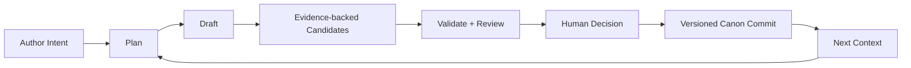

## 154. 如果只能给面试官展示一个功能

展示“生成一章并原子审批”的完整链路：先在 Preflight 看系统拒绝缺前章/预算/模型的请求；再展示 Context Preview 中 Worldbook selected/dropped、Memory、Skill Snapshot 和 Token；观察 Planner/Writer/Extractor/Reviewer 通过 SSE 推进；故意构造一个物品双重所有权或角色知识越界 BLOCKER；在审批面板选择 Candidate Fact、查看证据，修复后提交；最后展示 ChapterVersion、Accepted/Rejected Facts、CharacterState/Event/Knowledge 在同一事务变化，并通过故障注入证明失败全部回滚。这个功能一次性说明了 Context Engineering、Agent Workflow、Consistency、Human-in-the-loop 与事务可靠性，是项目区别于聊天壳的最强证据。

---

## 附录 A：本轮可复现验证记录

验证日期：2026-08-12，Asia/Shanghai。所有 Live 模型门禁保持关闭。

| 命令/环境 | 结果 |
|---|---|
| `backend\\mvnw.cmd verify` | BUILD SUCCESS；Surefire 19 tests，Failsafe 20 tests，全部 0 failure/error/skipped；Spotless 通过 |
| Testcontainers | Docker Desktop 29.6.2；PostgreSQL 18.4/pgvector 与 Redis 8.2 容器启动；19 migrations 到 V16 |
| `docker compose config --quiet` | 通过 |
| Frontend Docker build stage（Node 24 Alpine + pnpm 10.30） | `pnpm build` 通过 |
| `pnpm lint` | 通过，0 warning gate |
| `pnpm typecheck` | 通过 |
| `pnpm test:unit` | 18 files / 49 tests passed |
| `evals\\run-evals.cmd all` | 通过；frozen baseline/holdout hash verified；DeepSeek 调用 0 |

本机直接执行前端命令会遇到 Node 22/pnpm 11 与项目要求 Node 24/pnpm 10 不匹配，因此验证使用项目 Dockerfile 的 Node 24 build stage，不修改 `package.json` 或全局环境。

## 附录 B：关键配置速查

| 配置 | 当前默认 |
|---|---|
| Context TTL | 30 分钟 |
| Workflow stale timeout | 15 分钟 |
| Heartbeat / recovery scan | 15 秒 / 30 秒 |
| Workflow event timeout / poll | 5 分钟 / 250ms |
| Max active run per project | 1 |
| Task / Writer / Planner reasoning budget | 40,000 / 12,000 / 6,000 tokens |
| Worldbook token budget / topK | 4,000 / 8 |
| Retrieval mode / candidate pool / RRF k | VECTOR_ONLY / 10 / 60 |
| Event score weights | semantic .5 / participant .2 / location .1 / chapter .1 / importance .1 |
| Embedding | BAAI/bge-small-zh-v1.5，512 维，max length 512 |
| Skill Forge | 20 files；10 MiB/file；20 MiB total；manual 200—50,000 chars |
| TXT Import | 20MB；24h retention；1h cleanup；5,000 preview；12,000 analysis chunk |
| Frontend SSE reconnect | 最多 5 次；500ms 指数退避；上限 8s |

## 附录 C：事实来源索引

- Workflow：`workflow/application/WorkflowOrchestrator`、`WorkflowContextBuilder`、`WorkflowApprovalService`、`WorkflowAtomicCommitter`、`workflow/domain/WorkflowStateMachine`。
- RAG：`worldbook/application/WorldbookService`、`WorldbookRetrievalRanker`、`LocalOnnxEmbeddingGateway`、`application.yml`。
- Consistency：`ConsistencyValidatorEngine`、`StoryFact`、`CharacterKnowledge`、`ItemOwnership`、`ReviewIssue`。
- LLM：`DeepSeekAdapter`、`DeepSeekHttpClient`、`DeepSeekRequestFactory`、`DeepSeekAgent`。
- MCP：`StoryMcpCapabilities`、`McpStoryService`、MCP audit domain/application。
- TXT/Skill：`TxtBookImportService`、`TxtChapterParser`、`SkillForgeService` 与 V11—V16 migrations。
- Frontend：`useWorkflowEventStream`、`SseParser`、workflowStream store、WorkflowApprovalPanel、Workspace/Canvas components。
- Eval：`evals/README.md`、`evals/AGENTS.md`、`evals/reports/latest/summary.json`、holdout 与 experiments matrix。

## 附录 D：术语边界

- **Canon Asset 的确认/废弃** 与 **Story Fact 的 ACCEPTED/REJECTED** 是不同状态系统。
- **Memory** 是可检索事件，不等于权威 Canon。
- **Hybrid RAG** 已实现且可配置，不等于生产默认。
- **Atomic Commit 100%（Eval）** 是 14 个 Offline Workflow Case 的领域不变量，不等于真实数据库事务；数据库回滚由 Integration Test 补证。
- **Workflow Success 100%** 是 Stub LLM，不等于 Live Agent 质量。
- **Token Reduction** 是估算器相对值，不等于账单节省。
- **MCP Contract Eval** 是进程内调用，不等于 Streamable HTTP 性能测试。

---

文档维护规则：任何状态名、默认检索模式、迁移数量、测试数量或评测指标变化，都应先更新对应代码/报告，再更新本文。失败 Case 不得为了美化数字而删除。
