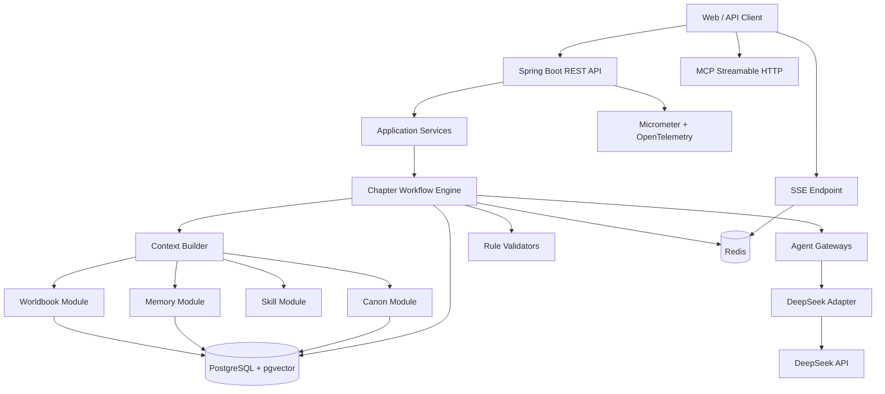

# StoryWeaver / 文脉
## Codex 后端实施设计文档（DeepSeek API + Docker + Roadmap +《龙族》模板演示）

> 文档版本：V1.2 Dragon Template Edition  
> 编写日期：2026-07-31  
> 文档用途：放置于项目仓库根目录，作为 Codex 分阶段开发的唯一实施规格  
> 项目类型：长篇小说创作 Agent 后端  
> 开发目标：8 周内完成可运行、可测试、可演示、可写入简历的 MVP  
> 前端范围：本稿不实现前端，只定义 REST、SSE 与 MCP 边界  
> Java：21  
> Spring Boot：4.1.0  
> Spring AI：2.0.0  
> LLM：DeepSeek V4 API  
> 数据库：PostgreSQL 18 + pgvector 0.8.6  
> 缓存与运行态：Redis 8.2  
> 架构：模块化单体  
> 部署：Dockerfile + Docker Compose  

---

# 0. Codex 总执行规则

Codex 必须先完整阅读本文件，再开始修改代码。

## 0.1 分阶段实施

必须严格按照 Phase 0—Phase 8 开发，不得一次性生成整个项目。

每个 Phase 都必须完成以下动作：

1. 阅读本阶段目标；
2. 列出准备新增和修改的文件；
3. 实施代码；
4. 执行格式检查；
5. 执行 `./mvnw clean verify`；
6. 执行本阶段集成测试；
7. 修复全部失败；
8. 输出阶段报告；
9. 等待人工确认后进入下一阶段。

禁止为了“看起来完成”而跳过测试、注释失败用例或删除断言。

---

## 0.2 真实性要求

禁止：

- 用固定字符串冒充 DeepSeek 响应；
- 用内存集合冒充 PostgreSQL；
- 用普通关键词 List 冒充 pgvector；
- 将多个 Prompt 改名为多 Agent，却没有独立输入输出和工作流状态；
- 把普通 REST 接口称为 MCP；
- 在同一事务中调用 LLM；
- 在 README 中把 Roadmap 写成已实现；
- 未经测试填写性能和准确率数字。

允许在测试中使用 Stub、Fake、WireMock，但必须位于测试目录或 `stub` Profile。

---

## 0.3 模块访问规则

Controller 只能访问本模块 Application Service。

禁止：

```text
Controller → Repository
Workflow → 其他模块 Repository
MCP Tool → Repository
Review → DeepSeek Client
Chapter → Worldbook Repository
```

正确形式：

```text
Controller
→ Application Service
→ Domain Service
→ Repository

模块 A
→ 模块 B 的公开 Facade
```

---

## 0.4 LLM 调用边界

只有 `llm` 模块可以直接依赖：

- Spring AI `ChatModel`；
- Spring AI `StreamingChatModel`；
- DeepSeek API Client；
- DeepSeek 请求和响应 DTO。

其他模块只能依赖以下端口：

```text
PlannerGateway
WriterGateway
ExtractorGateway
ReviewerGateway
EmbeddingGateway
```

---

## 0.5 模型输出不可信

所有结构化模型输出必须经过：

```text
JSON 解析
→ Java Record 映射
→ Bean Validation
→ 枚举校验
→ 项目实体引用校验
→ 原文证据校验
→ 业务规则校验
→ 置信度门禁
```

模型不得直接修改确认版正典。

---

## 0.6 数据与安全

- DeepSeek API Key 只从环境变量或 Secret 读取；
- 不将 Key 写入 Git、Docker 镜像或日志；
- 生产环境默认不保存完整 Prompt；
- 生产环境默认不记录完整小说正文；
- 每个项目操作必须校验当前用户所有权；
- DeepSeek `user_id` 使用 HMAC 后的匿名业务 ID；
- MCP 写操作只能写入候选事实；
- 用户修改正文后必须重新提取和审查；
- 所有费用均使用 `BigDecimal`；
- 所有时间均使用 `Instant`；
- 所有业务 ID 使用 UUID；
- Flyway 是数据库结构唯一来源。

---

## 0.7 Java 规范

- Java DTO 使用 `record`；
- JPA Entity 使用普通 class；
- 禁止 Entity 使用 Lombok `@Data`；
- Controller 不写业务逻辑；
- 统一使用 RFC 9457 Problem Details；
- Repository 不向 Controller 暴露；
- 不使用 `catch (Exception)` 静默吞错；
- 外部请求必须设置连接、读取和总超时；
- 状态修改必须有乐观锁或业务锁；
- 异步任务必须包含幂等键；
- 日志使用参数化方式，不字符串拼接敏感内容；
- 代码注释解释“为什么”，不重复代码本身。

---

# 1. 项目目标

## 1.1 需要解决的问题

普通长篇小说生成流程通常是：

```text
用户要求
→ 拼接最近正文
→ 调用模型
→ 返回下一章
```

随着章节增多，容易发生：

- 人物性格和状态漂移；
- 角色知道自己不应知道的信息；
- 唯一道具同时归属于多人；
- 时间线矛盾；
- 世界硬规则失效；
- 伏笔或历史事件被遗忘；
- 上下文无限增长；
- Token 与费用失控；
- 正文保存成功但状态结算失败；
- 无法解释模型为什么使用某条设定。

StoryWeaver MVP 聚焦：

> 通过动态世界书、分层记忆、角色知识边界、确定性校验和章节原子提交，让 DeepSeek 能稳定参与长篇续写。

---

## 1.2 MVP 主流程

```text
创建项目
→ 创建作者意图
→ 创建人物卡和世界规则
→ 创建章纲
→ 配置写作 Skill
→ 发起章节工作流
→ 写前预检
→ 激活世界书
→ 检索历史事件
→ 构建 Canonical Context Packet
→ Planner 生成场景计划
→ Writer 流式生成正文
→ Extractor 提取摘要、事件和候选事实
→ Java 规则校验
→ Reviewer 语义审查
→ 人工确认或局部修订
→ 章节正文与状态原子提交
```

---

## 1.3 MVP 必须实现

- 用户登录与项目隔离；
- 项目、正典资产、人物、大纲、章节和版本；
- Planner、Writer、Extractor、Reviewer 四个 Agent 节点；
- DeepSeek 非流式和 SSE 流式调用；
- 世界书常驻、关键词和向量激活；
- 最近章节、故事事件和正典状态三类记忆；
- 基础、项目、章节三级写作 Skill；
- 人物状态、道具、时间线、角色知识四类一致性检查；
- SSE 任务进度与正文流；
- 工作流恢复、取消和幂等；
- Token、缓存命中和费用统计；
- Story Project MCP Server；
- Dockerfile、Docker Compose、健康检查和持久化卷；
- 单元、集成、架构、契约和 AI 评测。

---

## 1.4 明确不做

- 短篇工作流；
- 扫榜和浏览器自动化；
- 封面生成；
- 多人协同编辑；
- Kafka；
- Neo4j；
- 通用 Mod 商店；
- 自动发布小说平台；
- 模型微调；
- 自动连续生成数百章；
- 精确复刻在世作者风格。

---

## 1.5 演示小说模板：《龙族》式现代校园幻想

本文档中的后端演示数据与评测样例统一使用《龙族Ⅰ·火之晨曦》的公开角色名、组织名和世界观名词，和前端 `V1.3 龙族模板演示版` 保持一致。

该模板只用于展示：

- 人物状态；
- 角色知识边界；
- 世界书激活；
- 故事事件检索；
- 唯一道具校验；
- 时间线校验；
- 章节工作流；
- DeepSeek 结构化输出；
- SSE 与费用统计。

不得在仓库中内置原著正文、长段摘录或可替代原作的内容。

### 演示项目

```text
项目名：龙族Ⅰ·火之晨曦
题材：现代都市 / 校园 / 龙族幻想
当前故事阶段：青铜城行动
核心任务：路明非进入卡塞尔学院后，逐步卷入屠龙任务
```

### 核心人物

```text
路明非
楚子航
陈墨瞳（诺诺）
恺撒·加图索
昂热
芬格尔
```

### 核心组织

```text
卡塞尔学院
秘党
学生会
狮心会
执行部
装备部
```

### 核心世界书条目

```text
龙族与混血种
血统评级
言灵
龙文
炼金术
尼伯龙根
青铜城
青铜与火之王
七宗罪
```

### 演示数据原则

- 所有示例章节号均为产品测试编号，不与原著目录逐章对应；
- 人物、世界书、大纲和章节均允许用户手动修改；
- AI 生成数据默认进入 `CANDIDATE`；
- 角色知识必须区分 `CONFIRMED`、`REPORTED`、`SUSPECTED` 和未知；
- 演示数据不得进入公共模板市场或公共训练集；
- 必须提供“一键删除演示项目”和“创建原创项目”能力。

---

# 2. 当前官方能力基线

## 2.1 DeepSeek API

OpenAI 兼容 Base URL：

```text
https://api.deepseek.com
```

Chat Endpoint：

```text
POST /chat/completions
```

当前模型标识：

```text
deepseek-v4-flash
deepseek-v4-pro
```

当前 API 能力：

- 思考与非思考模式；
- `reasoning_effort=high|max`；
- SSE 流式输出；
- JSON Object 输出；
- Tool Calls；
- 上下文缓存；
- `user_id` 隔离；
- 1M 上下文；
- 最大 384K 输出。

应用不得按模型最大上下文直接发送 1M Token，MVP 应设置更小的业务预算。

---

## 2.2 DeepSeek 参数规则

### 思考模式

请求：

```json
{
  "thinking": {
    "type": "enabled"
  },
  "reasoning_effort": "high"
}
```

可选推理强度：

```text
high
max
```

思考模式默认开启。

在思考模式中，不使用以下参数控制行为：

```text
temperature
top_p
presence_penalty
frequency_penalty
```

---

### 非思考模式

写作节点使用非思考模式：

```json
{
  "thinking": {
    "type": "disabled"
  },
  "temperature": 0.78
}
```

只调整 `temperature` 或 `top_p` 之一，默认只调整 `temperature`。

---

### 已废弃参数

DeepSeek 当前已废弃：

```text
frequency_penalty
presence_penalty
```

跨供应商配置对象可以保留字段，但 DeepSeek Adapter 必须：

- 标记不支持；
- 不发送到 DeepSeek；
- 在模型配置预览中显示忽略原因；
- 对开发者日志输出一次低频警告。

---

### JSON 输出

启用：

```json
{
  "response_format": {
    "type": "json_object"
  }
}
```

Prompt 必须明确要求输出 JSON，并给出结构示例。

如果出现：

- 空内容；
- 只有空白；
- JSON 截断；
- `finish_reason=length`；

必须进入结构化输出恢复流程，不能直接写库。

---

### Tool Calls

DeepSeek 只生成工具调用意图，Java 负责：

- 校验工具名；
- 校验参数 Schema；
- 校验项目权限；
- 执行工具；
- 记录审计；
- 决定是否继续下一轮。

---

### user_id

每个 DeepSeek 请求传递：

```text
sw_<HMAC(userUUID) 的短字符串>
```

不得包含：

- 姓名；
- 邮箱；
- 手机号；
- 真实数据库 UUID；
- 小说标题。

---

## 2.3 DeepSeek 缓存与费用

DeepSeek 上下文缓存默认工作。为提高命中率，Prompt 应将稳定内容放在前部：

```text
系统规则
→ Agent 角色
→ 输出契约
→ 作者意图
→ 世界硬规则
→ 稳定 Skill
→ 动态章节上下文
```

记录：

```text
prompt_tokens
completion_tokens
reasoning_tokens
prompt_cache_hit_tokens
prompt_cache_miss_tokens
```

价格可能变化，禁止在 Java 常量中写死。

价格配置保存：

```text
模型
缓存命中输入价
缓存未命中输入价
输出价
生效时间
币种
```

---

## 2.4 Spring 版本

采用：

```text
Spring Boot 4.1.0
Spring AI 2.0.0
```

Spring AI 2.0.x 官方支持 Spring Boot 4.0.x 和 4.1.x。

必须通过 Spring AI BOM 管理 AI 相关依赖版本，禁止手动混用 1.x 和 2.x。

---

## 2.5 数据与容器版本

建议固定：

```text
PostgreSQL 18
pgvector 0.8.6
Redis 8.2
```

Docker 镜像：

```text
pgvector/pgvector:0.8.6-pg18-bookworm
redis:8.2-alpine
```

生产发布时应固定镜像 Digest；本地设计稿先固定 Tag。

---

# 3. 技术架构



---

# 4. 架构决策

## 4.1 模块化单体

首版不拆微服务。

理由：

- 一个人开发；
- 正文与状态需要本地事务；
- 部署和调试简单；
- 避免分布式事务；
- 仍可通过模块边界保留后续拆分能力。

业务模块：

```text
auth
project
canon
outline
chapter
character
worldbook
memory
skill
workflow
llm
review
usage
mcp
shared
```

---

## 4.2 Web 技术

采用：

```text
Spring MVC
Java 21 Virtual Threads
JPA
SseEmitter
```

DeepSeek 流式 Adapter 内部可使用 `WebClient` 或 Spring AI Streaming API，但不得让 `Flux` 泄漏到领域层。

理由：

- 业务持久化使用 JPA；
- 原子提交需要同步事务；
- 避免全响应式体系中混用阻塞 JPA；
- Virtual Threads 能简化外部 I/O 并发；
- SSE 使用 `SseEmitter` 足够满足 MVP。

---

## 4.3 异步任务

MVP 不引入 Kafka。

采用：

```text
workflow_run 表
workflow_event 表
Virtual Thread Executor
Spring Application Event
定时恢复 Worker
Redis 运行态缓存
```

数据库保存任务真相，Redis 只提升流式事件和状态读取速度。

---

# 5. 项目目录

```text
storyweaver-backend/
├── CODEX.md
├── README.md
├── pom.xml
├── mvnw
├── mvnw.cmd
├── Dockerfile
├── compose.yaml
├── .dockerignore
├── .env.example
├── docs/
│   ├── architecture.md
│   ├── deepseek.md
│   ├── api.md
│   ├── database.md
│   ├── evaluation.md
│   └── adr/
├── src/
│   ├── main/
│   │   ├── java/com/storyweaver/
│   │   │   ├── StoryWeaverApplication.java
│   │   │   ├── shared/
│   │   │   ├── auth/
│   │   │   ├── project/
│   │   │   ├── canon/
│   │   │   ├── outline/
│   │   │   ├── chapter/
│   │   │   ├── character/
│   │   │   ├── worldbook/
│   │   │   ├── memory/
│   │   │   ├── skill/
│   │   │   ├── workflow/
│   │   │   ├── llm/
│   │   │   ├── review/
│   │   │   ├── usage/
│   │   │   └── mcp/
│   │   └── resources/
│   │       ├── application.yml
│   │       ├── application-local.yml
│   │       ├── application-docker.yml
│   │       ├── db/migration/
│   │       ├── prompts/
│   │       └── json-schemas/
│   └── test/
│       ├── java/com/storyweaver/
│       └── resources/
└── scripts/
    ├── dev-up.sh
    ├── dev-down.sh
    ├── reset-db.sh
    ├── live-deepseek-test.sh
    └── run-evaluation.sh
```

---

# 6. Maven 依赖

使用 Spring Boot Parent：

```xml
<parent>
    <groupId>org.springframework.boot</groupId>
    <artifactId>spring-boot-starter-parent</artifactId>
    <version>4.1.0</version>
</parent>
```

导入 Spring AI BOM：

```xml
<dependencyManagement>
    <dependencies>
        <dependency>
            <groupId>org.springframework.ai</groupId>
            <artifactId>spring-ai-bom</artifactId>
            <version>2.0.0</version>
            <type>pom</type>
            <scope>import</scope>
        </dependency>
    </dependencies>
</dependencyManagement>
```

主要依赖方向：

```text
spring-boot-starter-web
spring-boot-starter-security
spring-boot-starter-validation
spring-boot-starter-data-jpa
spring-boot-starter-data-redis
spring-boot-starter-actuator

spring-ai-starter-model-deepseek
spring-ai-starter-vector-store-pgvector
spring-ai-starter-mcp-server-webmvc
spring-ai-transformers

postgresql
flyway-core
flyway-database-postgresql

micrometer-registry-prometheus
micrometer-tracing-bridge-otel

spring-boot-starter-test
spring-security-test
testcontainers-postgresql
testcontainers-junit-jupiter
archunit-junit5
wiremock-standalone
```

Codex 必须根据 Spring AI 2.0.0 官方 BOM 确认具体 artifact 名称，再执行：

```bash
./mvnw dependency:tree
```

---

# 7. Docker 设计

## 7.1 Dockerfile

要求使用多阶段构建：

```dockerfile
FROM eclipse-temurin:21-jdk AS builder

WORKDIR /workspace

COPY .mvn .mvn
COPY mvnw pom.xml ./
RUN chmod +x mvnw
RUN ./mvnw -B -DskipTests dependency:go-offline

COPY src src
RUN ./mvnw -B clean package -DskipTests

FROM eclipse-temurin:21-jre

WORKDIR /app

RUN useradd --system --uid 10001 storyweaver

COPY --from=builder /workspace/target/*.jar /app/app.jar

USER 10001

EXPOSE 8080

ENV JAVA_OPTS=""

ENTRYPOINT ["sh", "-c", "java $JAVA_OPTS -jar /app/app.jar"]
```

要求：

- 运行阶段不包含 Maven 和源码；
- 非 root 用户运行；
- 不复制 `.env`；
- 不在镜像内写 DeepSeek Key；
- 最终镜像只包含 JRE 和 Jar。

---

## 7.2 `.dockerignore`

```text
.git
.github
.idea
.vscode
target
.env
.env.*
*.log
docs/private
data
docker-data
```

---

## 7.3 Compose 服务

必须包含：

```text
app
postgres
redis
prometheus
grafana
```

可选开发服务：

```text
pgadmin
redisinsight
```

不默认启动管理 UI。

---

## 7.4 compose.yaml 参考

```yaml
name: storyweaver

services:
  postgres:
    image: pgvector/pgvector:0.8.6-pg18-bookworm
    environment:
      POSTGRES_DB: ${POSTGRES_DB:-storyweaver}
      POSTGRES_USER: ${POSTGRES_USER:-storyweaver}
      POSTGRES_PASSWORD: ${POSTGRES_PASSWORD:-storyweaver}
    ports:
      - "${POSTGRES_PORT:-5432}:5432"
    volumes:
      - postgres_data:/var/lib/postgresql/data
    healthcheck:
      test:
        [
          "CMD-SHELL",
          "pg_isready -U ${POSTGRES_USER:-storyweaver} -d ${POSTGRES_DB:-storyweaver}"
        ]
      interval: 5s
      timeout: 5s
      retries: 20
      start_period: 10s
    networks:
      - backend

  redis:
    image: redis:8.2-alpine
    command:
      [
        "redis-server",
        "--appendonly",
        "yes",
        "--save",
        "60",
        "1000"
      ]
    ports:
      - "${REDIS_PORT:-6379}:6379"
    volumes:
      - redis_data:/data
    healthcheck:
      test: ["CMD", "redis-cli", "ping"]
      interval: 5s
      timeout: 3s
      retries: 20
      start_period: 5s
    networks:
      - backend

  app:
    build:
      context: .
      dockerfile: Dockerfile
    environment:
      SPRING_PROFILES_ACTIVE: docker
      DB_URL: jdbc:postgresql://postgres:5432/${POSTGRES_DB:-storyweaver}
      DB_USERNAME: ${POSTGRES_USER:-storyweaver}
      DB_PASSWORD: ${POSTGRES_PASSWORD:-storyweaver}
      REDIS_HOST: redis
      REDIS_PORT: 6379
      DEEPSEEK_API_KEY: ${DEEPSEEK_API_KEY}
      DEEPSEEK_BASE_URL: ${DEEPSEEK_BASE_URL:-https://api.deepseek.com}
      JWT_SECRET: ${JWT_SECRET}
      USER_ID_HMAC_SECRET: ${USER_ID_HMAC_SECRET}
      EMBEDDING_MODEL_PATH: ${EMBEDDING_MODEL_PATH:-/models/model.onnx}
      EMBEDDING_TOKENIZER_PATH: ${EMBEDDING_TOKENIZER_PATH:-/models/tokenizer.json}
    ports:
      - "${APP_PORT:-8080}:8080"
    depends_on:
      postgres:
        condition: service_healthy
      redis:
        condition: service_healthy
    volumes:
      - ${EMBEDDING_MODELS_DIR:-./models}:/models:ro
    healthcheck:
      test:
        [
          "CMD",
          "wget",
          "-qO-",
          "http://localhost:8080/actuator/health/readiness"
        ]
      interval: 10s
      timeout: 5s
      retries: 20
      start_period: 40s
    restart: unless-stopped
    networks:
      - backend

  prometheus:
    image: prom/prometheus:v3.5.0
    command:
      - "--config.file=/etc/prometheus/prometheus.yml"
    volumes:
      - ./docker/prometheus/prometheus.yml:/etc/prometheus/prometheus.yml:ro
      - prometheus_data:/prometheus
    ports:
      - "${PROMETHEUS_PORT:-9090}:9090"
    depends_on:
      app:
        condition: service_healthy
    networks:
      - backend

  grafana:
    image: grafana/grafana:12.1.0
    environment:
      GF_SECURITY_ADMIN_USER: ${GRAFANA_ADMIN_USER:-admin}
      GF_SECURITY_ADMIN_PASSWORD: ${GRAFANA_ADMIN_PASSWORD:-admin}
    volumes:
      - grafana_data:/var/lib/grafana
      - ./docker/grafana/provisioning:/etc/grafana/provisioning:ro
    ports:
      - "${GRAFANA_PORT:-3000}:3000"
    depends_on:
      - prometheus
    networks:
      - backend

volumes:
  postgres_data:
  redis_data:
  prometheus_data:
  grafana_data:

networks:
  backend:
    driver: bridge
```

Codex 实际创建时必须验证镜像 Tag 存在。若 Prometheus/Grafana 版本已变化，可更新为当前稳定版，并在阶段报告说明。

---

## 7.5 Compose 安全规则

- `.env` 不提交；
- `.env.example` 只放占位符；
- 生产环境禁止使用默认数据库密码；
- Grafana 生产环境禁止默认密码；
- PostgreSQL 和 Redis 生产环境不暴露公网端口；
- 健康检查必须存在；
- `depends_on` 只作为启动协调，应用仍需连接重试；
- Volume 必须命名并持久化；
- 容器日志不能输出小说全文或 API Key。

---

# 8. 环境变量

`.env.example`：

```dotenv
APP_PORT=8080

POSTGRES_DB=storyweaver
POSTGRES_USER=storyweaver
POSTGRES_PASSWORD=replace_me
POSTGRES_PORT=5432

REDIS_PORT=6379

DEEPSEEK_API_KEY=
DEEPSEEK_BASE_URL=https://api.deepseek.com

DEEPSEEK_PLANNER_MODEL=deepseek-v4-pro
DEEPSEEK_WRITER_MODEL=deepseek-v4-pro
DEEPSEEK_EXTRACTOR_MODEL=deepseek-v4-flash
DEEPSEEK_REVIEWER_MODEL=deepseek-v4-pro

JWT_SECRET=replace_with_at_least_32_bytes
USER_ID_HMAC_SECRET=replace_with_random_secret

EMBEDDING_MODELS_DIR=./models
EMBEDDING_MODEL_PATH=/models/model.onnx
EMBEDDING_TOKENIZER_PATH=/models/tokenizer.json

PROMPT_LOGGING_ENABLED=false

GRAFANA_ADMIN_USER=admin
GRAFANA_ADMIN_PASSWORD=replace_me
```

---

# 9. application.yml 设计

```yaml
spring:
  application:
    name: storyweaver-backend

  threads:
    virtual:
      enabled: true

  datasource:
    url: ${DB_URL}
    username: ${DB_USERNAME}
    password: ${DB_PASSWORD}
    hikari:
      maximum-pool-size: 20
      minimum-idle: 2
      connection-timeout: 10000
      validation-timeout: 3000

  jpa:
    open-in-view: false
    hibernate:
      ddl-auto: validate
    properties:
      hibernate:
        jdbc:
          time_zone: UTC

  flyway:
    enabled: true

  data:
    redis:
      host: ${REDIS_HOST:localhost}
      port: ${REDIS_PORT:6379}
      timeout: 3s

  ai:
    deepseek:
      api-key: ${DEEPSEEK_API_KEY}
      base-url: ${DEEPSEEK_BASE_URL:https://api.deepseek.com}

management:
  endpoints:
    web:
      exposure:
        include: health,info,prometheus,metrics
  endpoint:
    health:
      probes:
        enabled: true
      show-details: when_authorized
  tracing:
    sampling:
      probability: 1.0

server:
  shutdown: graceful
  forward-headers-strategy: framework

storyweaver:
  llm:
    planner:
      model: ${DEEPSEEK_PLANNER_MODEL:deepseek-v4-pro}
      timeout: 180s
      max-attempts: 2
      max-output-tokens: 6000
    writer:
      model: ${DEEPSEEK_WRITER_MODEL:deepseek-v4-pro}
      timeout: 300s
      max-attempts: 1
      max-output-tokens: 12000
    extractor:
      model: ${DEEPSEEK_EXTRACTOR_MODEL:deepseek-v4-flash}
      timeout: 120s
      max-attempts: 3
      max-output-tokens: 7000
    reviewer:
      model: ${DEEPSEEK_REVIEWER_MODEL:deepseek-v4-pro}
      timeout: 180s
      max-attempts: 2
      max-output-tokens: 8000

  workflow:
    stale-run-timeout: 15m
    heartbeat-interval: 15s
    max-active-runs-per-project: 1

  prompt:
    full-content-logging: ${PROMPT_LOGGING_ENABLED:false}
```

---

# 10. 数据库领域设计

## 10.1 核心表

```text
app_user
novel_project
canon_asset
canon_asset_version
outline_node
chapter
chapter_version
character
character_state
character_knowledge
worldbook
worldbook_entry
story_event
story_fact
item_ownership
skill_definition
skill_binding
context_packet
workflow_run
workflow_step
workflow_event
agent_execution
review_issue
usage_record
pricing_rule
mcp_audit_log
idempotency_record
```

---

## 10.2 状态枚举

### 正典资产

```text
DRAFT
CANDIDATE
CONFIRMED
CONFLICTED
DEPRECATED
```

### 章节

```text
DRAFT
GENERATING
REVIEW_REQUIRED
WAITING_APPROVAL
CONFIRMED
ARCHIVED
```

### 工作流

```text
CREATED
PREFLIGHT
CONTEXT_READY
PLANNING
PLAN_READY
WRITING
TEXT_READY
EXTRACTING
REVIEWING
REVISION_REQUIRED
WAITING_APPROVAL
COMMITTING
COMPLETED
BLOCKED
FAILED
ROLLED_BACK
CANCELLED
```

### 角色知识

```text
CONFIRMED
REPORTED
SUSPECTED
FALSE_BELIEF
```

未知信息通过缺少可见知识关系推导。

---

## 10.3 Flyway 顺序

```text
V1__users_and_projects.sql
V2__canon_assets.sql
V3__outlines_and_chapters.sql
V4__characters_and_knowledge.sql
V5__worldbook.sql
V6__story_events_and_facts.sql
V7__skills.sql
V8__workflow.sql
V9__usage_and_pricing.sql
V10__pgvector.sql
V11__mcp_and_audit.sql
```

---

## 10.4 数据约束

- 每个业务表包含 `project_id`；
- 所有版本表有唯一 `(entity_id, version_no)`；
- Chapter 使用乐观锁；
- 同一项目章节编号唯一；
- 唯一道具有效所有权不能时间重叠；
- Workflow 幂等键唯一；
- Candidate Fact 与 Canon Fact 分离；
- 事件和事实保存证据章节与段落键；
- JSONB 只存弱结构配置；
- 核心人物状态不得只存 JSONB；
- 所有向量文档带项目 metadata。

---

## 10.5 《龙族》演示数据映射

演示项目通过普通业务表实现，不创建专属于《龙族》的数据库表。

### 人物样例

```text
Character: 路明非
role: 卡塞尔学院新生
currentLocation: 卡塞尔学院 / 三峡任务区域
currentGoal: 完成当前任务并保护同行者
knowledge:
  - 卡塞尔学院与混血种体系：CONFIRMED
  - 青铜城任务目标：REPORTED
  - 自身真实血统：UNKNOWN（通过缺少可见关系推导）
  - 路鸣泽真实身份：UNKNOWN
```

```text
Character: 楚子航
role: 狮心会成员
currentGoal: 执行任务并确认异常目标
knowledge:
  - 卡塞尔学院执行规则：CONFIRMED
  - 青铜城行动资料：REPORTED
  - 青铜与火之王真实身份：在证据出现前不得标记为 CONFIRMED
```

### 世界书样例

```text
卡塞尔学院
秘党
混血种
血统评级
言灵
龙文
炼金术
青铜城
七宗罪
```

### 事件样例

```text
路明非收到卡塞尔学院录取通知
路明非进入卡塞尔学院
青铜城行动资料下发
行动成员抵达三峡任务区域
青铜城入口相关线索被发现
```

以上事件仅用于演示状态、顺序和知识传播，不内置原著正文。

---

# 11. 模块职责

## 11.1 auth

- 用户注册；
- 登录；
- JWT；
- 当前用户；
- 密码哈希；
- 项目权限。

---

## 11.2 project

- 小说项目；
- 作者意图；
- 当前焦点；
- 项目配置；
- 项目快照；
- 项目归档。

---

## 11.3 canon

- 正典资产；
- 资产版本；
- 候选确认；
- 冲突和废弃；
- 资产依赖版本。

---

## 11.4 outline

- 总纲；
- 分卷；
- 故事弧；
- 章纲；
- 章节目标。

MVP 至少实现总纲、分卷和章纲。

---

## 11.5 chapter

- 章节；
- 草稿；
- 章节版本；
- 摘要；
- 段落键；
- 人工修改；
- 版本恢复。

---

## 11.6 character

- 人物卡；
- 人物状态；
- 角色知识；
- 信息传播；
- 人物关系基础数据。

---

## 11.7 worldbook

- 世界书条目；
- 常驻激活；
- 关键词激活；
- 向量激活；
- 作用域；
- 可见性；
- Token 裁剪；
- 激活解释。

---

## 11.8 memory

- 最近章节；
- 章节摘要；
- 故事事件；
- Embedding；
- 相关事件检索；
- Redis 工作记忆。

---

## 11.9 skill

- BASE Skill；
- PROJECT Skill；
- CHAPTER Skill；
- 禁用表达；
- 合成；
- 冲突检测；
- Skill Snapshot。

---

## 11.10 workflow

- 章节状态机；
- 任务持久化；
- 步骤执行；
- SSE 事件；
- 取消；
- 超时恢复；
- 原子提交协调。

---

## 11.11 llm

- DeepSeek Adapter；
- Agent Gateway；
- Prompt；
- JSON 输出；
- SSE；
- 重试；
- 缓存 Usage；
- 费用元数据；
- 本地 Embedding。

---

## 11.12 review

- Java 确定性规则；
- Reviewer Agent；
- 证据；
- 严重度；
- 局部修订请求。

---

## 11.13 usage

- Token；
- 缓存命中；
- 费用；
- 请求耗时；
- 用户和项目预算；
- 模型价格。

---

## 11.14 mcp

- MCP Resources；
- Prompts；
- Tools；
- 权限；
- 审计；
- 候选写入。

---

# 12. DeepSeek Agent 路由

## 12.1 Planner

```yaml
model: deepseek-v4-pro
thinking: enabled
reasoning_effort: high
response_format: json_object
max_output_tokens: 6000
timeout: 180s
max_attempts: 2
```

用途：

- 场景拆分；
- 因果规划；
- 章节转折；
- must include / must avoid。

---

## 12.2 Writer

```yaml
model: deepseek-v4-pro
thinking: disabled
temperature: 0.78
stream: true
max_output_tokens: 12000
timeout: 300s
max_attempts: 1
```

规则：

- 不发送 `presence_penalty`；
- 不发送 `frequency_penalty`；
- 不同时调整 `top_p`；
- 不自动完整重试已输出大量正文的请求；
- 断流保存临时草稿，不生成正式版本。

---

## 12.3 Extractor

```yaml
model: deepseek-v4-flash
thinking: disabled
temperature: 0.1
response_format: json_object
max_output_tokens: 7000
timeout: 120s
max_attempts: 3
```

提取：

- 章节摘要；
- Story Events；
- Candidate Facts；
- 人物状态变化；
- 道具转移；
- 知识传播。

---

## 12.4 Reviewer

```yaml
model: deepseek-v4-pro
thinking: enabled
reasoning_effort: high
response_format: json_object
max_output_tokens: 8000
timeout: 180s
max_attempts: 2
```

Reviewer 只输出问题和建议，不直接提交。

---

## 12.5 Gateway

```java
public interface PlannerGateway {
    ChapterPlan plan(PlannerRequest request);
}

public interface WriterGateway {
    WriterRun stream(WriterRequest request, TextChunkSink sink);
}

public interface ExtractorGateway {
    ExtractionResult extract(ExtractorRequest request);
}

public interface ReviewerGateway {
    ReviewResult review(ReviewerRequest request);
}

public interface EmbeddingGateway {
    float[] embed(String text);
}
```

---

# 13. DeepSeek Adapter

## 13.1 两层实现

### Spring AI 层

处理：

- ChatModel；
- StreamingChatModel；
- Prompt；
- 通用 Tool Calling；
- ChatResponse；
- Observation。

### Vendor Extension 层

处理：

- `thinking`；
- `reasoning_effort`；
- `reasoning_content`；
- `user_id`；
- cache hit/miss；
- DeepSeek 特有错误；
- SSE keep-alive；
- 不支持参数过滤。

若 Spring AI 2.0.0 已原生暴露某字段，优先使用原生实现。

---

## 13.2 重试规则

可以重试：

- HTTP 408；
- HTTP 429；
- HTTP 5xx；
- 连接超时；
- JSON 空内容；
- JSON 解析失败；
- 非 Writer 节点的可恢复断流。

不自动重试：

- 400；
- 401；
- 402；
- 403；
- Writer 已产生正文后的断流；
- 用户取消；
- 预算不足。

退避：

```text
1s → 2s → 4s → 8s
```

增加随机抖动。

---

## 13.3 并发保护

应用级限制：

```text
单项目活跃写章任务：1
单用户活跃 Writer：1
v4-pro 总并发：4
v4-flash 总并发：8
```

使用 Semaphore 或 Bulkhead。

---

## 13.4 JSON 恢复流程

```text
首次响应
→ 空内容检查
→ JSON Parse
→ Schema/Bean Validation
→ 业务引用校验
```

失败后：

1. 原 Prompt 重试一次；
2. 加入简化 JSON 示例；
3. 将复杂提取拆成多个小提取；
4. 仍失败则 Workflow 进入 `BLOCKED` 或 `FAILED`。

---

# 14. Prompt 管理

目录：

```text
prompts/
├── common/
│   ├── safety.md
│   ├── canon-policy.md
│   └── output-policy.md
├── planner/
│   ├── system.md
│   └── json-example.md
├── writer/
│   └── system.md
├── extractor/
│   ├── system.md
│   └── json-example.md
└── reviewer/
    ├── system.md
    └── json-example.md
```

Prompt 分区：

```text
[SYSTEM_POLICY]
[AGENT_ROLE]
[OUTPUT_CONTRACT]
[AUTHOR_INTENT]
[HARD_CANON]
[CHAPTER_TASK]
[REFERENCE_DATA_UNTRUSTED]
[USER_INSTRUCTION]
```

每次 AgentExecution 保存：

- Prompt Key；
- Prompt Version；
- Prompt Hash；
- Context Packet ID；
- 资产版本集合。

---

## 14.1 《龙族》演示 Prompt 约束

演示项目的 Prompt 必须额外声明：

```text
这是产品演示数据。
只允许使用 Context Packet 中已经提供的公开人物名、组织名和高层设定。
不得复现、续写或大段仿写原著正文。
不得声称演示章节与原著真实章节逐章对应。
若 Context Packet 未提供某项事实，必须返回缺失或候选状态。
```

Writer 的目标是验证长篇工作流与一致性能力，不是复刻特定作者文风。

演示 Skill 应使用可测量的通用规则，例如：

```text
现代都市幻想
校园与任务并行
限制视角
对话简洁
信息逐步揭示
避免上帝视角泄密
```

不得配置为“精确模仿江南”。

---

# 15. Canonical Context Packet

## 15.1 内容

```text
packetId
projectId
chapterId
assetVersionMap
authorIntent
currentFocus
chapterOutline
viewpointCharacter
participantStates
characterKnowledge
activatedWorldbook
recentChapterText
recentSummaries
retrievedEvents
currentFacts
composedSkill
userInstruction
tokenBudget
contentHash
createdAt
```

---

## 15.2 不可变

创建后不可修改。

若期间人物卡、章纲或世界规则更新：

```text
Workflow → CONTEXT_STALE
```

用户选择：

- 使用旧 Packet 继续；
- 重新构建 Packet；
- 取消任务。

提交前必须再次校验依赖版本。

---

## 15.3 《龙族》演示 Packet 示例

```text
project: 龙族Ⅰ·火之晨曦
chapterTask: 青铜城行动测试章
viewpointCharacter: 路明非

participantStates:
  路明非:
    role: 卡塞尔学院新生
    currentGoal: 完成任务并保护同行者
  楚子航:
    role: 狮心会成员
    currentGoal: 执行任务并确认异常目标

characterKnowledge:
  路明非:
    卡塞尔学院体系: CONFIRMED
    青铜城任务目标: REPORTED
    自身真实血统: UNKNOWN
  楚子航:
    行动资料: REPORTED
    青铜与火之王真实身份: SUSPECTED

activatedWorldbook:
  - 卡塞尔学院
  - 混血种
  - 言灵
  - 青铜城
  - 七宗罪

mustAvoid:
  - 角色提前确认未知身份
  - 唯一炼金武器同时归属多人
  - 未记录移动过程却瞬间跨地点
```

---

# 16. Token 预算

业务预算远低于模型 1M 上限。

默认：

```text
Planner 输入：64K
Writer 输入：128K
Extractor 输入：64K
Reviewer 输入：96K
```

Writer 上下文分配：

| 内容 | 比例 |
|---|---:|
| 系统与输出规则 | 5% |
| 作者意图与当前焦点 | 7% |
| 章纲与场景计划 | 12% |
| 人物与角色知识 | 15% |
| 世界书 | 15% |
| 最近正文 | 25% |
| 历史事件 | 10% |
| Skill | 8% |
| 用户要求 | 3% |

超限裁剪顺序：

1. 低相关历史事件；
2. 旧正文替换为摘要；
3. 合并世界书；
4. 删除非出场人物次要信息；
5. 删除 Skill 示例；
6. 保留硬规则；
7. 保留章纲；
8. 保留角色知识；
9. 仍超限则阻止运行。

---

# 17. 世界书

## 17.1 激活方式

MVP 仅实现：

```text
CONSTANT
KEYWORD
VECTOR
```

---

## 17.2 流程

```text
项目与状态过滤
→ 作用域过滤
→ 常驻条目
→ 关键词命中
→ 向量召回
→ 角色可见性
→ 去重
→ 优先级
→ Token 裁剪
→ 激活报告
```

---

## 17.3 pgvector

Embedding 由本地模型提供，DeepSeek 不承担 Embedding。

默认模型可选：

```text
BAAI/bge-small-zh-v1.5 的 ONNX 版本
```

要求：

- 向量维度通过部署配置固定；
- 表结构维度与模型一致；
- 切换模型需要重建 Embedding；
- 小数据集先用精确搜索；
- 性能证明需要后再建立 HNSW；
- metadata 必须包含 projectId 和 scope。

---

## 17.4 激活报告

```json
{
  "entryId": "...",
  "title": "青铜城水下结构",
  "reasons": ["CONSTANT", "KEYWORD:青铜城"],
  "priority": 900,
  "estimatedTokens": 430,
  "selected": true,
  "dropReason": null
}
```

---

# 18. 分层记忆

## 18.1 最近章节

注入：

- 上一章全文；
- 最近三章摘要；
- 最近人物状态变化；
- 未解决 BLOCKER。

---

## 18.2 故事事件

每个事件保存：

- 参与者；
- 地点；
- 故事时间；
- 行为；
- 结果；
- 重要度；
- 谁知道；
- 证据段落；
- Embedding。

检索综合分：

```text
0.50 语义
0.20 人物重合
0.10 地点
0.10 章节接近
0.10 重要度
```

权重配置化。

---

## 18.3 正典状态

结构化获取：

- 人物生死；
- 当前地点；
- 伤势；
- 能力；
- 唯一道具；
- 角色知识；
- 世界硬规则。

硬事实不能由向量相似度决定。

---

# 19. Skill

三级：

```text
BASE
PROJECT
CHAPTER
```

优先级：

```text
用户本次明确要求
> CHAPTER
> PROJECT
> BASE
```

支持规则键：

```text
POV_MODE
DIALOGUE_DENSITY
PACING
OMNISCIENT_ALLOWED
FIGHT_INTENSITY
DESCRIPTION_DENSITY
FORBIDDEN_PATTERN
```

冲突时不自动猜测，阻止生成并要求选择。

每次 Context Packet 保存合成后的 Skill Snapshot。

---

# 20. 工作流

## 20.1 Preflight

检查：

- 当前用户所有权；
- 章纲确认；
- 视角人物；
- 作者意图；
- 世界硬规则；
- 上一章已提交；
- 项目无其他活跃 Writer；
- DeepSeek 健康；
- Embedding 模型健康；
- 用户预算；
- Skill 无冲突。

---

## 20.2 Context Build

保存：

- Packet；
- 资产版本；
- 世界书报告；
- 事件检索报告；
- Skill Snapshot；
- Token 估算；
- 预计费用。

---

## 20.3 Planner

输出：

```json
{
  "chapterTitle": "...",
  "chapterGoal": "...",
  "viewpointCharacterId": "...",
  "scenes": [],
  "mustInclude": [],
  "mustAvoid": [],
  "exitHook": "..."
}
```

---

## 20.4 Writer

SSE 事件：

```text
workflow.step
text.delta
usage.partial
warning
heartbeat
text.completed
workflow.error
```

正文先保存到运行态草稿，不创建正式 ChapterVersion。

---

## 20.5 Extractor

输出：

```text
summary
events
candidateFacts
characterChanges
itemTransfers
knowledgeTransfers
```

所有事实必须带证据片段或段落键。

---

## 20.6 Java Validator

- CharacterStateValidator；
- ItemOwnershipValidator；
- TimelineValidator；
- KnowledgeBoundaryValidator；
- CanonReferenceValidator。

---

## 20.7 Reviewer

结合：

- 正文；
- Packet；
- Extractor；
- Java 问题；
- Skill。

输出：

- 问题；
- 严重度；
- 原文证据；
- 历史证据；
- 建议；
- 是否阻止提交。

---

## 20.8 Approval

用户可以：

- 确认；
- 拒绝；
- 修改正文；
- 接受部分候选事实；
- 请求局部修订；
- 重新提取；
- 重新审查。

修改正文后必须重新 Extract 和 Review。

---

## 20.9 Atomic Commit

数据库事务一次提交：

```text
ChapterVersion
Chapter currentVersion
Summary
StoryEvents
Accepted Facts
CharacterStates
ItemOwnership
CharacterKnowledge
ReviewResult
UsageRecord
Workflow COMPLETED
```

LLM 调用不得位于该事务内。

失败全部回滚。

---

# 21. 一致性规则

## 21.1 人物状态

- 死亡人物正常出现；
- 地点无解释跳转；
- 伤势突然恢复；
- 使用未获得能力；
- 身体状态前后矛盾。

---

## 21.2 唯一道具

- 同一时间多个 Owner；
- 未转移却换人持有；
- 损坏后继续正常使用；
- 尚未出现就被使用。

---

## 21.3 时间线

- 结果早于原因；
- 同时位于两个地点；
- 日期倒退；
- 移动时间不足；
- 事件持续时间矛盾。

---

## 21.4 角色知识

- 未知秘密直接说出；
- 怀疑被当作确认；
- 没有传播事件；
- 描述不在场的私密细节。

---

## 21.5 严重度

```text
INFO
LOW
MEDIUM
HIGH
BLOCKER
```

BLOCKER 阻止提交。

---

## 21.6 《龙族》演示冲突样例

### 人物状态冲突

```text
路明非在同一故事时间同时被记录为：
- 位于卡塞尔学院；
- 位于三峡青铜城行动现场。
```

若没有移动事件或不同时间标签，返回 `HIGH` 或 `BLOCKER`。

### 唯一道具冲突

```text
同一有效时间段内：
- 路明非持有七宗罪剑匣；
- 楚子航也被记录为持有同一完整剑匣。
```

若没有转移、共享或拆分定义，返回 `BLOCKER`。

### 时间线冲突

```text
“青铜城入口开启”被记录在“行动成员抵达任务区域”之前，
但正文和大纲没有远程开启或倒叙标记。
```

返回 `HIGH`。

### 角色知识冲突

```text
楚子航在证据出现前，把“青铜与火之王的真实身份”
作为已经确认的事实直接说出。
```

若角色知识表中仅为 `SUSPECTED` 或不存在关系，返回 `BLOCKER`。

### 世界规则冲突

```text
正文让普通人物在没有血统、设备或知识来源的情况下，
直接识别龙文并完整解释其含义。
```

若 Context Packet 没有提供能力或事件依据，返回 `HIGH`。

---

# 22. SSE

Endpoint：

```http
GET /api/workflows/{runId}/events
Accept: text/event-stream
```

事件：

```json
{
  "eventId": 41,
  "runId": "...",
  "type": "text.delta",
  "step": "WRITING",
  "sequence": 108,
  "timestamp": "...",
  "payload": {}
}
```

要求：

- `Last-Event-ID` 重连；
- sequence 单调递增；
- 每 15 秒心跳；
- DeepSeek keep-alive 不进入正文；
- 断流时保存运行态草稿；
- Workflow 完成后保留完整草稿，Delta 可按保留策略清理。

---

# 23. REST API

## 23.1 Auth

```http
POST /api/auth/register
POST /api/auth/login
GET  /api/me
```

## 23.2 Projects

```http
POST /api/projects
GET  /api/projects
GET  /api/projects/{projectId}
PUT  /api/projects/{projectId}
POST /api/projects/{projectId}/snapshots
```

## 23.3 Canon Assets

```http
POST /api/projects/{projectId}/assets
GET  /api/projects/{projectId}/assets
PUT  /api/assets/{assetId}
POST /api/assets/{assetId}/confirm
POST /api/assets/{assetId}/deprecate
```

## 23.4 Characters

```http
POST /api/projects/{projectId}/characters
GET  /api/projects/{projectId}/characters
GET  /api/characters/{characterId}
PUT  /api/characters/{characterId}
GET  /api/characters/{characterId}/state
GET  /api/characters/{characterId}/knowledge
```

## 23.5 Worldbook

```http
POST /api/projects/{projectId}/worldbook-entries
GET  /api/projects/{projectId}/worldbook-entries
PUT  /api/worldbook-entries/{entryId}
POST /api/projects/{projectId}/worldbook/preview
```

## 23.6 Outlines and Chapters

```http
POST /api/projects/{projectId}/outlines
POST /api/projects/{projectId}/chapters
GET  /api/chapters/{chapterId}
PUT  /api/chapters/{chapterId}/outline
GET  /api/chapters/{chapterId}/versions
POST /api/chapters/{chapterId}/restore/{versionNo}
```

## 23.7 Workflow

```http
POST /api/chapters/{chapterId}/workflows
GET  /api/workflows/{runId}
GET  /api/workflows/{runId}/events
POST /api/workflows/{runId}/cancel
POST /api/workflows/{runId}/approve
POST /api/workflows/{runId}/request-revision
POST /api/workflows/{runId}/reextract
```

## 23.8 Usage

```http
GET /api/projects/{projectId}/usage
GET /api/projects/{projectId}/cost-estimate
```

---

## 23.9 演示数据 API

Phase 8 可提供受保护的开发/演示入口：

```http
POST   /api/demo/dragon-template
DELETE /api/demo/dragon-template/{projectId}
```

约束：

- 仅在 `demo` 或 `local` Profile 启用；
- 生产环境默认禁用；
- 只为当前登录用户创建项目；
- 数据全部使用原创摘要和结构化字段；
- 不包含原著章节正文；
- 重复调用必须幂等；
- 删除时只删除该用户的演示项目；
- README 明确标注这是演示种子数据。

---

# 24. MCP Server

## 24.1 传输

目标协议：

```text
MCP Streamable HTTP
```

实现时必须根据 Spring AI 2.0.0 MCP Starter 的实际支持检查。

若 Spring AI Starter 尚未完整支持 2026-07-28 新版 Streamable HTTP，则：

1. 记录兼容性 ADR；
2. 先实现 Spring AI 当前稳定支持的 HTTP 传输；
3. 不把兼容实现描述成新版完全兼容；
4. 保持 MCP Application Service 与传输层分离。

---

## 24.2 Resources

```text
story://projects/{projectId}/author-intent
story://projects/{projectId}/current-outline
story://projects/{projectId}/recent-summary
story://characters/{characterId}/card
story://characters/{characterId}/knowledge
```

---

## 24.3 Prompts

```text
plan-next-chapter
review-chapter
query-story-state
```

---

## 24.4 Tools

```text
get_character_state
get_character_knowledge
get_worldbook_entries
get_recent_story_events
get_item_owner
save_candidate_fact
```

前五个只读。

`save_candidate_fact`：

- 只创建 CANDIDATE；
- 必须携带证据；
- 不直接影响正典；
- 记录调用者和审计。

---

# 25. 费用与预算

保存：

```text
模型
输入 Token
输出 Token
推理 Token
缓存命中 Token
缓存未命中 Token
请求时间
价格规则版本
估算费用
实际费用
```

预算：

- 单次任务上限；
- 用户日上限；
- 项目累计上限；
- Writer 输出上限；
- Planner 推理强度上限。

价格规则可更新，不重新改代码。

---

# 26. 可观测性

Metrics：

```text
storyweaver_llm_requests_total
storyweaver_llm_latency_seconds
storyweaver_llm_input_tokens_total
storyweaver_llm_output_tokens_total
storyweaver_llm_cache_hit_tokens_total
storyweaver_llm_cost_total
storyweaver_workflow_duration_seconds
storyweaver_workflow_failures_total
storyweaver_worldbook_activations_total
storyweaver_memory_search_latency_seconds
storyweaver_review_issues_total
storyweaver_sse_connections
```

低基数标签：

```text
agent
model
status
step
severity
```

禁止将 userId、projectId、chapterId 作为 Metric 标签。

Trace：

```text
HTTP
→ Preflight
→ Context Build
→ Worldbook
→ Memory Search
→ Planner
→ Writer
→ Extractor
→ Validators
→ Reviewer
→ Commit
```

---

# 27. 测试策略

## 27.1 单元测试

必须覆盖：

- Skill 优先级；
- Skill 冲突；
- 世界书过滤；
- 世界书 Token 裁剪；
- 事件综合评分；
- 人物知识判断；
- 道具所有权；
- 时间线；
- 费用计算；
- 状态机；
- 幂等；
- DeepSeek 参数过滤；
- HMAC user_id。

---

## 27.2 集成测试

Testcontainers：

- PostgreSQL + pgvector；
- Redis；
- Flyway；
- JPA；
- SSE；
- MCP；
- 权限隔离；
- 原子提交。

---

## 27.3 DeepSeek 契约测试

CI 默认使用 WireMock/MockWebServer，覆盖：

- 普通成功；
- SSE 成功；
- Keep-Alive；
- `[DONE]`；
- JSON 空内容；
- JSON 截断；
- 429；
- 500；
- 网络断开；
- reasoning content；
- cache hit/miss Usage；
- Tool Calls；
- 参数废弃过滤。

真实 API 测试：

```text
@Tag("deepseek-live")
```

默认不在普通 CI 运行。

---

## 27.4 架构测试

ArchUnit：

- Controller 不依赖 Repository；
- 非 llm 模块不依赖 DeepSeek；
- MCP 不依赖 Repository；
- shared 不依赖业务模块；
- 无模块循环依赖；
- Entity 不出现在 API Response 中。

---

## 27.5 AI 评测

构建 120 组《龙族》模板冲突数据：

```text
人物状态 40
  - 路明非、楚子航等人物的地点、伤势、身份和目标

唯一道具 20
  - 七宗罪等炼金武器的归属、转移和损坏状态

时间线 30
  - 入学、任务下发、抵达三峡、青铜城行动的先后关系

角色知识 30
  - 卡塞尔学院规则、行动资料、龙王身份和角色秘密
```

指标：

- Precision；
- Recall；
- F1；
- 证据定位准确率；
- BLOCKER 漏检率。

---

## 27.6 上下文对照实验

Baseline：

```text
全部历史章节注入
```

StoryWeaver：

```text
最近章节
+ 动态世界书
+ 相关事件
+ 正典状态
```

比较：

- 输入 Token；
- 缓存命中；
- 首 Token；
- 总耗时；
- 费用；
- 冲突；
- 人工评分。

---

# 28. CI

建议 GitHub Actions：

```text
checkout
→ setup-java 21
→ cache Maven
→ mvnw clean verify
→ architecture tests
→ integration tests
→ build Docker image
→ Trivy image scan
```

普通 CI 不调用真实 DeepSeek。

需要 Secret 的 Live Job 手动触发。

---


# 29. Roadmap 总则

## 29.1 Roadmap 的作用

本章定义产品在 MVP 完成后的版本演进方向。

它与第 33 章的 Phase 0—Phase 8 不同：

| 内容 | 回答的问题 |
|---|---|
| Phase 实施计划 | Codex 应按什么顺序完成当前 MVP |
| 产品 Roadmap | MVP 完成后，产品继续增加什么能力 |
| 技术 Roadmap | 底层架构、协议、模型和部署如何演进 |
| Release Gate | 每个版本满足什么条件后才能发布 |

Roadmap 中的功能默认状态均为 `PLANNED`，不得在 README、接口文档或简历中描述为已实现。

---

## 29.2 Roadmap 设计原则

### 核心闭环优先

任何新功能不得破坏以下核心闭环：

```text
写前预检
→ 动态上下文
→ 场景规划
→ 流式写作
→ 事实提取
→ 一致性审查
→ 人工确认
→ 原子提交
```

### 评测先于扩张

没有完成以下评测前，不进入 V1.1：

- 四类一致性检测；
- 上下文 Baseline；
- Token 与费用统计；
- SSE 断流恢复；
- 十章连续工作流；
- 项目所有权隔离。

### Roadmap 不等于承诺日期

版本周期是估算，不应对外承诺固定发布日期。每个版本以 Exit Gate 为准。

### 每次只增加一个主要复杂度来源

例如：

- V1.1 增加导入和影响分析；
- V1.5 增加半自动推进；
- V2.0 才增加多租户协作和完整创作工作台；
- V3.0 才考虑生态和插件。

不得在同一版本同时引入微服务、Kafka、Neo4j、插件市场和多人协作。

---

## 29.3 功能状态标签

所有 Roadmap 项目必须使用以下状态：

```text
PLANNED
DESIGNING
IN_DEVELOPMENT
EXPERIMENTAL
RELEASED
DEPRECATED
CANCELLED
```

README 只允许把 `RELEASED` 写入“已实现”。

`EXPERIMENTAL` 功能必须：

- 默认关闭；
- 通过 Feature Flag 开启；
- 标注数据兼容风险；
- 不计入稳定 API 承诺。

---

# 30. 产品 Roadmap

## 30.1 版本总览

| 版本 | 定位 | 预计周期 | 核心结果 |
|---|---|---:|---|
| V1.0 | 简历 MVP | 8 周 | 完成长篇章节闭环 |
| V1.1 | 导入与创作效率 | 4—6 周 | 现有作品可恢复为结构化项目 |
| V1.5 | 半自动长篇生产 | 6—8 周 | 可控地连续推进 1—3 章 |
| V2.0 | 完整创作平台 | 3—4 个月 | 覆盖规划、写作、拆解和协作 |
| V3.0 | 创作生态 | 长期 | Skill、Mod 与多模态内容生态 |

---

## 30.2 V1.0：简历 MVP

### 目标

证明项目不是普通 LLM 套壳，而是具有：

- 可恢复工作流；
- 动态世界书；
- 分层记忆；
- 角色知识边界；
- 确定性一致性检查；
- DeepSeek 流式写作；
- 原子提交；
- Docker 化部署；
- 可观测与费用治理；
- MCP 受控工具。

### 范围

V1.0 即本文 Phase 0—Phase 8 的全部内容。

### Exit Gate

```text
[ ] 连续完成至少 10 章测试流程
[ ] 120 组冲突评测完成
[ ] 四类一致性检测均有实测数据
[ ] 上下文方案相对 Baseline 有明确 Token 对比
[ ] SSE 断流和重连测试通过
[ ] 正文与状态不存在半提交事故
[ ] Docker Compose 一键启动
[ ] Story Project MCP 六个工具可调用
[ ] README 区分已实现和 Roadmap
```

未达到 Exit Gate，不得进入 V1.1。

---

## 30.3 V1.1：作品导入与创作效率

### 产品目标

让用户将已写作品导入 StoryWeaver，并快速恢复：

- 章节；
- 人物；
- 世界设定；
- 时间线；
- 物品；
- 未解决事件；
- 当前续写起点。

### 后端功能

#### 文件导入

支持：

```text
TXT
Markdown
DOCX
ZIP 项目目录
```

PDF 不作为首选格式。

导入流程：

```text
上传文件
→ 编码与格式检测
→ 章节切分
→ 重复章节识别
→ 章节顺序确认
→ 异步提取
→ 候选资产
→ 用户确认
```

#### 人物和别名合并

识别：

- 人物名；
- 别名；
- 称呼；
- 同名不同人；
- 角色首次出现；
- 角色状态候选。

所有合并必须允许人工撤销。

#### 候选世界书

从已导入正文中提取：

- 地点；
- 势力；
- 道具；
- 能力；
- 世界规则；
- 历史事件。

默认状态为 `CANDIDATE`。

#### 伏笔生命周期 MVP

状态：

```text
PLANNED
PLANTED
REINFORCED
PARTIALLY_REVEALED
RESOLVED
ABANDONED
```

每条伏笔保存证据章节和预计处理范围。

#### 章节影响分析

用户修改旧章节后，系统计算：

- 哪些事实可能失效；
- 哪些人物状态可能受影响；
- 哪些后续章节依赖旧事实；
- 哪些 Embedding 需要重建；
- 哪些 Context Packet 已过期。

#### Git 工程导出

导出可读目录：

```text
canon/
manuscript/
runtime/
reviews/
exports/
```

不导出 API Key 和加密凭据。

### 技术约束

- 导入任务异步执行；
- 原文件保存在受控对象存储或本地持久化目录；
- 导入结果全部进入候选区；
- 不允许一次模型调用解析整本小说；
- 每章提取可独立重试；
- 导入必须支持断点续跑。

### Exit Gate

```text
[ ] 可导入至少 20 章测试小说
[ ] 章节切分准确率达到项目设定目标
[ ] 人物别名合并可人工修正
[ ] 候选资产不直接进入正典
[ ] 修改旧章节能生成影响清单
[ ] 导入任务中断后可恢复
```

---

## 30.4 V1.5：半自动长篇生产

### 产品目标

在人工确认的大纲范围内，连续推进 1—3 章，同时保留重大剧情门禁。

### 后端功能

#### 滚动大纲

维护：

```text
全书总纲
当前分卷
未来 10—20 章故事弧
未来 3—5 章详细章纲
下一章场景卡
```

每章提交后，系统只滚动补足未来窗口。

#### 批量章节任务

支持：

```text
AUTO_ADVANCE_MAX_CHAPTERS = 1..3
```

每一章仍独立执行完整工作流，不允许把三章作为一次模型输出。

#### 重大剧情门禁

以下变更必须暂停：

- 主要人物死亡；
- 世界硬规则变化；
- 主角获得核心能力；
- 主线反派身份揭示；
- 伏笔被废弃；
- 当前卷结局变化；
- 单章费用超过阈值。

#### 自动局部修订

只允许针对：

- 问题句；
- 问题段；
- 必要相邻段落。

默认最大修改比例可配置，例如 15%。

#### 多模型降级

支持：

```text
主模型失败
→ 同供应商低成本模型
→ 本地兼容模型
→ 停止并等待人工
```

模型切换必须保留：

- Prompt 版本；
- 模型版本；
- 费用；
- 质量评测标签。

#### 章节分支

支持从任意确认版本创建：

```text
MAIN
ALTERNATIVE_A
ALTERNATIVE_B
```

分支中的事实与状态不能污染主线。

### Exit Gate

```text
[ ] 可连续推进 3 章且每章独立提交
[ ] 重大剧情变化能触发人工门禁
[ ] 自动修订不超过配置范围
[ ] 分支状态与主线隔离
[ ] 模型降级过程可审计
[ ] 批量任务可取消并恢复
```

---

## 30.5 V2.0：完整创作平台

### 产品目标

从“章节 Agent 后端”扩展为覆盖作品全生命周期的创作平台。

### 功能方向

#### 造书台

- 灵感访谈；
- 题材定位；
- 人物建档；
- 世界搭建；
- 总纲和分卷纲；
- 作者意图维护。

#### 长篇拆解

对用户拥有权利的作品进行：

- 黄金三章；
- 人物弧；
- 爽点；
- 情绪；
- 信息差；
- 节奏；
- 章尾；
- 可迁移技法。

#### 短篇工作流

独立于长篇：

```text
故事核
→ 情绪曲线
→ 反转链
→ 小节大纲
→ 成稿
```

不得只通过改变字数复用长篇 Prompt。

#### 多人协作

- 作者；
- 编辑；
- 只读审稿人；
- 评论；
- 资产锁；
- 冲突合并；
- 审批流程。

#### 关系与时间线可视化 API

向前端提供：

- 人物关系；
- 事件因果；
- 伏笔图；
- 时间线；
- 地图与移动路径。

MVP 仍可使用 PostgreSQL；只有查询证明确实需要时才评估图数据库。

#### 搜索与工作台

- 全文检索；
- 条件过滤；
- 世界书调试；
- Prompt/Context 检查器；
- 版本差异；
- 审查中心。

### Exit Gate

```text
[ ] 长篇和短篇工作流数据模型明确分离
[ ] 多人权限和审计通过安全测试
[ ] 资产并发修改可检测
[ ] 拆解结果不保存无授权完整原文
[ ] 前端可查看 Context 来源和版本
[ ] 平台级备份与恢复流程完成
```

---

## 30.6 V3.0：创作生态

### 产品目标

将 StoryWeaver 扩展为可共享、可组合的创作生态。

### Skill 生态

- 私有 Skill；
- 团队 Skill；
- 公开 Skill；
- 版本；
- 依赖；
- 冲突；
- 许可；
- A/B 评测；
- 相似片段风险检测。

### 声明式 Mod

允许增加：

- 工作流 Hook；
- 审查规则；
- 状态字段；
- Prompt Slot；
- UI Schema；
- 受控 MCP Tool。

默认不运行任意 Java、Shell 或脚本。

### 多模态能力

- 角色立绘；
- 场景概念图；
- 封面底图；
- TTS 有声小说；
- 视觉小说工程导出。

### 发布适配

仅在平台允许和用户授权时提供：

- 格式转换；
- 发布前检查；
- 草稿推送；
- 更新记录。

默认不自动公开发布。

### 数据与生态治理

- 发布者身份；
- 权限清单；
- 数字签名；
- 恶意 Prompt 检测；
- 许可证；
- 下架与版本冻结；
- 兼容性测试。

---

## 30.7 暂不进入 Roadmap 的能力

以下能力除非有真实用户需求，否则不进入开发承诺：

- 自主无限写作；
- 无人工门禁的主要剧情改写；
- 任意代码插件；
- 自动绕过平台限制；
- 未授权作品批量抓取；
- 精确模仿在世作者；
- 将用户作品用于公共训练；
- 未经确认的自动发布。

---

# 31. 技术 Roadmap

## 31.1 LLM 与 DeepSeek 演进

### V1.0

- Chat Completions；
- `deepseek-v4-pro`；
- `deepseek-v4-flash`；
- 思考/非思考模式；
- JSON Output；
- SSE；
- Tool Calls；
- 缓存 Token 统计。

### V1.1

- 模型注册表从配置升级为数据库版本化；
- 定时读取官方能力元数据；
- 模型价格按生效时间版本化；
- 对新模型执行 Contract Test；
- Prompt Golden Set 回归。

### V1.5

- Provider Fallback；
- 本地 OpenAI-compatible Provider；
- 模型健康度评分；
- 自动熔断；
- 可配置峰谷成本策略。

### V2.0

- Provider-neutral Agent Gateway；
- 多模型质量路由；
- Canary 模型升级；
- 相同任务并行影子评测；
- 自动生成模型升级报告。

### 升级规则

DeepSeek 当前 `deepseek-v4-flash` 支持 Responses API，而 `deepseek-v4-pro` 的支持状态需要以官方最新文档为准。任何 API 切换必须先完成兼容性测试，不得仅根据模型名称推断能力。

---

## 31.2 Prompt 与 Agent Roadmap

### Prompt Registry

升级为：

```text
promptKey
semanticVersion
contentHash
compatibleModels
outputSchemaVersion
createdAt
releasedAt
deprecatedAt
```

### Agent Contract

每个 Agent 具有独立版本：

```text
planner-v1
writer-v1
extractor-v1
reviewer-v1
```

Agent 升级不得直接覆盖历史执行版本。

### Golden Regression

固定一组：

- 规划案例；
- 提取案例；
- 审查案例；
- Writer 风格案例；
- 高风险冲突案例。

模型、Prompt 或 Schema 升级都必须运行回归。

---

## 31.3 Context 与检索 Roadmap

### V1.0

- 常驻；
- 关键词；
- pgvector Exact Search；
- 固定 Top K；
- 综合评分。

### V1.1

- Embedding 版本字段；
- 后台重建任务；
- 文档 Chunk 版本；
- 混合检索；
- 检索离线评测。

### V1.5

- 数据规模达到阈值后启用 HNSW；
- 索引参数基于压测调整；
- 热世界书缓存；
- 查询结果缓存；
- 多阶段 Rerank。

### V2.0

- 多语言 Embedding；
- 用户自选本地模型；
- Embedding 灰度升级；
- 跨项目模板库，但不得泄露私有项目。

---

## 31.4 数据库 Roadmap

### V1.0

- PostgreSQL 单实例；
- Flyway；
- pgvector；
- 定期逻辑备份。

### V1.1

- 导入文件元数据；
- 影响分析表；
- Embedding 重建队列；
- 备份恢复演练。

### V1.5

- 读写性能分析；
- 分区评估；
- 大表归档；
- 项目级数据导出与删除。

### V2.0

- 高可用 PostgreSQL；
- 只读副本；
- 灾备；
- Row Level Security 评估；
- 大租户隔离策略。

只有实际规模需要时才引入分库分表。

---

## 31.5 Redis Roadmap

### V1.0

Redis 用于：

- SSE 运行态；
- 短期状态；
- 限流；
- 锁；
- 临时缓存。

### V1.1

- 缓存命中指标；
- Key 生命周期审计；
- 内存上限和淘汰策略；
- 故障时从数据库恢复。

### V1.5

如果异步任务量增加，可评估 Redis Streams；未证明需要前不引入 Kafka。

### V2.0

只有在吞吐、保留期和消费者数量明显超过 Redis Streams 适用范围时，再评估 Kafka。

---

## 31.6 MCP Roadmap

### V1.0

- Story Project MCP；
- Resources；
- Prompts；
- 六个 Tools；
- 项目权限；
- 审计；
- 候选写入。

### 协议基线

MCP 2026-07-28 采用无状态请求模型；Streamable HTTP 的每个请求均通过单独 POST 发送，响应可以是 JSON 或请求级 SSE 流。实现不得依赖连接本身保存会话上下文。

### V1.1

- 协议版本协商测试；
- Stateless Streamable HTTP；
- 授权 Scope；
- Tool 输出 Schema；
- 兼容性测试矩阵。

### V1.5

- 第三方 MCP 工具白名单；
- 工具风险分级；
- 用户确认；
- 超时、配额和熔断；
- Prompt Injection 防护。

### V2.0

- MCP Tool Marketplace；
- 签名；
- 许可；
- 沙箱；
- 依赖图；
- 版本冻结。

---

## 31.7 Docker 与部署 Roadmap

### V1.0：本地和演示部署

```text
Dockerfile
Docker Compose
PostgreSQL
Redis
Prometheus
Grafana
健康检查
持久化卷
```

### V1.1：Secrets 与 Staging

- DeepSeek Key 使用 Compose Secrets；
- 数据库密码使用 Secret File；
- 独立 Staging Profile；
- 自动数据库备份；
- 镜像漏洞扫描；
- SBOM；
- 镜像 Digest 固定。

Docker Compose Secrets 应按服务授权，并挂载到 `/run/secrets/<name>`；生产环境不得只依赖明文环境变量保存 API Key。

### V1.5：生产单机

- 反向代理；
- TLS；
- 限流；
- 日志轮转；
- 备份告警；
- 健康检查；
- 滚动替换策略；
- 配置中心或 Secret Manager。

### V2.0：编排平台评估

只有满足以下条件才评估 Kubernetes：

- 多实例需求；
- 自动扩缩容；
- 高频发布；
- 多环境；
- 高可用；
- 运维团队具备能力。

不得为了简历提前引入 Kubernetes。

---

## 31.8 安全 Roadmap

### V1.0

- JWT；
- 项目所有权；
- HMAC user_id；
- API Key 不落日志；
- MCP 候选写入；
- Prompt 分区；
- 依赖扫描。

### V1.1

- BYOK；
- AES-GCM；
- 主密钥管理；
- 数据导出与删除；
- 审计查询；
- Compose Secrets。

### V1.5

- KMS/Vault；
- 密钥轮换；
- 项目级权限；
- 高风险 Tool 二次确认；
- 恶意导入文件扫描；
- 内容安全策略版本化。

### V2.0

- 团队 RBAC；
- 企业 SSO；
- 数据驻留；
- 合规审计；
- RLS；
- 安全事件响应流程。

---

## 31.9 可观测性 Roadmap

### V1.0

- Metrics；
- Trace；
- JSON Log；
- Grafana 基础面板。

### V1.1

定义 SLI：

```text
Workflow 成功率
Writer 首 Token
上下文构建 P95
SSE 重连率
结构化输出成功率
单章费用
```

### V1.5

定义 SLO 和告警：

- 高失败率；
- DeepSeek 429；
- 费用异常；
- 数据库连接池耗尽；
- Redis 内存；
- SSE 长时间无事件；
- 工作流卡死。

### V2.0

- 租户级成本分析；
- 模型质量指标；
- Prompt 版本对比；
- 模型升级 Canary Dashboard。

---

## 31.10 测试 Roadmap

### V1.0

- Unit；
- Integration；
- Architecture；
- DeepSeek Contract；
- AI 冲突集；
- Baseline。

### V1.1

- 导入 Golden Files；
- 章节切分数据集；
- 人物合并评测；
- 影响分析测试；
- 备份恢复测试。

### V1.5

- 批量章节 Chaos Test；
- 模型降级测试；
- 分支隔离测试；
- 长时间任务测试。

### V2.0

- 多租户压测；
- 权限模糊测试；
- Prompt Injection 测试；
- 灰度发布回归；
- 灾难恢复演练。

---

# 32. Release Gate、兼容与风险管理

## 32.1 Release Gate

每个版本发布前必须满足：

```text
[ ] 全部数据库迁移可从上一稳定版本执行
[ ] 回滚或前向修复方案存在
[ ] API 变更已记录
[ ] Prompt 和 Schema 已版本化
[ ] DeepSeek Contract Test 通过
[ ] 核心 AI Golden Set 无不可接受回退
[ ] Docker 镜像完成扫描
[ ] 备份和恢复已验证
[ ] README 已更新功能状态
[ ] Roadmap 项目状态已更新
```

---

## 32.2 API 兼容

REST API 使用：

```text
/api/v1/...
```

原则：

- V1 内尽量向后兼容；
- 删除字段先 Deprecated；
- 新增必填字段需要新版本；
- SSE Event Type 不得无提示改名；
- MCP Tool 名发布后视为稳定契约。

---

## 32.3 数据库兼容

- Flyway 只前向迁移；
- 禁止修改已经发布的 Migration；
- 删除列至少跨一个稳定版本；
- 长时间数据迁移使用后台 Job；
- Embedding 维度变化使用新表或新列，不原地破坏旧向量。

---

## 32.4 Prompt 与模型兼容

每次保存：

```text
modelName
modelVersion
promptVersion
schemaVersion
contextPacketVersion
```

新模型发布后：

1. 运行 Contract Test；
2. 运行 Golden Set；
3. 影子流量评测；
4. 对比费用与缓存；
5. 人工审核 Writer；
6. 再切换默认模型。

---

## 32.5 Feature Flag

以下能力必须通过 Feature Flag：

- 自动推进多章；
- 新模型；
- 新 Embedding；
- MCP 外部工具；
- 自动局部修订；
- 导入自动确认；
- 实验性索引。

Feature Flag 关闭后必须回到稳定路径。

---

## 32.6 主要风险

| 风险 | 影响 | 缓解 |
|---|---|---|
| DeepSeek 模型名或价格变化 | 配置失效、费用偏差 | 模型注册表、价格版本、官方巡检 |
| Spring AI API 变化 | 编译或运行不兼容 | BOM、契约测试、ADR、版本锁定 |
| MCP 规范变化 | 第三方客户端不兼容 | 协议协商、兼容测试、传输隔离 |
| Embedding 模型切换 | 维度和结果不兼容 | Embedding 版本、后台重建、双读 |
| Docker Tag 更新或下架 | 无法重建 | 固定 Digest、镜像镜像仓库、SBOM |
| 生成质量回退 | 正文不可用 | Golden Set、Canary、版本回滚 |
| 自动推进失控 | 剧情和费用风险 | 章数上限、重大剧情门禁、预算门禁 |
| 导入错误污染正典 | 后续状态错误 | 全部候选、人工确认、来源证据 |
| 多租户数据泄露 | 严重安全事故 | owner 校验、集成测试、RLS 评估 |
| Roadmap 过度扩张 | 项目无法完成 | Release Gate、单版本单复杂度原则 |

---

## 32.7 Roadmap 维护文件

仓库新增：

```text
docs/roadmap.md
docs/releases/V1.0.md
docs/releases/V1.1.md
docs/adr/
```

`docs/roadmap.md` 包含：

```text
版本
功能
状态
负责人
依赖
风险
入口条件
退出条件
```

每个 Pull Request 若改变 Roadmap 功能，必须更新状态和版本说明。

---

# 33. Phase 实施计划

## Phase 0：脚手架与 Docker

实现：

- Maven Wrapper；
- Spring Boot；
- 包结构；
- Dockerfile；
- Compose；
- Flyway；
- Actuator；
- Problem Details；
- Testcontainers；
- ArchUnit；
- CI。

验收：

```text
./mvnw clean verify 通过
docker compose config 通过
docker compose up -d postgres redis 通过
数据库和 Redis 健康
/actuator/health 为 UP
```

---

## Phase 1：Auth、Project 与 Canon

实现：

- 用户；
- 密码哈希；
- JWT；
- Project；
- CanonAsset；
- AssetVersion；
- 所有权检查；
- 乐观锁。

验收：

- 用户 A 无法访问用户 B 项目；
- 资产可版本化和确认；
- Flyway 空库执行成功；
- API 集成测试通过。

---

## Phase 2：人物、大纲、章节和 Skill

实现：

- Character；
- CharacterState；
- Outline；
- Chapter；
- ChapterVersion；
- BASE/PROJECT/CHAPTER Skill；
- Skill 冲突。

验收：

- 能手工创建完整写作资产；
- Skill 合成稳定；
- 章节可手工版本化；
- 该阶段不调用 LLM。

---

## Phase 3：DeepSeek Adapter

实现：

- Spring AI DeepSeek；
- Vendor 参数扩展；
- Planner；
- Writer SSE；
- Extractor；
- Reviewer；
- Retry；
- Usage；
- Contract Test。

验收：

- Thinking 模式不发送 temperature；
- Writer 非思考模式可设置 temperature；
- 废弃参数不发送；
- JSON 空内容恢复；
- Keep-Alive 不进入正文；
- API Key 不进入日志；
- 真实 API Smoke Test 可手动通过。

---

## Phase 4：世界书与事件记忆

实现：

- Worldbook；
- 常驻；
- 关键词；
- 本地 ONNX Embedding；
- pgvector；
- StoryEvent；
- 相关检索；
- 激活预览。

验收：

- 三种激活均可演示；
- 有激活原因；
- Token 裁剪测试通过；
- Embedding 不可用时降级到常驻+关键词；
- 不跨项目检索。

---

## Phase 5：章节工作流

实现：

- WorkflowRun；
- 状态机；
- Preflight；
- Context Packet；
- Planner；
- Writer；
- Extractor；
- SSE；
- 恢复 Worker；
- 取消。

验收：

- 可生成运行态章节草稿；
- 断流不生成正式版本；
- SSE 可重连；
- 同项目单 Writer；
- Context 过期可检测。

---

## Phase 6：一致性与原子提交

实现：

- StoryFact；
- ItemOwnership；
- CharacterKnowledge；
- Validators；
- Reviewer；
- Approval；
- Atomic Commit；
- Rollback。

验收：

- 四类冲突可检测；
- BLOCKER 阻止提交；
- 用户修改后重新提取；
- 事务失败时正文和状态都不提交；
- 成功提交后下一章能读取新状态。

---

## Phase 7：MCP、费用与观测

实现：

- MCP；
- 六个 Tools；
- Resources；
- Prompts；
- 审计；
- 费用 API；
- Metrics；
- Trace；
- Grafana Dashboard。

验收：

- MCP Client 可列出并调用；
- 写入只创建候选事实；
- 越权项目拒绝；
- Prometheus 能看到 LLM 与 Workflow 指标；
- Grafana 展示基础面板。

---

## Phase 8：评测与简历 Demo

实现：

- 冲突数据集；
- Context Baseline；
- 性能测试；
- 《龙族》结构化演示种子数据；
- 一键创建与删除演示项目；
- README；
- 架构图；
- 实测结果文件。

验收：

- 完整三分钟《龙族》模板 Demo；
- 演示数据不包含原著正文；
- 所有简历数字可复现；
- README 明确已实现/P1/Roadmap；
- 没有虚构功能。

---

# 34. Definition of Done

```text
[ ] Docker Compose 可启动完整后端依赖
[ ] 应用容器使用非 root 用户
[ ] Flyway 可从空库执行
[ ] 项目所有权隔离有测试
[ ] DeepSeek Planner/Extractor/Reviewer 结构化输出可用
[ ] Writer SSE 可用
[ ] 429、断流、空 JSON 有测试
[ ] 世界书三种激活可用
[ ] 最近章节、事件记忆、正典状态均生效
[ ] 四类一致性规则均有测试
[ ] 正文和状态原子提交
[ ] SSE 可重连
[ ] MCP 六工具可调用
[ ] Token、缓存命中、费用可查询
[ ] Prometheus 和 Grafana 可用
[ ] 能连续完成至少 10 章测试工作流
[ ] 完成 120 组冲突评测
[ ] 完成上下文 Baseline 对照
[ ] 可一键创建和删除《龙族》结构化演示项目
[ ] 演示项目不包含原著正文或长段摘录
[ ] README 不夸大实现
```

---

# 35. 《龙族》模板后端演示流程

1. 用户登录并创建《龙族Ⅰ·火之晨曦》演示项目；
2. 系统写入路明非、楚子航等结构化人物卡；
3. 写入卡塞尔学院、混血种、言灵、青铜城和七宗罪等世界书；
4. 创建“青铜城行动测试章”章纲；
5. Preflight 验证视角人物、上一章、预算和 Skill；
6. Context Builder 激活青铜城相关世界书；
7. Planner 返回场景计划；
8. Writer 通过 SSE 生成原创演示文本；
9. Extractor 提取事件、人物状态、候选事实和知识传播；
10. Validator 注入一条“角色提前确认龙王身份”的测试冲突；
11. Reviewer 返回带证据的 `BLOCKER`；
12. 用户修订后重新提取和审查；
13. 章节正文、事件、状态和知识在一个事务中提交；
14. Usage API 返回 Token、缓存命中和费用；
15. 删除演示项目，确认不影响其他用户数据。

---

# 36. Codex 阶段报告格式

```markdown
## Phase N 完成摘要

### 新增文件
- ...

### 修改文件
- ...

### 关键设计
- ...

### Docker 变更
- ...

### 数据库迁移
- ...

### 运行命令

```bash
./mvnw clean verify
docker compose config
docker compose up -d
```

### 测试结果
- 单元测试：
- 集成测试：
- 架构测试：
- Docker 健康检查：

### 未完成项
- ...

### 风险
- ...

### 下一阶段建议
- ...
```

---

# 37. 给 Codex 的第一条实施指令

```text
阅读仓库根目录的
StoryWeaver_CODEX_后端设计文档_DeepSeek_Docker.md。

现在只实施 Phase 0，不要提前创建业务 Entity，也不要接入 DeepSeek。

要求：
1. 使用 Java 21；
2. 使用 Spring Boot 4.1.0；
3. 使用 Spring AI 2.0.0 BOM，但 Phase 0 不调用模型；
4. 创建 Maven Wrapper 和模块包结构；
5. 创建 Dockerfile、compose.yaml、.dockerignore 和 .env.example；
6. Compose 至少包含 PostgreSQL/pgvector 0.8.6-pg18-bookworm 与 Redis 8.2；
7. 创建 Flyway、Actuator、Problem Details、Testcontainers、ArchUnit 和 CI；
8. 执行 ./mvnw clean verify；
9. 执行 docker compose config；
10. 启动 PostgreSQL 与 Redis 并验证健康；
11. 编译或测试失败必须修复，不得跳过；
12. 按“Codex 阶段报告格式”汇报。
```

---

# 38. 参考资料

## DeepSeek

- Quick Start  
  https://api-docs.deepseek.com/

- Chat Completion  
  https://api-docs.deepseek.com/zh-cn/api/create-chat-completion/

- Models and Pricing  
  https://api-docs.deepseek.com/zh-cn/quick_start/pricing

- Thinking Mode  
  https://api-docs.deepseek.com/guides/thinking_mode/

## Spring

- Spring AI Getting Started  
  https://docs.spring.io/spring-ai/reference/getting-started.html

- Spring AI DeepSeek Chat  
  https://docs.spring.io/spring-ai/reference/api/chat/deepseek-chat.html

- Spring AI Overview  
  https://docs.spring.io/spring-ai/reference/index.html

- Spring Boot Releases  
  https://github.com/spring-projects/spring-boot/releases

## Docker and Data

- Docker Compose  
  https://docs.docker.com/compose/

- Docker Compose Quickstart  
  https://docs.docker.com/compose/gettingstarted/

- pgvector  
  https://github.com/pgvector/pgvector

- pgvector Docker Tags  
  https://hub.docker.com/r/pgvector/pgvector/tags

- Redis 8.2  
  https://redis.io/docs/latest/develop/whats-new/8-2/

## MCP

- MCP 2026-07-28 Overview  
  https://modelcontextprotocol.io/specification/2026-07-28/basic

- Streamable HTTP  
  https://modelcontextprotocol.io/specification/2026-07-28/basic/transports/streamable-http

## Roadmap 与运维补充

- DeepSeek Models and Pricing  
  https://api-docs.deepseek.com/zh-cn/quick_start/pricing

- Spring AI Getting Started  
  https://docs.spring.io/spring-ai/reference/getting-started.html

- Spring AI MCP Overview  
  https://docs.spring.io/spring-ai/reference/api/mcp/mcp-overview.html

- MCP 2026-07-28 Base Protocol  
  https://modelcontextprotocol.io/specification/2026-07-28/basic

- MCP Streamable HTTP  
  https://modelcontextprotocol.io/specification/2026-07-28/basic/transports/streamable-http

- Docker Compose Startup Order  
  https://docs.docker.com/compose/how-tos/startup-order/

- Docker Compose Secrets  
  https://docs.docker.com/compose/how-tos/use-secrets/

## 《龙族》演示模板说明

- 演示模板使用《龙族Ⅰ·火之晨曦》中公开可识别的角色、组织和世界观名称；
- 路明非是卡塞尔学院的 S 级学生，楚子航与狮心会相关，均适合用于人物状态和知识边界演示；
- 青铜城、言灵和七宗罪适合用于地点、规则、事件和唯一物品校验；
- 仓库不得内置原著正文、长段摘录或可替代原作的内容；
- 所有生成正文必须是面向产品测试的原创演示文本；
- 正式产品必须提供创建原创项目和清除演示数据的入口。

## 《龙族》演示名称参考

- 《龙族：卡塞尔之门》官方网站  
  https://lz.zulong.com/

- 路明非角色资料（《龙族：卡塞尔之门》官方账号维护页面）  
  https://wiki.biligame.com/lzkp/%E8%B7%AF%E6%98%8E%E9%9D%9E

- 楚子航相关角色资料（《龙族：卡塞尔之门》官方账号维护页面）  
  https://wiki.biligame.com/lzkp/%E6%A5%9A%E5%AD%90%E8%88%AA%26%E5%A4%8F%E5%BC%A5

