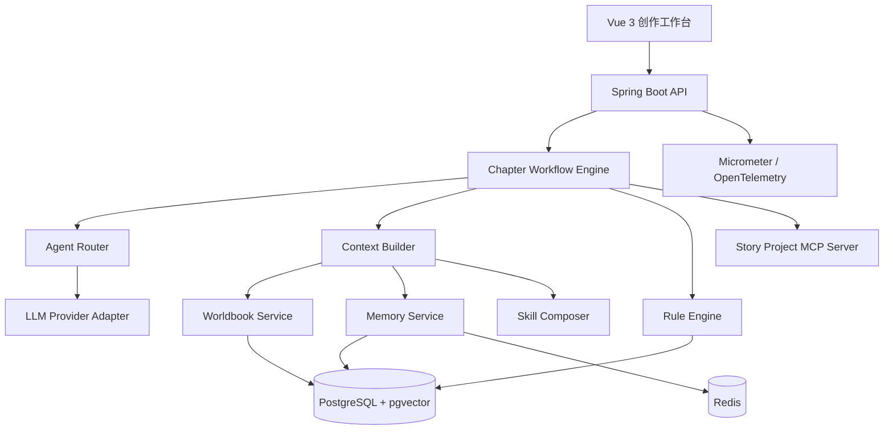
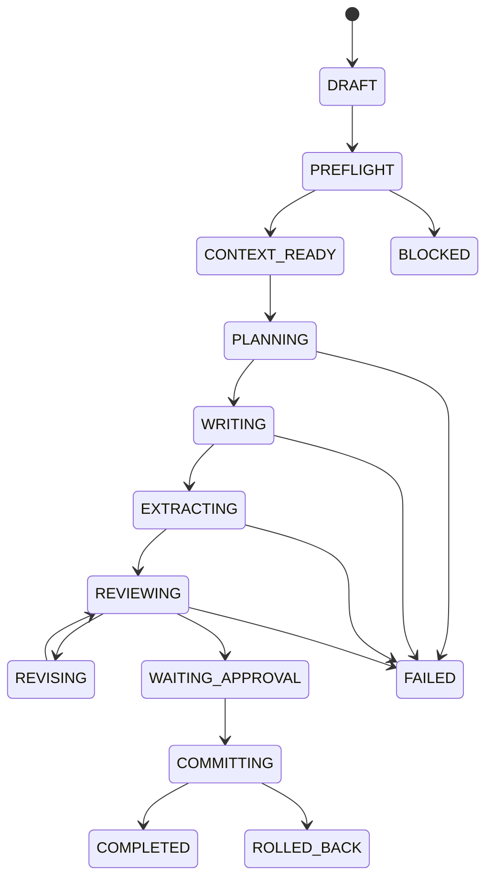

# 文脉 StoryWeaver
## 基于 Spring AI、动态世界书与分层记忆的长篇小说创作 Agent

> 文档版本：V3.0 简历落地版  
> 文档性质：产品与系统设计稿  
> 开发目标：个人在 8 周内完成可演示 MVP  
> 项目定位：Java 后端 / AI 应用开发 / Agent 工程化简历项目  
> 本稿不包含：具体代码、接口字段、SQL 建表语句和部署命令  
> 核心原则：**少而完整、可测量、可解释、可在面试中证实。**

---

# 1. 为什么重新设计

上一版产品设计覆盖长篇、短篇、扫榜、拆文、导入、审查、去 AI 味、封面、Browser CDP、Skill、Mod、MCP、知识图谱和多 Agent。作为完整产品规划没有问题，但直接作为个人简历项目会出现五个风险：

1. 范围过大，面试官容易怀疑只有设计稿；
2. 技术名词过多，核心技术贡献不突出；
3. “多 Agent”可能只是多个 Prompt 的重新命名；
4. MCP 数量很多，却没有一个真正做深；
5. 缺少可复现的评测数据和对照实验。

因此，新版只聚焦一个核心问题：

> **如何让大模型连续创作长篇小说时，减少设定遗忘、人物知识越界和前后事实冲突，同时控制上下文成本。**

---

# 2. 项目一句话定义

文脉 StoryWeaver 是一套长篇小说创作 Agent。

它通过 Java 状态机依次编排：

```text
写前预检
→ 世界书与记忆检索
→ 场景规划
→ 正文生成
→ 事实提取
→ 一致性审查
→ 局部修订
→ 章节与状态原子提交
```

用户能够查看每章使用了哪些世界书、历史事件和写作 Skill，并能追踪 Token、费用、冲突证据和章节版本。

---

# 3. 简历核心卖点

项目只突出六项能力：

1. **可控 Agent 工作流**：不让多个 Agent 自由聊天，由 Java 状态机决定步骤、输入、输出、重试和提交。
2. **动态世界书**：通过常驻、关键词和向量检索选择当前章节真正需要的设定。
3. **分层记忆**：Redis 保存短期任务和最近对话，PostgreSQL 保存章节与正典，pgvector 检索历史事件。
4. **角色认知边界**：区分角色已确认、听说、怀疑、错误认知和未知信息，检测上帝视角。
5. **写作 Skill 合成**：将基础规则、项目规则和章节规则按优先级合并，并展示最终生效内容。
6. **可量化评测**：使用人工构造的冲突数据集、Token 对照实验和性能指标证明效果。

---

# 4. 产品范围

## 4.1 P0：简历必须完成

以下能力组成完整闭环，全部完成后才将项目写入简历。

### A. 项目与章节

- 创建长篇项目；
- 维护作者意图；
- 人物卡；
- 世界设定；
- 分卷、章纲与章节；
- 章节版本；
- 富文本或 Markdown 编辑；
- 项目快照。

### B. 长篇章节工作流

- 写前预检；
- 动态上下文构建；
- 场景规划；
- 流式正文；
- 事实提取；
- 一致性审查；
- 局部修订；
- 人工确认；
- 状态提交。

### C. 动态世界书

实现且只实现三种激活方式：

- 常驻；
- 关键词；
- pgvector 向量检索。

支持：

- 作用范围；
- 优先级；
- Token 预算；
- 角色可见性；
- 激活原因展示。

### D. 四层记忆

- 最近对话；
- 最近章节；
- 语义事件记忆；
- 正典事实与角色状态。

### E. 写作 Skill

- 基础中文网文 Skill；
- 项目私有 Skill；
- 章节临时规则；
- 禁用表达；
- 优先级合成；
- 冲突提示；
- 最终 Skill 预览。

### F. 一致性审查

MVP 只保证四类：

- 人物状态；
- 唯一物品归属；
- 时间顺序；
- 角色知识越界。

### G. 工程能力

- SSE 流式输出；
- 长任务状态；
- 超时和有限重试；
- Token 与费用统计；
- 章节版本回滚；
- Agent 运行轨迹；
- 一个 Story Project MCP Server。

---

## 4.2 P1：有时间再完成

只选择 1—2 项，作为项目加分项：

- 已有小说导入；
- 伏笔生命周期；
- 记忆宫殿；
- Skill A/B 试写；
- Git 项目导出；
- OpenTelemetry 完整调用链；
- 章节影响分析。

---

## 4.3 Roadmap：不写成已实现功能

以下能力保留为未来产品 Skill，不进入 MVP 简历描述：

- 长篇扫榜；
- 长篇深度拆文；
- 短篇写作、扫榜与拆文；
- Browser CDP；
- 自动封面；
- Mod 市场；
- Neo4j；
- 多人协作；
- TTS；
- 平台自动发布。

README 中可以说明产品已预留扩展点，但不得把 Roadmap 当作已完成功能。

---

# 5. 与 oh-story-claudecode 的关系

oh-story-claudecode 提供了完整的创作方法参考，包括 `story-setup`、总控与 Dashboard、长短篇写作/拆文/扫榜、去 AI 味、导入、审查、封面、Browser CDP、专业 Agent、项目文件分层、References 按需加载和自动化 Hooks。

文脉不把这些 Skill 原样搬到 Web 页面，而是做三项重新设计：

1. 把文件型写作流程改成 Java 领域模型与可恢复状态机；
2. 把静态参考文件扩展为可解释的世界书、记忆与 Skill 合成；
3. 把命令式工具改成有权限、可统计、可评测的 Agent 产品。

面试时应主动说明参考来源，重点讲自己的工程设计与实现。

---

# 6. 用户与核心场景

## 6.1 目标用户

MVP 只服务一类用户：

> 已经有基础设定，希望使用 AI 辅助连续创作长篇小说的作者。

暂不以市场分析、短篇创作或封面设计用户为核心。

## 6.2 核心场景

用户已经完成前 15 章，准备写第 16 章。

系统需要：

1. 读取第 16 章章纲；
2. 检查视角人物与所需设定；
3. 激活相关世界书；
4. 获取上一章全文和最近摘要；
5. 检索与当前人物、地点和伏笔相关的历史事件；
6. 生成场景计划；
7. 生成正文；
8. 提取本章新增事实；
9. 发现人物是否使用了未知信息；
10. 检查道具、时间和状态；
11. 给出局部修订；
12. 用户确认后，同时提交正文和状态。

---

# 7. 系统总体架构



---

# 8. 技术栈收缩

## 8.1 MVP 技术栈

### 前端

- Vue 3；
- TypeScript；
- Vite；
- Element Plus；
- Pinia；
- TipTap 或 Markdown 编辑器；
- SSE。

### 后端

- Java 21；
- Spring Boot；
- Spring AI；
- Spring Modulith；
- Spring Security；
- Spring Data JPA；
- Spring Data Redis。

### 数据

- PostgreSQL；
- pgvector；
- Redis。

### 工程

- Docker Compose；
- Micrometer；
- OpenTelemetry；
- Prometheus；
- Grafana。

## 8.2 MVP 明确不使用

### 不使用 Kafka

当前是个人项目，核心任务量有限。先使用数据库任务表、Spring Modulith 应用事件和可恢复状态机。只有在真实并发和吞吐压力证明需要时再引入消息队列。

### 不使用 Neo4j

MVP 的人物关系、事实和角色知识可以使用 PostgreSQL 关系表表示。只有出现大量多跳图查询后，再评估 Neo4j。

### 不拆微服务

首版采用模块化单体：

```text
project
chapter
worldbook
memory
skill
agent
review
model
usage
mcp
```

模块边界明确，但不增加分布式事务和部署复杂度。

### 不做通用插件市场

MVP 的 Skill 是受控数据配置，不运行用户任意代码。

---

# 9. Agent 设计

## 9.1 只保留四个 LLM Agent

### 1. Planner Agent

输入：

- 章纲；
- 当前人物状态；
- 当前地点；
- 世界书；
- 相关历史事件；
- 作者本次要求。

输出：

- 3—5 个场景；
- 每个场景的目的；
- 冲突；
- 信息增量；
- 转折；
- 章尾钩子。

### 2. Writer Agent

输入：

- 已确认场景计划；
- 当前世界状态；
- 角色认知；
- 写作 Skill；
- 最近正文。

输出：

- 章节正文。

### 3. Extractor Agent

输入：

- 本章正文；
- 写前世界状态。

输出：

- 候选故事事件；
- 候选事实；
- 人物状态变化；
- 物品转移；
- 知识传播。

要求低温度和结构化输出，不允许自行补充正文中不存在的事实。

### 4. Reviewer Agent

输入：

- 正文；
- 写前状态；
- Extractor 输出；
- 当前 Skill；
- 相关历史证据。

输出：

- 问题列表；
- 严重程度；
- 证据；
- 修改建议。

## 9.2 Java 确定性组件

以下不是 Agent：

- Workflow Engine；
- Worldbook Activator；
- Context Budgeter；
- Timeline Validator；
- Item Ownership Validator；
- Knowledge Boundary Validator；
- Version Manager；
- Cost Guard。

这能避免把普通业务逻辑包装成“智能体”。

## 9.3 Agent 节点的工程标准

每个 Agent 必须具有：

- 独立任务定义；
- 独立模型配置；
- 明确输入字段；
- 结构化输出；
- 最大重试次数；
- 超时时间；
- Token 上限；
- 输出校验；
- 运行日志；
- 失败降级。

因此，“多 Agent”不是几个名字不同的 Prompt，而是工作流中的可验证节点。

---

# 10. 章节状态机



## 10.1 写前预检

检查：

- 作者意图；
- 当前章章纲；
- 视角人物；
- 人物卡；
- 上一章状态是否已提交；
- 世界硬规则；
- 写作模型；
- 输出长度；
- 费用上限。

缺少关键资产时停止，不让模型凭空补设定。

## 10.2 原子提交

提交单元包含：

- 章节版本；
- 章节摘要；
- 故事事件；
- 正典事实；
- 人物状态；
- 物品归属；
- 角色知识变化；
- Token 和费用；
- 工作流结果。

其中任何一步失败，整次提交回滚。

---

# 11. 动态世界书

## 11.1 世界书定义

世界书是带有激活规则的小说设定，而不是一份全部塞给模型的长文档。

条目类型：

- 人物；
- 地点；
- 组织；
- 物品；
- 能力；
- 世界硬规则；
- 历史；
- 秘密；
- 仪式。

## 11.2 MVP 激活方式

### 常驻

用于作者意图、视角规则和不可违反的世界硬规则。

### 关键词

从本章章纲、出场人物、场景地点、用户指令和最近正文中匹配。

### 向量检索

根据本章语义，从 pgvector 中检索相关背景条目。

不使用向量检索判断唯一物品持有人、人物生死等硬事实。

## 11.3 条目必要属性

- 标题；
- 内容；
- 类型；
- 状态；
- 作用范围；
- 关键词；
- 是否常驻；
- 优先级；
- Token 上限；
- 角色可见性；
- 来源；
- 版本。

## 11.4 激活顺序

```text
作用范围过滤
→ 加载常驻条目
→ 关键词命中
→ 向量召回
→ 角色可见性过滤
→ 去重
→ 优先级排序
→ Token 裁剪
→ 激活报告
```

## 11.5 激活报告

| 条目 | 原因 | 优先级 | Token | 是否硬规则 |
|---|---|---:|---:|---|
| 圣山禁忌 | 场景地点命中 | 900 | 430 | 是 |
| 苗澜舟人物卡 | 出场人物 | 850 | 520 | 否 |
| 第 8 章祭祀异常 | 向量检索 | 720 | 210 | 否 |

---

# 12. 分层记忆

Spring AI 的 Chat Memory 适合管理当前会话需要的消息，不等于保存完整聊天历史。因此项目将会话记忆与小说正典分开。

## 12.1 M1：最近对话

存储：Redis。

默认：

```text
最近 8 条消息
用户输入和 Agent 返回各算一条
只允许偶数
推荐范围 6—10
```

作用：

- 记住用户刚刚的调整；
- 维持规划对话；
- 不作为小说事实真源。

## 12.2 M2：最近章节

注入：

- 上一章完整正文；
- 最近 3 章摘要；
- 当前未解决冲突；
- 最近人物状态变化。

## 12.3 M3：故事事件记忆

存储：PostgreSQL + pgvector。

每个事件包含：

- 参与者；
- 动作；
- 地点；
- 时间；
- 结果；
- 谁知道；
- 重要度；
- 来源章节和段落。

按语义、人物、地点、时间和重要度综合检索。

## 12.4 M4：正典状态

存储：PostgreSQL。

维护：

- 人物生死；
- 当前地点；
- 伤势；
- 能力；
- 人物关系；
- 物品归属；
- 角色知识；
- 世界硬规则。

这一层只通过结构化查询获取，不依赖向量相似度。

---

# 13. 角色认知边界

## 13.1 五种知识状态

| 状态 | 含义 |
|---|---|
| CONFIRMED | 亲眼看见或可靠确认 |
| REPORTED | 他人转述 |
| SUSPECTED | 角色推测 |
| FALSE_BELIEF | 角色相信，但事实错误 |
| UNKNOWN | 不应知道 |

## 13.2 写作约束

Writer Agent 获得的角色上下文只包含：

```text
CONFIRMED
REPORTED
SUSPECTED
FALSE_BELIEF
```

不会注入 `UNKNOWN` 内容。

## 13.3 知识传播

Extractor 识别：

```text
谁将什么信息
在第几章
通过什么方式
告诉了谁
接收者是否相信
```

候选传播经过规则校验后再更新角色知识。

## 13.4 知识越界报告

```text
问题：角色知识越界
位置：第 16 章第 8 段
角色：苗澜舟

当前台词：
“归墟教已经进了圣山。”

已有状态：
苗澜舟只知道阵法被改动；
归墟教铜钱由陆青玄单独发现；
两人尚未交换信息。

修改方向：
1. 改为怀疑；
2. 增加信息交换；
3. 删除明确组织名称。
```

---

# 14. 写作 Skill

## 14.1 MVP 只支持三层

```text
基础 Skill
项目私有 Skill
章节临时规则
```

不做公开市场，不做可执行代码插件。

## 14.2 Skill 内容

- 叙事视角；
- 句长倾向；
- 段落长度；
- 对话比例；
- 节奏；
- 描写偏好；
- 章尾规则；
- 禁用表达；
- 审查项；
- 正反例。

## 14.3 合成优先级

```text
本次用户指令
> 章节临时规则
> 项目私有 Skill
> 基础 Skill
```

硬性禁用项不得被普通偏好覆盖。

## 14.4 冲突示例

```text
基础 Skill：
禁止上帝视角。

章节规则：
展示反派的真实心理。
```

系统不直接合并，而是提示：

```text
检测到视角冲突。
可选方案：
1. 删除反派心理；
2. 切换为反派视角独立场景；
3. 将内容改为主角观察和推测。
```

## 14.5 去 AI 味

`story-deslop` 在 MVP 中作为一组审查 Skill，而不是独立大系统。

确定性检查：

- 禁用句式；
- 重复段落；
- 连续短句；
- 工程词残留；
- 标点；
- 截断。

LLM 检查：

- 机械总结；
- 空泛比喻；
- 角色说话同质化；
- 解释代替画面；
- 情绪直接命名。

---

# 15. 一致性审查

## 15.1 人物状态

检查：

- 已死亡人物再次正常出现；
- 伤势无恢复过程；
- 地点不合理跳转；
- 能力突然出现。

## 15.2 唯一物品

检查：

- 同一物品同时被两人持有；
- 物品已损坏却继续正常使用；
- 未记录转移事件。

## 15.3 时间线

检查：

- 结果早于原因；
- 同一时间同一角色在两个地点；
- 旅行时间不可能；
- 章节日期顺序冲突。

## 15.4 角色认知

检查：

- 使用 UNKNOWN 信息；
- 把 SUSPECTED 当作已确认事实；
- 获得信息但没有传播事件；
- 角色知道自己不在场的细节。

## 15.5 双层审查

### Java 规则

处理确定性问题：

- 唯一归属；
- 生死；
- 时间比较；
- 知识集合；
- 状态枚举。

### Reviewer Agent

处理语义问题：

- 暗示是否过度；
- 人物行为是否符合动机；
- 台词是否实际上泄露秘密；
- 修订方案是否自然。

---

# 16. Story Project MCP

## 16.1 为什么只做一个 MCP

简历不需要罗列十个 MCP。

一个真正可演示、带权限和审计的 MCP Server，比多个停留在设计中的连接器更有说服力。

## 16.2 MCP 角色

文脉应用既是：

- MCP Host/Client：调用外部可信工具；
- Story Project MCP Server：向受支持的 Agent 环境暴露小说项目能力。

MVP 重点完成 Server。

## 16.3 MCP 能力

### Resources

- 当前章纲；
- 人物卡；
- 世界硬规则；
- 最近章节摘要；
- 当前项目状态。

### Prompts

- 规划下一章；
- 查询人物状态；
- 审查当前章节。

### Tools

只提供 6 个：

```text
get_character_state
get_character_knowledge
get_worldbook_entries
get_recent_story_events
get_item_owner
save_candidate_fact
```

前五个只读，最后一个只允许保存候选事实，不能直接修改正典。

## 16.4 MCP 安全

- 每个 Tool 使用 JSON Schema；
- Tool 描述明确目的、参数和限制；
- Project ID 与用户权限校验；
- 写入只进入候选区；
- 正典变更必须回到 Web 应用确认；
- 每次调用记录 Agent、参数、结果和耗时；
- 不向 MCP 暴露模型 API Key；
- 不允许 Shell 和任意文件读取；
- 超时与调用次数限制。

---

# 17. 模型设计

## 17.1 模型角色

### 规划模型

要求推理较强、结构化输出和中等上下文。

### 写作模型

要求中文长文能力、流式输出、风格遵循和足够输出长度。

### 提取模型

要求低成本、低温度和 JSON 稳定。

### 审查模型

要求引用证据、较强推理和低温度。

### Embedding 模型

用于世界书、故事事件和章节摘要。

## 17.2 参数中心

支持：

- Temperature；
- Top P；
- Top K；
- Presence Penalty；
- Frequency Penalty；
- 最大输出；
- 上下文上限；
- 思考预算；
- 超时；
- 重试。

模型不支持的参数置灰，并显示原因。

## 17.3 默认参数原则

- 规划：中等创造性；
- 写作：中等偏高创造性；
- 提取：低温度；
- 审查：低温度、高推理预算；
- 修订：中等温度、高原文保留。

不宣称某组参数适用于全部模型。

---

# 18. 动态上下文

## 18.1 Canonical Context Packet

每次章节任务生成统一上下文包：

```text
作者意图
当前焦点
章纲
场景计划
视角人物
角色认知
激活世界书
最近章节
相关事件
当前事实
写作 Skill
本次用户要求
Token 预算
```

Planner、Writer、Extractor 和 Reviewer 均引用该上下文包的版本号。

## 18.2 推荐预算

| 内容 | 占比 |
|---|---:|
| 系统与作者意图 | 7% |
| 章纲和场景 | 12% |
| 人物与认知 | 13% |
| 世界书 | 15% |
| 最近章节 | 23% |
| 历史事件 | 10% |
| Skill | 8% |
| 工具结果 | 2% |
| 输出预留 | 10% |

只是默认策略，实际按模型上下文调整。

## 18.3 超限裁剪

顺序：

1. 删除低相关事件；
2. 旧正文替换为摘要；
3. 合并重复世界书；
4. 删除非出场人物的次要信息；
5. 删除 Skill 中的示例；
6. 保留硬规则、章纲和角色认知；
7. 仍超限则阻止生成。

---

# 19. 前端产品

## 19.1 主界面

```text
┌──────────────────────────────────────────────────────────┐
│ 项目 / 第16章 / 模型 / Token / 费用 / 工作流状态          │
├────────────┬──────────────────────────┬───────────────────┤
│ 资产树      │ 正文编辑器                │ Agent 面板         │
│            │                          │                   │
│ 大纲        │ 流式生成                  │ 当前步骤            │
│ 人物        │ 问题高亮                  │ 世界书命中          │
│ 世界书      │ 版本差异                  │ 记忆来源            │
│ 事件        │                          │ Skill 合成          │
│ 事实        │                          │ 审查与费用          │
└────────────┴──────────────────────────┴───────────────────┘
```

## 19.2 核心页面

只做：

- 项目总览；
- 人物与设定；
- 大纲；
- 章节编辑；
- 世界书；
- 记忆与事件；
- Skill；
- 审查；
- 模型与费用；
- MCP 审计。

## 19.3 运行可视化

```text
✓ 写前预检
✓ 激活世界书 9 条
✓ 检索历史事件 8 条
✓ 组装上下文 31,420 Token
✓ 生成场景计划
● 正在生成正文
○ 提取事实
○ 连续性审查
○ 等待确认
```

---

# 20. 可观测性与成本

## 20.1 记录内容

- Agent 类型；
- 模型；
- 输入 Token；
- 输出 Token；
- 推理 Token；
- 耗时；
- 费用；
- Tool 调用；
- 重试；
- 世界书命中；
- 记忆命中；
- 错误；
- 任务状态。

## 20.2 用户费用面板

写作前：

```text
预计输入：31,420 Token
预计输出：6,000 Token
预计费用：￥X.XX
本日累计：￥X.XX
项目累计：￥XX.XX
```

写作后显示真实值。

价格配置独立维护，不在业务代码中写死。

## 20.3 隐私

默认不记录完整 Prompt、完整正文和模型完整回复。调试模式开启时明确提醒可能包含用户私有作品。

---

# 21. 评测体系

## 21.1 测试数据

准备：

- 20 章自有测试小说；
- 15 个角色；
- 60 个世界书条目；
- 150 个故事事件；
- 120 组人工冲突；
- 30 个角色知识越界案例；
- 20 个唯一物品冲突；
- 30 个时间冲突；
- 40 个人物状态冲突。

## 21.2 一致性指标

- Precision；
- Recall；
- F1；
- 按冲突类型分别统计；
- 严重错误漏检率；
- 错误证据定位准确率。

## 21.3 Token 对照实验

### Baseline A

```text
系统提示
+ 全部历史章节
+ 本章要求
```

### 文脉 B

```text
系统提示
+ 动态世界书
+ 最近章节
+ 相关事件
+ 正典状态
+ Skill
```

比较：

- 输入 Token；
- 生成耗时；
- 设定错误数量；
- 人工评分；
- 单章费用。

## 21.4 系统指标

- 世界书激活 P95；
- 记忆检索 P95；
- 上下文构建 P95；
- 首 Token 时间；
- SSE 断线恢复率；
- 结构化输出成功率；
- 工作流恢复率；
- 原子提交失败次数；
- MCP 调用成功率。

## 21.5 目标值与真实值分开

设计阶段只设置目标，不在简历中写成结果。

| 指标 | 目标 |
|---|---:|
| 一致性检测 F1 | ≥ 85% |
| 角色知识越界 Recall | ≥ 90% |
| Token 节省 | ≥ 40% |
| 上下文构建 P95 | < 800 ms |
| 结构化输出成功率 | ≥ 98% |
| 状态半提交事故 | 0 |

项目完成后，用真实测试结果替换。

---

# 22. 三分钟 Demo

1. 打开已写 15 章的测试项目；
2. 查看人物、世界书、历史事件和当前状态；
3. 点击“生成第 16 章”；
4. 展示本章激活的世界书、历史事件和 Token；
5. 流式生成正文；
6. 正文中人为保留一个角色知识越界；
7. Reviewer 给出冲突位置和第 15 章证据；
8. 点击局部修订；
9. 用户确认；
10. 提交章节和角色状态；
11. 展示 Agent 轨迹、耗时和费用；
12. 通过 MCP 查询“青铜钥匙当前由谁持有”。

这个 Demo 可以证明：

- Java 工作流；
- LLM；
- RAG；
- 状态管理；
- Tool/MCP；
- 一致性；
- 流式体验；
- 费用和观测。

---

# 23. 八周开发计划

| 周次 | 交付 |
|---|---|
| 第 1 周 | 项目、人物、设定、大纲、章节和版本 |
| 第 2 周 | Spring AI、多模型配置、SSE 流式生成 |
| 第 3 周 | Java 章节状态机、任务状态和回滚 |
| 第 4 周 | 世界书常驻/关键词/向量激活与预览 |
| 第 5 周 | Redis 对话记忆、章节摘要和事件检索 |
| 第 6 周 | 角色状态、物品、时间线和认知边界 |
| 第 7 周 | Skill 合成、审查、局部修订、MCP |
| 第 8 周 | 评测、压测、观测、Docker 和 Demo |

---

# 24. 完成标准

项目只有满足以下条件，才算完成 MVP：

```text
[ ] 能连续生成至少 10 章
[ ] 每章均经过状态机完整流程
[ ] 世界书三种激活方式均可演示
[ ] 最近对话、章节、事件和正典四层记忆均生效
[ ] 四类一致性问题均有自动测试
[ ] Story Project MCP 六个能力可调用
[ ] 写入工具不能直接修改正典
[ ] SSE 可显示正文和步骤
[ ] Token、费用和耗时可查看
[ ] 章节和状态可一起提交或回滚
[ ] 已完成至少一轮 Baseline 对照实验
[ ] README 明确区分已实现功能与 Roadmap
```

---

# 25. 简历写法模板

> **文脉 StoryWeaver——基于 Spring AI、动态世界书与分层记忆的长篇小说创作 Agent**
>
> - 基于 Java 21、Spring Boot、Spring AI 和 Spring Modulith 构建章节创作工作流，使用状态机编排写前预检、上下文构建、场景规划、正文生成、事实提取、一致性审查和原子提交。
> - 设计动态世界书系统，通过常驻规则、关键词匹配和 pgvector 语义检索激活人物、地点及世界设定，并根据作用域、优先级和 Token 预算生成可解释上下文。
> - 使用 Redis 管理最近对话和任务状态，结合最近章节摘要、故事事件向量检索与 PostgreSQL 正典状态构建分层记忆，降低长篇续写中的设定遗忘。
> - 构建角色认知边界与确定性规则，自动检测人物状态、时间线、唯一物品归属和角色知识越界，并使用审查 Agent 生成带原文证据的局部修订建议。
> - 开发 Story Project MCP Server，提供人物状态、角色知识、世界书、事件和物品归属等受控查询工具，候选写入经 JSON Schema、权限与人工确认后才能晋升为正典。
> - 基于 SSE、Micrometer 和 OpenTelemetry 展示 Agent 运行步骤、模型延迟、Token、费用、世界书命中和失败信息；在 XX 组测试中实现一致性检测 F1 **XX%**，较全文注入方案减少输入 Token **XX%**。

> 只有实际实现和测试后的功能才能保留，所有 XX 必须替换为真实值。

---

# 26. 面试边界说明

## 已完成

只讲真实完成的：

- 长篇工作流；
- 世界书；
- 分层记忆；
- 四类一致性；
- Skill；
- Story Project MCP；
- SSE 和费用。

## 未完成

主动说明：

- 短篇；
- 扫榜；
- 浏览器自动化；
- 封面；
- Mod 市场；
- Neo4j；
- 自动发布；

属于产品 Roadmap，不是当前实现。

坦诚的边界比虚构“大而全系统”更可信。

---

# 27. 关键技术决策

## 为什么采用 Spring AI

项目需要模型供应商适配、流式生成、Structured Output、Tool Calling、Chat Memory、Vector Store、MCP 和 Observability。Spring AI 能与 Spring Boot、Security、事务和 Java 领域层统一集成。

## 为什么选择 PostgreSQL + pgvector

MVP 同时需要业务数据、版本、正典事实、元数据过滤和向量相似检索。将向量与业务数据放在同一数据库，减少同步系统数量。Redis 只负责短期、高频和可过期状态。

## 为什么世界书不等于普通 RAG

普通 RAG 主要根据语义召回文本。世界书还包含作用范围、常驻、角色可见性、优先级、Token 上限、版本和硬规则属性。向量检索只是世界书激活的一种方式。

## 为什么只做一个 MCP

MCP 的价值不是数量，而是标准化、权限和可组合性。Story Project MCP 已能证明 Resources、Prompts、Tools、JSON Schema、只读与候选写入、用户授权和调用审计。

## 为什么不用自由式多 Agent

自由对话难以保证停止条件、Token 成本、正典一致、可复现和失败回滚。因此由 Java 状态机控制 Agent 的顺序、输入、输出和重试。

---

# 28. 参考资料

1. oh-story-claudecode  
   https://github.com/worldwonderer/oh-story-claudecode

2. Spring AI Reference  
   https://docs.spring.io/spring-ai/reference/index.html

3. Spring AI Chat Memory  
   https://docs.spring.io/spring-ai/reference/api/chat-memory.html

4. Spring AI Advisors  
   https://docs.spring.io/spring-ai/reference/api/advisors.html

5. Spring AI Observability  
   https://docs.spring.io/spring-ai/reference/observability/index.html

6. Spring Modulith Reference  
   https://docs.spring.io/spring-modulith/reference/index.html

7. Model Context Protocol Specification 2026-07-28  
   https://modelcontextprotocol.io/specification/2026-07-28/basic

8. MCP Server Features  
   https://modelcontextprotocol.io/specification/2026-07-28/server

9. pgvector  
   https://github.com/pgvector/pgvector

10. Redis Documentation  
    https://redis.io/docs/latest/
